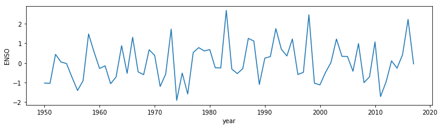
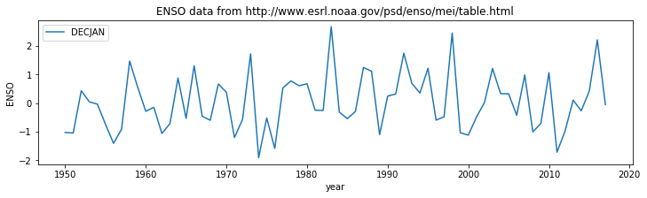
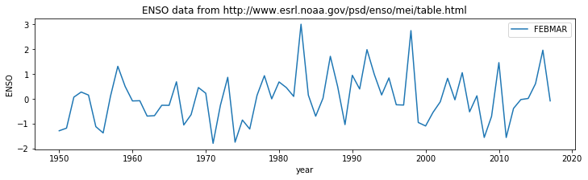
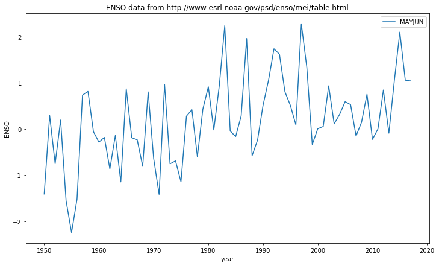
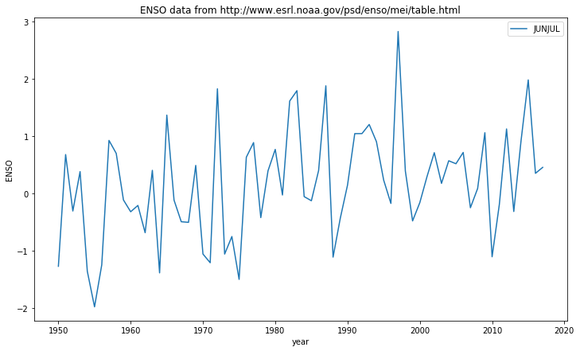
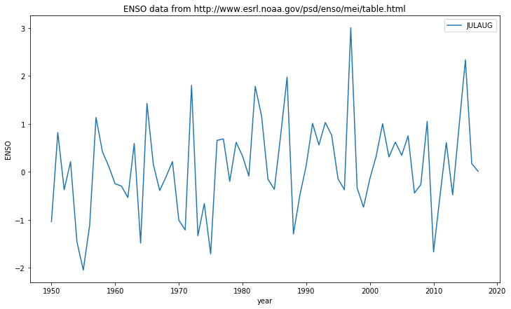
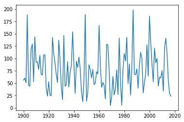

1. Introduction to Python With ANSWERS
======================================

.. raw:: html

   <h1>

Table of Contents

.. raw:: html

   </h1>

.. container:: toc

   .. raw:: html

      <ul class="toc-item">

   .. raw:: html

      <li>

   1. Introduction to Python With ANSWERS

   .. raw:: html

      <ul class="toc-item">

   .. raw:: html

      <li>

   1.1 Getting Started

   .. raw:: html

      <ul class="toc-item">

   .. raw:: html

      <li>

   1.1.1 Comments and print function

   .. raw:: html

      </li>

   .. raw:: html

      <li>

   1.1.2 Variables, Values and Data types

   .. raw:: html

      </li>

   .. raw:: html

      <li>

   1.1.3 Arithmetic

   .. raw:: html

      </li>

   .. raw:: html

      <li>

   1.1.4 Assignment Operators

   .. raw:: html

      </li>

   .. raw:: html

      <li>

   1.1.5 Logical Operators

   .. raw:: html

      </li>

   .. raw:: html

      <li>

   1.1.6 Comparison Operators and if

   .. raw:: html

      </li>

   .. raw:: html

      <li>

   1.1.7 Summary

   .. raw:: html

      </li>

   .. raw:: html

      </ul>

   .. raw:: html

      </li>

   .. raw:: html

      <li>

   1.2 Text and looping

   .. raw:: html

      <ul class="toc-item">

   .. raw:: html

      <li>

   1.2.1 len

   .. raw:: html

      </li>

   .. raw:: html

      <li>

   1.2.2 for … in … and enumerate

   .. raw:: html

      </li>

   .. raw:: html

      <li>

   1.2.3 slice

   .. raw:: html

      </li>

   .. raw:: html

      <li>

   1.2.4 replace

   .. raw:: html

      </li>

   .. raw:: html

      <li>

   1.2.5 find

   .. raw:: html

      </li>

   .. raw:: html

      <li>

   1.2.5 split and splitlines

   .. raw:: html

      </li>

   .. raw:: html

      <li>

   1.2.6 Summary

   .. raw:: html

      </li>

   .. raw:: html

      </ul>

   .. raw:: html

      </li>

   .. raw:: html

      <li>

   1.3. Groups of things

   .. raw:: html

      <ul class="toc-item">

   .. raw:: html

      <li>

   1.3.1 tuple

   .. raw:: html

      </li>

   .. raw:: html

      <li>

   1.3.2 list

   .. raw:: html

      </li>

   .. raw:: html

      <li>

   1.3.3 np.array

   .. raw:: html

      </li>

   .. raw:: html

      <li>

   1.3.4 dict

   .. raw:: html

      </li>

   .. raw:: html

      <li>

   1.3.5 Summary

   .. raw:: html

      </li>

   .. raw:: html

      </ul>

   .. raw:: html

      </li>

   .. raw:: html

      </ul>

   .. raw:: html

      </li>

   .. raw:: html

      </ul>

Python is a popular general purpose, free language. As opposed to other
systems that are focused towards a particular task (e.g. R for
statistics), Python has a strong following on the web, on systems
operations and in data analysis. For scientific computing, a large
number of useful add-ons (“libraries”) are available to help you analyse
and process data. This is an invaluable resource.

In addition to being free, Python is also very portable, and easy to
pick up.

The aim of this Chapter is to introduce you to some of the fundamental
concepts in Python. Mainly, this is based around fundamental data types
in Python (``int``, ``float``, ``str``, ``bool`` etc.) and ways to group
them (``tuple``, ``list``, array, string and ``dict``).

Although some of the examples we use are very simple to explain a
concept, the more developed ones should be directly applicable to the
sort of programming you are likely to need to do.

Further, a more advanced section of the chapter is available, that goes
into some more detail and complkications. This too has a set of
exercises with worked examples.

In this session, you will be introduced to some of the basic concepts in
Python.

**The session should last 4 hours (one week).**

1.1 Getting Started
-------------------

1.1.1 Comments and print function
~~~~~~~~~~~~~~~~~~~~~~~~~~~~~~~~~

Comments are statements ignored by the language interpreter.

Any text after a # in a *code block* is a comment.

You can ‘run’ the code in a code block using the ‘run’ widget (above) or
hitting the keys (‘typing’) and at the same time.

**E1.1.1 Exercise**

-  Try running the code block below
-  Explain what happened (‘what the computer did’)

.. code:: python

    # Hello world

\ **ANSWER**

Nothing ‘apparently’ happened, but really, the code block was
interpreted as a set of Python commands and executed. As there is only a
comment, there was no output.

You can also use text blocks (contained in quotes) to contain comments,
but note that if it is the last statement in the code, the text block
may be printed out to the terminal.

.. code:: python

    # single line text
    'hello world is not printed'
    
    # multi-line text
    '''
    Hello 
    world
    is printed
    '''


.. parsed-literal::

    '\nHello \nworld\nis printed\n'


**E1.1.2 Exercise**

-  Copy the text from above in the window below

-  Then put a new text block at the end and note down what happens

-  What does the ``\n`` mean/do?

.. code:: python

    # do the exercise here
    # ANSWER
    
    # single line text
    'hello world is not printed'
    
    # multi-line text
    '''
    Hello 
    world
    is printed
    '''
    
    '''
    Another text block
    '''


.. parsed-literal::

    '\nAnother text block\n'


ANSWER

The last output is printed. In this case, it is the string
``'\nAnother text block\n'``.

The ``\n`` is a newline character. It setrs the text cursor to the start
of a new line.

To print some statement (by default, to the screen you are using), use
the ``print`` method:

.. code:: python

    print('hello world')


.. parsed-literal::

    hello world


.. code:: python

    print('hello','world')


.. parsed-literal::

    hello world


In Python 3.X, ``print`` is a function with the *argument(s)* (here, the
string you want printed) enclosed in the function’s (round) brackets.

**E1.1.3 Exercise**

-  Copy the print statement from above code block.

-  Change the words in the quotes and print them out.

-  Add some comments to the code block explaining what you have done and
   seen.

.. code:: python

    # do the exercise here
    # ANSWER
    
    
    '''
    The print statement below sends text to the output channel (the 'screen' as it were). 
    In this case, it prints the string 'good', followed by a space, then the string 'morning'
    '''
    print('good','morning')


.. parsed-literal::

    good morning


1.1.2 Variables, Values and Data types
~~~~~~~~~~~~~~~~~~~~~~~~~~~~~~~~~~~~~~

The idea of **variables** is fundamental to any programming. You can
think of this as the *name* of *something*, so it is a way of allowing
us to refer to some object in the language.

What the variable *is* set to is called its **value**.

So let’s start with a variable we will call (*declare to be*) ``x``.

We will give a *value* of the string ``'one'`` to this variable:

.. code:: python

    x = 'one'
    
    print(x)


.. parsed-literal::

    one


**E1.1.4 Exercise**

-  set the a variable called x to some different string (e.g. ‘hello
   world’)

-  print the value of the variable ``x``

-  Try this again, putting some ‘newlines’ (``\n``) in the string

.. code:: python

    # do the exercise here
    # ANSWER
    
    x = 'hello world'
    
    print(x)
    '''
    Note the space before the final
    hello world, as there is a comma 
    between '\n' and x
    '''
    print(x,'\n',x)


.. parsed-literal::

    hello world
    hello world 
     hello world


.. code:: python

    # Now we set x to the value 1
    
    x = 1
    
    print(x,'is type',type(x))


.. parsed-literal::

    1 is type <class 'int'>


In a computing language, the *sort of thing* the variable can be set to
is called its **data type**.

In python, we can access this with the method ``type()`` as in the
example above.

In the example above, the datatype is an **integer** number
(e.g. ``1, 2, 3, 4``).

In ‘natural language’, we might read the example above as ‘x is one’.

**E1.1.5 Exercise**

-  set the a variable called ``x`` to the integer ``5``

-  print the value and type of the variable ``x``

-  change the data type used for ``x`` to something else (e.g. a string)

.. code:: python

    # do the exercise here
    # ANSWER
    
    x = 5
    '''
    We use the methods type() and str() here
    '''
    print(x,type(x),str(x))


.. parsed-literal::

    5 <class 'int'> 5


Setting ``x = 1`` is different to:

.. code:: python

    x = 'one'

because here we have set value of the variable ``x`` to a **string**
(i.e. some text).

A string is enclosed in quotes, e.g. \ ``"one"`` or ``'one'``, or even
``"'one'"`` or ``'"one"'``.

.. code:: python

    print ("one")
    print ('one')
    print ("'one'")
    print ('"one"')


.. parsed-literal::

    one
    one
    'one'
    "one"


**E1.1.6 Exercise**

-  create a variable ``name`` containing your name, as a string.

-  using this variable and the print function, print out a statement
   such as ``my name is Fred`` (if your name were ``Fred``)

.. code:: python

    # do the exercise here
    # ANSWER
    
    name = 'Professor Philip Lewis'
    print('My name is',name)


.. parsed-literal::

    My name is Professor Philip Lewis


Setting ``x = 1`` or ``x = 'one'`` is different to:

.. code:: python

    x = 1.0

because here we have set value of the variable ``x`` to a **floating
point** number (these are treated and stored differently to integers in
computing).

This in turn is different to:

.. code:: python

    x = True

where ``True`` is a **logical** or **boolean** datatype (something is
``True`` or ``False``).

**E1.1.7 Exercise**

-  in the code block below, create a variable called ``my_var`` and set
   it to some value (your choice of value, but be clear about the data
   type you intend)

-  print the value of the variable to the screen, along with the data
   type.

.. code:: python

    # do the exercise here
    # ANSWER
    
    # set to integer
    my_var = 100
    print(my_var,type(my_var))


.. parsed-literal::

    100 <class 'int'>


We have so far seen four datatypes:

-  integer (``int``): 32 bits long on most machines
-  (double-precision) floating point (``float``): (64 bits long)
-  Boolean (``bool``)
-  string (``str``)

but we will come across more (and even create our own!) as we go through
the course.

In each of these cases above, we have used the variable ``x`` to contain
these different data types.

As we saw above, if you want to know what the data type of a variable
is, you can use the method ``type()``

.. code:: python

    print (type(1));
    print (type(1.0));
    print (type('one'));
    print (type(True));


.. parsed-literal::

    <class 'int'>
    <class 'float'>
    <class 'str'>
    <class 'bool'>


You can explicitly convert between data types, e.g.:

.. code:: python

    print ('int(1.1) = ',int(1.1))
    print ('float(1) = ',float(1))
    print ('str(1) = ',str(1))
    print ('bool(1) = ',bool(1))


.. parsed-literal::

    int(1.1) =  1
    float(1) =  1.0
    str(1) =  1
    bool(1) =  True


but only when it makes sense:

.. code:: python

    print ("converting the string '1' to an integer makes sense:",int('1'))


.. parsed-literal::

    converting the string '1' to an integer makes sense: 1


.. code:: python

    print ("converting the string 'one' to an integer doesn't:",int('one'))


::


    ---------------------------------------------------------------------------

    ValueError                                Traceback (most recent call last)

    <ipython-input-23-11bdc0c0e878> in <module>
    ----> 1 print ("converting the string 'one' to an integer doesn't:",int('one'))
    

    ValueError: invalid literal for int() with base 10: 'one'


When you get an error (such as above), you will need to learn to *read*
the error message to work out what you did wrong.

**E1.1.8 Exercise**

-  why did the statement above not work?

-  type some other data conversions below that *do* work.

.. code:: python

    # do the exercise here
    # ANSWER
    
    print(str(1),str('1 2 3'))
    print(int('1'))


.. parsed-literal::

    1 1 2 3
    1


We tried to convert a string (‘one’) to an integer, that doesn’t make
sense. It *is* ok e.g. for ``int('1')`` though.

1.1.3 Arithmetic
~~~~~~~~~~~~~~~~

Often we will want to do some
`arithmetic <http://www.tutorialspoint.com/python/python_basic_operators.htm>`__
with numbers in a program, and we use the ‘normal’ (derived from C)
operators for this.

Note the way this works for integers and floating point representations.

.. code:: python

    '''
        Some examples of arithmetic operations in Python
    
        Note how, if we mix float and int, the result is raised to float
        (as the more general form)
    '''
    
    print (10 + 100)     # int addition
    print (10. - 100)    # float subtraction
    print (1./2.)        # float division
    print (1/2)          # int division
    print (10.*20.)      # float multiplication
    print (2 ** 3.)      # float exponent
    
    print (65%2)         # int remainder
    print (65//2)        # floor operation


.. parsed-literal::

    110
    -90.0
    0.5
    0.5
    200.0
    8.0
    1
    32


**E1.1.9 Exercise**

-  change the numbers in the examples above to make sure you understand
   these basic operations.

-  try combining operations and use brackets ``()`` to check that that
   works as expected.

-  see what happens when you add (i.e. use ``+``) strings together

.. code:: python

    # do the exercise here
    # ANSWER
    
    print (1 + 10)     # int addition
    print (1. - 10)    # float subtraction
    print (3./2.)        # float division
    print (3/2)          # int division
    print (1.*2.)      # float multiplication
    print (2 ** 8.)      # float exponent
    
    print (129%2)         # int remainder
    print (129//2)        # floor operation


.. parsed-literal::

    11
    -9.0
    1.5
    1.5
    2.0
    256.0
    1
    64


Most of these are obvious. The integer division in this case returns a
float, which is a change from Pythjon 2.

The remainder and floor terms mean that ``129 = 64 * 2 + 1``,
i.e. \ ``129 = floor * 2 + remainder``

1.1.4 Assignment Operators
~~~~~~~~~~~~~~~~~~~~~~~~~~

.. code:: python

    '''
        Assignment operators
    
        x = 3   assigns the value 3 to the variable x
        x += 2  adds 2 onto the value of x
                so is the same as x = x + 2
                similarly /=, *=, -=
        x %= 2  is the same as x = x % 2
        x **= 2 is the same as x = x ** 2
        x //= 2 is the same as x = x // 2
    
        A 'magic' trick
        ===============
    
        based on
        https://www.wikihow.com/Read-Someone%27s-Mind-With-Math-(Math-Trick)
    
        whatever you put as myNumber, the answer is 42
    
        Try this with integers or floating point numbers ...
    '''
    
    # pick a number 
    myNumber = 34.67
    
    x = myNumber
    
    x *= 2
    
    x *= 5
    
    x /= myNumber
    
    x -= 7
    
    x += 39
    
    # The answer will always be 42
    print(x)


.. parsed-literal::

    42.0


**E1.1.10 Exercise**

-  change the number assigned to ``myNumber`` and check if ``42`` is
   still returned
-  copy and edit the code to print the value of ``x`` each time you
   change it, and add comments explaining what is happening for each
   line of code. This should allow you to follow more carefully what has
   happened with the arithmetic and also to simplify the code (use fewer
   statements to achieve the same thing).

.. code:: python

    # do the exercise here
    # ANSWER
    
    myNumber = 27.6
    x = myNumber
    print(x)
    x *= 2
    print(x)
    x *= 5
    print(x)
    x /= myNumber
    print(x)
    x -= 7
    print(x)
    x += 39
    # The answer will always be 42
    print(x)


.. parsed-literal::

    27.6
    55.2
    276.0
    10.0
    3.0
    42.0


.. code:: python

    # do the exercise here
    # ANSWER ... not so magic after all
    
    myNumber = 27.6
    
    x = 10
    print(x)
    x += 32
    # The answer will always be 42
    print(x)


.. parsed-literal::

    10
    42


1.1.5 Logical Operators
~~~~~~~~~~~~~~~~~~~~~~~

Logical operators combine boolean variables. Recall from above:

.. code:: python

    print (type(True),type(False));


.. parsed-literal::

    <class 'bool'> <class 'bool'>


The three main logical operators you will use are:

::

   not, and, or

The impact of the ``not`` opeartor should be straightforward to
understand, though we can first write it in a ‘truth table’:

= =====
A not A
= =====
T F
F T
= =====

.. code:: python

    print('not True is',not True)
    print('not False is',not False)


.. parsed-literal::

    not True is False
    not False is True


**E1.1.11 Exercise:**

-  write a statement to set a variable ``x`` to ``True`` and print the
   value of ``x`` and ``not x``

-  what does ``not not x`` give? Make sure you understand why

.. code:: python

    # do the exercise here
    # ANSWER
    
    x = True
    print(x)
    print(not x)
    print(not not x)


.. parsed-literal::

    True
    False
    True


not not cancels out.

The operators ``and`` and ``or`` should also be quite straightforward to
understand: they have the same meaning as in normal english. Note that
``or`` is ‘inclusive’ (so, read ``A or B`` as ‘either A or B or both of
them’).

.. code:: python

    print ('True and True is',True and True)
    print ('True and False is',True and False)
    print ('False and True is',False and True)
    print ('False and False is',False and False)


.. parsed-literal::

    True and True is True
    True and False is False
    False and True is False
    False and False is False


So, ``A and B`` is ``True``, if and only if both ``A`` is ``True`` and
``B`` is ``True``. Otherwise, it is ``False``

We can represent this in a ‘truth table’:

= = =======
A B A and B
= = =======
T T T
T F F
F T F
F F F
= = =======

**E1.1.12 Exercise:**

-  draw a truth table *on some paper*, label the columns ``A``, ``B``
   and ``A and B`` and fill in the columns ``A`` and ``B`` as above
-  without looking at the example above, write the value of ``A and B``
   in the third column.
-  draw another truth table *on some paper*, label the columns ``A``,
   ``B`` and ``A and B`` and fill in the columns ``A`` and ``B`` as
   above
-  write the value of ``A or B`` in the third column.

If you are unsure, test the response using code, below.

.. code:: python

    # do the testing here e.g.
    print (True or False)


.. parsed-literal::

    True


ANSWER

|image0|

|image1|

.. |image0| image:: images/tt.pdf
.. |image1| image:: images/tt2.pdf

**E1.1.13 Exercise**

-  Copy the following truth table onto paper and fill in the final
   column:

= = = ================
A B C ((A and B) or C)
= = = ================
T T T
T T F
T F T
T F F
F T T
F T F
F F T
F F F
= = = ================

-  Try some other compound statements

If you are unsure, or to check your answers, test the response using
code, below.

.. code:: python

    # do the testing here e.g.
    print ((True and False) or True)


.. parsed-literal::

    True


ANSWER

Do it one statement at a time:

= = = ======= ==============
A B C A and B (A and B) or C
= = = ======= ==============
T T T T       T
T T F T       T
T F T F       T
T F F F       F
F T T F       T
F T F F       F
F F T F       T
F F F F       F
= = = ======= ==============

1.1.6 Comparison Operators and ``if``
~~~~~~~~~~~~~~~~~~~~~~~~~~~~~~~~~~~~~

A comparison operator ‘compares’ two terms (e.g. variables) and returns
a boolean data type (``True`` or ``False``).

For example, to see if the value of some variable ``a`` is ‘the same
value as’ (‘equivalent to’) the value of some variable ``b``, we use the
equivalence operator (``==``). To test for non equivalence, we use the
not equivalent operator ``!=`` (read the ``!`` as ‘not’):

.. code:: python

    a = 100
    b = 10
    
    # Note the use of \n and \t in here
    # 
    print ('a is',a,'and\nb is',b,'\n')
    print ('\ta is equivalent to b?',a == b)


.. parsed-literal::

    a is 100 and
    b is 10 
    
    	a is equivalent to b? False


**E1.1.14 Exercise**

-  copy the code above and change the values (or type) of the variables
   ``a`` and ``b`` to test their equivalence.
-  what does the ``\t`` in the print statement do?
-  add a ``print`` statement to your code that tests for ‘non
   equivalence’
-  write some code to see if ``(a or b)`` is equivalent to ``(b or a)``
   or not

.. code:: python

    # do the exercise here
    # ANSWER
    
    # for logical operators
    a = True
    b = False
    
    # Note the use of \n and \t in here
    # 
    print ('a is',a,'and\nb is',b,'\n')
    print ('\ta is equivalent to b?',a == b)
    print ('\ta is not equivalent to b?',a != b)
    print ('\t(a or b) == (b or a)?',(a or b) == (b or a))
    
    # for other comparisons ... the or works differently
    a = 10
    b = 20
    
    # Note the use of \n and \t in here
    # 
    print ('a is',a,'and\nb is',b,'\n')
    print ('\ta is equivalent to b?',a == b)
    print ('\ta is not equivalent to b?',a != b)
    print ('\t(a or b) == (b or a)?',(a or b) == (b or a))
    
    # this just sets to a and b respectively, since True
    print((a or b),(b or a))


.. parsed-literal::

    a is True and
    b is False 
    
    	a is equivalent to b? False
    	a is not equivalent to b? True
    	(a or b) == (b or a)? True
    a is 10 and
    b is 20 
    
    	a is equivalent to b? False
    	a is not equivalent to b? True
    	(a or b) == (b or a)? False
    10 20


A full set of comparison operators is:

======
===============================================================================
symbol meaning
======
===============================================================================
is     `is identical to <https://www.geeksforgeeks.org/difference-operator-python/>`__
is not is not identical to
==     is equivalent to
!=     is not equivalent to
>      greater than
>=     greater than or equal to
<      less than
<=     less than or equal to
======
===============================================================================

so that, for example:

.. code:: python

    # Comparison examples
    
    # is one plus one list identical to two list?
    print ([1 + 1] is [2])
    
    # is one plus one list equal to two list?
    print ([1 + 1] == [2])
    
    # is one less than or equal to 0.999?
    print (1 <= 0.999)
    
    # is one plus one not equal to two?
    print (1 + 1 != 2)
    
    # note the use of single quotes inside a double quoted string here
    # is 'more' greater than 'less'?
    print ("more" > "less")
    
    # "is 100 less than 2?"
    print (100 < 2)


.. parsed-literal::

    False
    True
    False
    False
    True
    False


**Aside on string comparisons**

In the case of string comparisons, the
`ASCII <http://www.asciitable.com>`__ codes of the string characters are
compared. So for example the statement “more” > “less” returns True.

Here, the comparison is effectively

::

   m > l

Since ``m`` comes after ``l`` in the alphabet, the ASCII code for ``m``
(109) is greater than the ASCII code for ``l`` (108) (see
http://www.asciitable.com) so

::

   109 > 108

returns True. Note that ASCII capital letters come before the lower case
letters.

In practice, we mainly avoid string comparisons (other than to confirm
equivalence). So there is little direct use of string comparisons other
than ``==``. It is useful to know how this works however, in case it
crops up or happens ‘by accident’. It is also worth understanding what
ASCII codes are.

**Conditional test**

One common use of comparisons is for program control, using an ``if``
statement:

::

   if condition1 is True:
       doit1()
   elif condition2 is True:
       doit2()
   else:
       doit3()
       

where ``is`` compares identity. This allows us to run blocks of code
(e.g. the method ``doit1()``) only under a particular condition (or set
of conditions).

In Python, the statement(s) we run on condition (here ``doit1()`` etc.)
are *indented*.

The indent can be one or more spaces or a ``<tab>`` character, the
choice is up to the programmer. However, it **must be consistent**.

.. code:: python

    test = [1+1]
    print('test is {}'.format(test))
    
    # initialise retval
    retval = None
    
    # conduct some tests, and set the 
    # variable retval to True if we pass
    # any test
    
    if test is [2]:
        retval = True
        print('passed test 1: "if test is [2]"')
    elif test == [2]:
        retval = True
        print('passed test 2: "if test == [2]"')
    else:
        retval = False
        print('failed both tests')
        
    print('retval is',retval)


.. parsed-literal::

    test is [2]
    passed test 2: "if test == [2]"
    retval is True


**E1.1.15 Exercise**

-  copy the example above, and change it to use other examples from the
   ‘Comparison examples’ code block. Change the value of ``test`` to get
   different responses and make notes as to why you get the result you
   do.
-  try out some more complicated conditions, e.g. multipler tests,
   combined with an ``and`` operator.

.. code:: python

    # do the exercise here
    # ANSWER
    
    test = [3 / 2]
    print('test is {}'.format(test))
    
    # initialise retval
    retval = None
    
    # conduct some tests, and set the 
    # variable retval to True if we pass
    # any test
    
    if test is [1.5]:
        retval = True
        print('passed test 1: "if test is [1.5]"')
    elif test == [1]:
        retval = True
        print('passed test 2: "if test == [1]"')
    else:
        retval = False
        print('failed both tests')
        
    print('retval is',retval)


.. parsed-literal::

    test is [1.5]
    failed both tests
    retval is False


So be careful how you use ``is``. It is not the same as ``==`` which
only tests for equivalence. ``is`` is really a pointer comparison, so
are they the same object?

1.1.7 Summary
~~~~~~~~~~~~~

In this section, you have had an introduction to the Python programming
language, running in a ```jupyter notebook`` <http://jupyter.org>`__
environment.

You have seen how to write comments in code, how to form ``print``
statements and basic concepts of variables, values, and data types. You
have seen how to maniputae data with arithmetic and assignment
operators, as well as the basics in dealing with logic and tests
returning logical values.

1.2 Text and looping
--------------------

In Python, collections of characters (``a``, ``b``, ``1``, …) are called
strings. Strings and characters are input by surrounding the relevant
text in either double (``"``) or single (``'``) quotes. There are a
number of special characters that can be encoded in a string provided
they’re “escaped”. For example, some we have come across are:

-  ``\n``: the carriage return
-  ``\t``: a tabulator

.. code:: python

    print ("I'm a happy string")
    print ('I\'m a happy string') # the apostrophe has been escaped as not to be confused by end of string
    print ("\tI'm a happy string")
    print ("I'm\na\nhappy\nstring")


.. parsed-literal::

    I'm a happy string
    I'm a happy string
    	I'm a happy string
    I'm
    a
    happy
    string


We can do a number of things with strings, which are very useful. These
so-called string methods are defined on all strings by Python by
default, and can be used with every string. For one, we can concatenate
strings using the ``+`` symbol as we saw above.

1.2.1 ``len``
~~~~~~~~~~~~~

Gives the length of the string as number of characters:

.. code:: python

    t = ''
    print ('the length of',t,'is',len(t))
    
    
    s = "Hello" + "there" + "everyone"
    
    print ('the length of',s,'is',len(s))


.. parsed-literal::

    the length of  is 0
    the length of Hellothereeveryone is 18


**Exercise E1.2.1**

-  what does a zero-length string look like?
-  The ``Hello there everyone`` example above has no spaces between the
   words. Copy the code to the block below and modify it to have spaces.
-  confirm that you get the expected increase in length.

.. code:: python

    # do exercise here
    # ANSWER
    
    zero = ''
    s = "Hello" + " " + "there" + " " +  "everyone"
    print(s)
    print ('the length of',s,'is',len(s))


.. parsed-literal::

    Hello there everyone
    the length of Hello there everyone is 20


1.2.2 ``for ... in ...`` and ``enumerate``
~~~~~~~~~~~~~~~~~~~~~~~~~~~~~~~~~~~~~~~~~~

Very commonly, we need to iterate or ‘loop’ over some set of items.

The basic stucture for doing this (in Python, and many other languages)
is ``for item in group:``, where ``item`` is the name of some variable
and ``group`` is a set of values.

The loop is run so that ``item`` takes on the first value in ``group``,
then the second, etc.

.. code:: python

    # for loop
    group = [4,3,2,1]
    
    for item in group:
        '''print counter in loop'''
        print(item)
        
    print ('blast off!')


.. parsed-literal::

    4
    3
    2
    1
    blast off!


The ``group`` in this example is the list of integer numbers
``[4,3,2,1]``. A ``list`` is a group of comma-separated items contained
in square brackets ``[]``.

In Python, the statement(s) we run whilst looping (here ``print(item)``)
are *indented*.

The indent can be one or more spaces or a ``<tab>`` character, the
choice is up to the programmer. However, it **must be consistent**.

**Exercise 1.2.1**

-  generate a list of strings called ``group`` with the names of (some
   of) the items in your pocket or bag (or make some up!)
-  set up a ``for`` loop to go through and print each item

.. code:: python

    # do exercise here
    # ANSWER
    
    group = ['cat','fish','egg']
    for item in group:
        print('I have',item,'in my pocket')


.. parsed-literal::

    I have cat in my pocket
    I have fish in my pocket
    I have egg in my pocket


Quite often, we want to keep track of the ‘index’ of the item in the
loop (the ‘item number’).

One way to do this would be to use a variable (called ``count`` here).

Before we enter the loop, we initialise the value to zero.

.. code:: python

    # for loop
    group = ['hat','dog','keys']
    
    # initialise a variable count
    count = 0
    
    for item in group:
        '''print counter in loop'''
        
        print('item',count,'is',item)
        
        # add 1 onto count
        count += 1


.. parsed-literal::

    item 0 is hat
    item 1 is dog
    item 2 is keys


**Exercise 1.2.2**

-  copy the code above, and check to see if the value of ``count`` at
   the end of the loop is the same as the length of the list. Why should
   this be so?
-  change the code so that the counting starts at 1, rather than 0.

.. code:: python

    # do exercise here
    # ANSWER
    
    # for loop
    group = ['hat','dog','keys']
    
    # initialise a variable count
    count = 0
    
    for item in group:
        '''print counter in loop'''
        
        print('item',count,'is',item)
        
        # add 1 onto count
        count += 1
    '''
    Expect the same as we have incremented
    count once for each item in group, so it
    should be the same as the length of the group!
    '''
    print(count,len(group))


.. parsed-literal::

    item 0 is hat
    item 1 is dog
    item 2 is keys
    3 3


Since counting in loops is a common task, we can use the built in method
``enumerate()`` to achieve the same thing as above. The syntax is then:

.. code:: python

    # for loop
    group = ['hat','dog','keys']
    
    for count,item in enumerate(group):
        '''print counter in loop'''
        print('item',count,'is',item)


.. parsed-literal::

    item 0 is hat
    item 1 is dog
    item 2 is keys


**Exercise 1.2.3**

-  copy the code above, and check to see if the value of ``count`` at
   the end of the loop is the same as the length of the list.
-  change the code so that the printed count starts at 1, rather than 0.

Hint: how can you make it print ``count+1`` rather than ``count``?

.. code:: python

    # do exercise here
    # ANSWER
    
    # for loop
    group = ['hat','dog','keys']
    
    for count,item in enumerate(group):
        '''print counter in loop'''
        print('item',count,'is',item)
    
    '''
    In this case, count starts at 0 and takes the
    values 0, 1 and 2 as we loop over the 3 items.
    '''
    print(count,len(group))
    '''
    print count + 1 !!
    '''
    print('item',count+1,'is',item)


.. parsed-literal::

    item 0 is hat
    item 1 is dog
    item 2 is keys
    2 3
    item 3 is keys


1.2.3 ``slice``
~~~~~~~~~~~~~~~

A string can be thought of as an ordered ‘array’ of characters.

So, for example the string ``hello`` can be thought of as a construct
containing ``h`` then ``e``, ``l``, ``l``, and ``o``.

We can index a string, so that e.g. \ ``'hello'[0]`` is ``h``,
``'hello'[1]`` is ``e`` etc.

We have seen above the idea of the ‘length’ of a string. In this
example, the length of the string ``hello`` is 5.

.. code:: python

    string = 'hello'
    
    # length
    slen = len(string)
    print('length of {} is {}'.format(string,slen))
    
    # select these indices
    indices = 0,1,3
    
    # loop over each item in indices
    for index in indices:
        print('character {} of {} is {}'.format(index,string,string[index]))


.. parsed-literal::

    length of hello is 5
    character 0 of hello is h
    character 1 of hello is e
    character 3 of hello is l


**Exercise E1.2.4**

-  copy the code above, and see what happens if you set a value in
   ``indices`` that is the value of length of the string. Why does it
   respond so?
-  make the code robust to this issue, but using an ``if`` statement to
   test if ``index`` is in the required range.

.. code:: python

    # do exercise here
    # ANSWER
    
    string = 'hello'
    
    # length
    slen = len(string)
    print('length of {} is {}'.format(string,slen))
    
    # select these indices
    indices = 0,1,3,6
    
    # loop over each item in indices
    '''
    WE expect a failure as we have
    asked for an out of range index
    '''
    
    for index in indices:
        print('character {} of {} is {}'.format(index,string,string[index]))
    


.. parsed-literal::

    length of hello is 5
    character 0 of hello is h
    character 1 of hello is e
    character 3 of hello is l


::


    ---------------------------------------------------------------------------

    IndexError                                Traceback (most recent call last)

    <ipython-input-68-88baf263801d> in <module>
         18 
         19 for index in indices:
    ---> 20     print('character {} of {} is {}'.format(index,string,string[index]))
         21 


    IndexError: string index out of range


.. code:: python

    # do exercise here
    # ANSWER
    
    string = 'hello'
    
    # length
    slen = len(string)
    print('length of {} is {}'.format(string,slen))
    
    # select these indices
    indices = 0,1,3,6
    
    # loop over each item in indices
    '''
    Fix by using condition
    '''
    
    for index in indices:
        if index < slen:
            print('character {} of {} is {}'.format(index,string,string[index]))
        else:
            print('index {} beyond the string length {}'.format(index,slen))
    


.. parsed-literal::

    length of hello is 5
    character 0 of hello is h
    character 1 of hello is e
    character 3 of hello is l
    index 6 beyond the string length 5


We can use the idea of a ‘slice’ to access particular elements within
the string.

For a slice, we can specify:

-  start index (0 is the first)
-  stop index (not including this)
-  skip (do every ‘skip’ character)

When specifying this as array access, this is given as, e.g.:

``array[start:stop:skip]``

-  The default start is 0
-  The default stop is the length of the array
-  The default skip is 1

You can specify a slice with the default values by leaving the terms
out:

``array[::2]``

would give values in the array ``array`` from 0 to the end, in steps of
2.

This idea is fundamental to array processing in Python. We will see
later that the same mechanism applies to all ordered groups.

.. code:: python

    s = "Hello World"
    print (s,len(s))
    
    start = 0
    stop  = 11
    skip  = 2
    print (s[start:stop:skip])
    
    # use -ve numbers to specify from the end
    # use None to take the default value
    
    start = -3
    stop  = None
    skip  = 1
    print (s[start:stop:skip])


.. parsed-literal::

    Hello World 11
    HloWrd
    rld


**Exercise E1.2.5**

The example above allows us to access an individual character(s) of the
array.

-  copy the example above, and print the string starting from the
   default start value, up to the default stop value, in steps of ``2``.
-  write code to print out the 4\ :math:`^{th}` letter (character) of
   the string ``s``.

.. code:: python

    # do exercise here
    # ANSWER
    
    s = "Hello World"
    
    # take the default start by setting to None
    start = None
    stop  = None
    skip  = 2
    print (s[start:stop:skip])
    
    # 4th char ... start at 0 remember!
    print(s[3])


.. parsed-literal::

    HloWrd
    l


1.2.4 ``replace``
~~~~~~~~~~~~~~~~~

We can replace all occurrences of a string within a string by some other
string. We can also replace a string by an empty string, thus in effect
removing it:

.. code:: python

    print ("I'm a very happy string".replace("happy", "unhappy"))


.. parsed-literal::

    I'm a very unhappy string


**Exercise E1.2.6**

-  copy the statement above, and use the ``replace`` method to make it
   print out ``"I'm a happy string"``.

Hint: you want to replace the string ``very`` with, effectively,
nothing, i.e. a zero-length string.

.. code:: python

    # do exercise here
    # ANSWER
    
    # note that we replace 'very '
    print ("I'm a very happy string".replace("very ", ""))


.. parsed-literal::

    I'm a happy string


1.2.5 ``find``
~~~~~~~~~~~~~~

Quite often, we might want to find a string inside another string, and
potentially give the location (as in characters from the start of the
string) where this string occurs. We can use the ``find`` method, which
will return either a ``-1`` if the string isn’t found, or an integer
giving the index of where the string starts (for the first time).

.. code:: python

    print ("I'm a very happy string".find("a"))
    print ("I'm a very happy string".find("happy"))


.. parsed-literal::

    4
    11


Let’s use the idea of ``find()`` to sort out a messy table of data that
we get from a web page.

First, we need to import the package ``requests`` to access some
information from a `URL <https://en.wikipedia.org/wiki/URL>`__ (from a
web page). The data we get will be in
`html <https://en.wikipedia.org/wiki/HTML>`__.

The data we will examine is a dataset of
`ENSO <https://en.wikipedia.org/wiki/ENSO>`__ values for each month of
the year from January 1950 to present, made available by
`NOAA <https://en.wikipedia.org/wiki/NOAA>`__/

If you visit you will see the data table we are interested in. So, how
do we ‘grab’ this?

The `URL <https://en.wikipedia.org/wiki/URL>`__ points to
`html <https://en.wikipedia.org/wiki/HTML>`__ code. When you display
this in a browser, it is rendered appropriately.

If you access the html directly, you will get the following:

.. code:: python

    # Web scraping example
    
    import requests
    
    url = "http://www.esrl.noaa.gov/psd/enso/mei/table.html"
    
    # This line will pull the URL data as a string
    txt = requests.get(url).text
    
    # show the first 1000 characters (see 'slice' above: this is the same as [None:1000:None])
    print(txt[:1000])


.. parsed-literal::

    <html>
    <head><title>MEI timeseries from Dec/Jan 1940/50 up to the present</title></head>
    <body>
    <pre>
    MEI Index (updated: 13 October 2018)
    
    Bimonthly MEI values (in 1/1000 of standard deviations), starting with Dec1949/Jan1950, thru last
    month.  More information on the MEI can be found on the <a href="mei.html">MEI homepage</a>.
    Missing values are left blank.  Note that values can still change with each monthly update, even 
    though such changes are typically smaller than +/-0.1.  All values are normalized for each bimonthly
    season so that the 44 values from 1950 to 1993 have an average of zero and a standard deviation of "1".  
    Responses to 'FAQs' can be found below this table:
    
    YEAR    DECJAN  JANFEB  FEBMAR  MARAPR  APRMAY  MAYJUN  JUNJUL  JULAUG  AUGSEP  SEPOCT  OCTNOV  NOVDEC
    1950	-1.03	-1.133	-1.283	-1.071	-1.434	-1.412	-1.269	-1.042	-.631	-.406	-1.138	-1.235
    1951	-1.049	-1.152	-1.178	-.511	-.374	.288	.679	.818	.726	.768	.726	.504
    1952	.433	.138	.071	.224	-.307	-.756	-.305	-.374	.


We notice the presence of html codes in the text string
(e.g. ``<html>``, ``<pre>``). There are particular packages for neatly
parsing html (scraping information from web pages), one of the most
common being
`BeautifulSoup <https://www.crummy.com/software/BeautifulSoup/bs4/doc/>`__.
This will tend to be more useful if the html is well fomatted, and the
data contained in ``<table>`` sections, or similar structures. Here, we
just have a block of text in the ``<pre>`` section.

If we want to *just* access the dataset here then, we might notice that
the data we want to access starts when we see the string ``YEAR``.

We can use ``find()`` to discover the index of this in the string:

.. code:: python

    start = txt.find('YEAR')
    
    print('start of useful data at index {}\n---------------------------------'.format(start))
    print(txt[start:start+1000])


.. parsed-literal::

    start of useful data at index 688
    ---------------------------------
    YEAR    DECJAN  JANFEB  FEBMAR  MARAPR  APRMAY  MAYJUN  JUNJUL  JULAUG  AUGSEP  SEPOCT  OCTNOV  NOVDEC
    1950	-1.03	-1.133	-1.283	-1.071	-1.434	-1.412	-1.269	-1.042	-.631	-.406	-1.138	-1.235
    1951	-1.049	-1.152	-1.178	-.511	-.374	.288	.679	.818	.726	.768	.726	.504
    1952	.433	.138	.071	.224	-.307	-.756	-.305	-.374	.31	.306	-.328	-.098
    1953	.044	.401	.277	.687	.756	.191	.382	.209	.483	.124	.099	.351
    1954	-.036	-.027	.154	-.616	-1.465	-1.558	-1.355	-1.456	-1.159	-1.32	-1.113	-1.088
    1955	-.74	-.669	-1.117	-1.621	-1.653	-2.247	-1.976	-2.05	-1.829	-1.725	-1.813	-1.846
    1956	-1.408	-1.275	-1.371	-1.216	-1.304	-1.523	-1.244	-1.118	-1.35	-1.461	-1.014	-.993
    1957	-.915	-.348	.108	.383	.813	.73	.926	1.132	1.117	1.114	1.167	1.268
    1958	1.473	1.454	1.313	.991	.673	.812	.7	.421	.171	.237	.501	.691
    1959	.553	.81	.502	.202	-.025	-.062	-.112	.111	.092	-.038	-.151	-.247
    1960	-.287	-.253	-.082	.007	-.322	-.287	-.318	-.25	-.47	-.332	-.308	-.39
    1961	-.15	-.235	-.073	.017	-.302	-.185	-.208	-.3	-.3	-.51	-.416	-.60


If we look again at the web page
http://www.esrl.noaa.gov/psd/enso/mei/table.html, we might notice that
the end of the useful data is delimited by two newlines and the string
``(1)``, i.e., as a string ``\n\n(1)``. So we should be able to use
``find()`` again to get the location of the end of the data
(i.e. ``stop``, in the sense of a slice).

**Exercise 1.2.6**

-  use this observation to form a string called ``data_table``,
   containing all of the useful data (i.e. ``txt[start:stop]``).
-  print the string ``data_table``.

.. code:: python

    # do exercise here
    # ANSWER
    
    start = txt.find('YEAR')
    end = txt.find('\n\n(1)')
    
    print('start of useful data at index {}\n---------------------------------'.format(start))
    data_table = txt[start:end]
    
    print(data_table)


.. parsed-literal::

    start of useful data at index 688
    ---------------------------------
    YEAR    DECJAN  JANFEB  FEBMAR  MARAPR  APRMAY  MAYJUN  JUNJUL  JULAUG  AUGSEP  SEPOCT  OCTNOV  NOVDEC
    1950	-1.03	-1.133	-1.283	-1.071	-1.434	-1.412	-1.269	-1.042	-.631	-.406	-1.138	-1.235
    1951	-1.049	-1.152	-1.178	-.511	-.374	.288	.679	.818	.726	.768	.726	.504
    1952	.433	.138	.071	.224	-.307	-.756	-.305	-.374	.31	.306	-.328	-.098
    1953	.044	.401	.277	.687	.756	.191	.382	.209	.483	.124	.099	.351
    1954	-.036	-.027	.154	-.616	-1.465	-1.558	-1.355	-1.456	-1.159	-1.32	-1.113	-1.088
    1955	-.74	-.669	-1.117	-1.621	-1.653	-2.247	-1.976	-2.05	-1.829	-1.725	-1.813	-1.846
    1956	-1.408	-1.275	-1.371	-1.216	-1.304	-1.523	-1.244	-1.118	-1.35	-1.461	-1.014	-.993
    1957	-.915	-.348	.108	.383	.813	.73	.926	1.132	1.117	1.114	1.167	1.268
    1958	1.473	1.454	1.313	.991	.673	.812	.7	.421	.171	.237	.501	.691
    1959	.553	.81	.502	.202	-.025	-.062	-.112	.111	.092	-.038	-.151	-.247
    1960	-.287	-.253	-.082	.007	-.322	-.287	-.318	-.25	-.47	-.332	-.308	-.39
    1961	-.15	-.235	-.073	.017	-.302	-.185	-.208	-.3	-.3	-.51	-.416	-.608
    1962	-1.065	-.963	-.692	-1.04	-.89	-.87	-.683	-.538	-.56	-.642	-.598	-.482
    1963	-.718	-.837	-.675	-.761	-.473	-.144	.404	.59	.734	.848	.866	.765
    1964	.878	.481	-.256	-.545	-1.234	-1.15	-1.384	-1.486	-1.309	-1.196	-1.211	-.907
    1965	-.536	-.329	-.259	.086	.464	.867	1.367	1.425	1.379	1.25	1.378	1.27
    1966	1.307	1.186	.689	.515	-.178	-.193	-.116	.152	-.094	-.018	.022	-.181
    1967	-.462	-.898	-1.05	-1.03	-.448	-.236	-.492	-.391	-.627	-.655	-.407	-.357
    1968	-.602	-.727	-.635	-.944	-1.093	-.812	-.503	-.104	.213	.46	.607	.367
    1969	.67	.849	.458	.622	.674	.801	.49	.212	.162	.537	.683	.417
    1970	.38	.432	.228	.014	-.099	-.636	-1.055	-1.007	-1.251	-1.068	-1.063	-1.203
    1971	-1.204	-1.507	-1.79	-1.839	-1.429	-1.42	-1.207	-1.213	-1.467	-1.399	-1.301	-.969
    1972	-.575	-.398	-.256	-.166	.423	.966	1.826	1.8	1.522	1.667	1.74	1.787
    1973	1.723	1.515	.87	.491	-.099	-.758	-1.056	-1.334	-1.734	-1.65	-1.482	-1.826
    1974	-1.912	-1.768	-1.743	-1.62	-1.048	-.694	-.75	-.664	-.628	-1.031	-1.23	-.886
    1975	-.522	-.576	-.85	-.927	-.838	-1.148	-1.497	-1.712	-1.876	-1.968	-1.748	-1.732
    1976	-1.587	-1.366	-1.213	-1.157	-.483	.276	.633	.654	1.018	.978	.511	.565
    1977	.529	.29	.145	.552	.31	.414	.888	.684	.783	1.016	.99	.877
    1978	.777	.912	.935	.199	-.378	-.605	-.42	-.199	-.391	.003	.203	.406
    1979	.608	.379	.002	.301	.374	.429	.396	.615	.759	.694	.759	1.004
    1980	.677	.601	.684	.912	.958	.911	.769	.329	.263	.223	.27	.111
    1981	-.25	-.14	.455	.669	.189	-.024	-.026	-.09	.174	.132	-.021	-.126
    1982	-.258	-.125	.1	.008	.443	.93	1.612	1.778	1.783	2.061	2.441	2.425
    1983	2.677	2.931	3.008	2.812	2.498	2.235	1.793	1.159	.459	.056	-.115	-.17
    1984	-.314	-.509	.151	.39	.18	-.049	-.054	-.155	-.12	.026	-.332	-.585
    1985	-.546	-.576	-.696	-.468	-.706	-.166	-.126	-.365	-.535	-.119	-.042	-.279
    1986	-.293	-.183	.028	-.107	.353	.279	.401	.765	1.077	1.002	.89	1.202
    1987	1.249	1.218	1.716	1.855	2.107	1.958	1.878	1.973	1.851	1.671	1.286	1.293
    1988	1.115	.716	.495	.389	.193	-.582	-1.109	-1.295	-1.526	-1.313	-1.447	-1.311
    1989	-1.103	-1.241	-1.035	-.76	-.393	-.242	-.43	-.494	-.315	-.319	-.058	.131
    1990	.243	.573	.951	.46	.652	.511	.147	.127	.366	.303	.4	.362
    1991	.319	.323	.399	.449	.741	1.051	1.044	1.008	.739	1.031	1.202	1.34
    1992	1.747	1.886	1.985	2.247	2.085	1.735	1.045	.559	.488	.663	.595	.664
    1993	.692	.99	.987	1.408	1.993	1.616	1.204	1.026	.966	1.09	.848	.595
    1994	.352	.193	.159	.465	.58	.803	.904	.762	.893	1.437	1.312	1.251
    1995	1.219	.959	.845	.453	.57	.507	.234	-.147	-.445	-.461	-.463	-.537
    1996	-.597	-.566	-.236	-.391	-.041	.087	-.173	-.374	-.457	-.338	-.134	-.325
    1997	-.48	-.605	-.248	.527	1.132	2.275	2.825	3.002	2.99	2.423	2.551	2.344
    1998	2.455	2.777	2.751	2.658	2.206	1.336	.392	-.336	-.636	-.789	-1.069	-.908
    1999	-1.039	-1.123	-.95	-.88	-.596	-.339	-.478	-.739	-.967	-.954	-1.031	-1.142
    2000	-1.122	-1.189	-1.09	-.397	.251	.001	-.159	-.145	-.238	-.367	-.701	-.55
    2001	-.496	-.649	-.548	-.05	.282	.052	.297	.332	-.174	-.255	-.138	.033
    2002	.017	-.16	-.118	.401	.886	.932	.712	1.002	.881	1.02	1.101	1.156
    2003	1.214	.944	.83	.413	.214	.107	.177	.309	.46	.534	.584	.362
    2004	.332	.37	-.036	.358	.558	.315	.571	.617	.558	.524	.818	.684
    2005	.325	.816	1.057	.626	.885	.589	.519	.343	.296	-.152	-.374	-.55
    2006	-.428	-.414	-.521	-.571	.045	.526	.716	.748	.8	.976	1.297	.965
    2007	.985	.537	.125	.026	.348	-.155	-.248	-.442	-1.197	-1.204	-1.149	-1.178
    2008	-1.006	-1.371	-1.552	-.858	-.345	.142	.088	-.269	-.58	-.681	-.584	-.646
    2009	-.714	-.69	-.705	-.106	.326	.751	1.06	1.05	.707	.924	1.134	1.059
    2010	1.066	1.526	1.462	.978	.658	-.228	-1.103	-1.671	-1.879	-1.888	-1.472	-1.558
    2011	-1.719	-1.544	-1.554	-1.387	-.199	-.003	-.193	-.517	-.778	-.917	-.933	-.945
    2012	-.98	-.675	-.382	.11	.757	.842	1.126	.607	.316	.097	.141	.111
    2013	.103	-.068	-.026	.09	.205	-.094	-.314	-.481	-.155	.148	-.042	-.234
    2014	-.27	-.259	.018	.295	1.001	1.046	.915	.937	.557	.45	.773	.566
    2015	.417	.464	.614	.916	1.583	2.097	1.981	2.334	2.479	2.256	2.3	2.12
    2016	2.216	2.17	1.963	2.094	1.752	1.053	.352	.167	-.118	-.363	-.197	-.11
    2017	-.052	-.043	-.08	.744	1.445	1.039	.456	.009	-.478	-.551	-.277	-.576
    2018	-.623	-.731	-.502	-.432	.465	.469	.076	.132	.509


This exercise is a very good example of `web
scraping <https://en.wikipedia.org/wiki/Web_scraping>`__. Web scraping
is often rather messy (you have to work out some ‘key’ to reliably
delimit the information you want) but can be extreemely valuable for
accessing datasets that are not cleanly presented. We have only gonbe
part of the way to extracting a useful dataset here, because the dataset
we are interested in (the ENSO data) are still represented as a string,
whereas we really want them to be a set of floating point numbers. We
will deal with this later.

1.2.5 ``split`` and ``splitlines``
~~~~~~~~~~~~~~~~~~~~~~~~~~~~~~~~~~

The first ‘line’ of
\`\ ``should contain the 'header' information, i.e. the title of the data columns (``\ YEAR\ ``,``\ DECJAN\ ``etc.). We want to separate the header from the numbers in the data table, so we want to 'split' the string called``\ data_table\`
into a header string and data string.

One approach to this would be split the string into ‘lines’ of text
(rather than one block). Effectively that means splitting into multiple
strings whenever we hit a ``\n`` character. Rather than do that
explicitly, we use the ``splitlines()`` method:

.. code:: python

    import requests
    url = "http://www.esrl.noaa.gov/psd/enso/mei/table.html"
    txt = requests.get(url).text
    
    # copy the useful data
    start = txt.find('YEAR')
    stop  = txt.find('\n\n(1)')
    data_table = txt[start:stop]
    
    # split into a list of strings
    data_lines = data_table.splitlines()
    
    # tell me something useful
    print(type(data_lines),len(data_lines))
    
    # loop over some examples
    for i in 0,1,len(data_lines)-1:
        print('line {} {}\n\t{}'.format(i,type(data_lines[i]),data_lines[i]))


.. parsed-literal::

    <class 'list'> 70
    line 0 <class 'str'>
    	YEAR    DECJAN  JANFEB  FEBMAR  MARAPR  APRMAY  MAYJUN  JUNJUL  JULAUG  AUGSEP  SEPOCT  OCTNOV  NOVDEC
    line 1 <class 'str'>
    	1950	-1.03	-1.133	-1.283	-1.071	-1.434	-1.412	-1.269	-1.042	-.631	-.406	-1.138	-1.235
    line 69 <class 'str'>
    	2018	-.623	-.731	-.502	-.432	.465	.469	.076	.132	.509


This splits each ‘line’ of text into an entry in a ``list``, so that the
header data is now given in the first entry (``data_lines[0]``) and the
lines containinmg data, after that.

From the print out above, we notice that the final ‘data line’ (index
``-1``) is shorter than (has fewer entries than) the other lines. This
is because we are only part way through this year!.

In ‘real’ datasets, we quite often have ‘messy’ lines of data such as
this (or data missing for other reasons). How you want to deal with the
‘messy bits’ depends on the sort of analysis you want to do.

One option (the simplest) would be to simply remove the last line
(ignore this year’s data):

.. code:: python

    header = data_lines[0]
    
    # select the data block as being from entry 1 to -1
    # so, **not including the last row**
    data = data_lines[1:-1]
    
    print('header:',header)
    
    for i in 0,1,len(data)-1:
        print('line {} {}\n\t{}'.format(i,type(data[i]),data[i]))


.. parsed-literal::

    header: YEAR    DECJAN  JANFEB  FEBMAR  MARAPR  APRMAY  MAYJUN  JUNJUL  JULAUG  AUGSEP  SEPOCT  OCTNOV  NOVDEC
    line 0 <class 'str'>
    	1950	-1.03	-1.133	-1.283	-1.071	-1.434	-1.412	-1.269	-1.042	-.631	-.406	-1.138	-1.235
    line 1 <class 'str'>
    	1951	-1.049	-1.152	-1.178	-.511	-.374	.288	.679	.818	.726	.768	.726	.504
    line 67 <class 'str'>
    	2017	-.052	-.043	-.08	.744	1.445	1.039	.456	.009	-.478	-.551	-.277	-.576


**Exercise 1.2.7**

-  copy the code from above and explore the response using line indices
   ``-1`` and ``-2``.

.. code:: python

    # do exercise here
    # ANSWER
    
    header = data_lines[0]
    
    # select the data block as being from entry 1 to -1
    # so, **not including the last row**
    data = data_lines[1:-1]
    
    print('header:',header)
    
    # THE LAST TWO LINES
    for i in -1,-2:
        print('line {} {}\n\t{}'.format(i,type(data[i]),data[i]))


.. parsed-literal::

    header: YEAR    DECJAN  JANFEB  FEBMAR  MARAPR  APRMAY  MAYJUN  JUNJUL  JULAUG  AUGSEP  SEPOCT  OCTNOV  NOVDEC
    line -1 <class 'str'>
    	2017	-.052	-.043	-.08	.744	1.445	1.039	.456	.009	-.478	-.551	-.277	-.576
    line -2 <class 'str'>
    	2016	2.216	2.17	1.963	2.094	1.752	1.053	.352	.167	-.118	-.363	-.197	-.11


If we want to manipulate or plot the information contained in this (the
numbers), we need to convert each of the string representations to a
floating point number, e.g. the number ``-1.03`` rather than the string
``'-1.03'``.

Each entry in the list ``data`` is a string, as we saw above.

We can split an individual string (such as ``data[0]`` into a list of
strings, using the string method ``split()``. By default, this splits on
‘white space’ (i.e. spaces or tab characters), so, e.g.:

.. code:: python

    line = data[0].split()
    print(data[0])
    print(line,len(line))


.. parsed-literal::

    1950	-1.03	-1.133	-1.283	-1.071	-1.434	-1.412	-1.269	-1.042	-.631	-.406	-1.138	-1.235
    ['1950', '-1.03', '-1.133', '-1.283', '-1.071', '-1.434', '-1.412', '-1.269', '-1.042', '-.631', '-.406', '-1.138', '-1.235'] 13


So, we have split the long string into 13 strings in a list.

We want to generate a new list with 13 corresponding floating point
values:

.. code:: python

    # split the line on whitespace
    line = data[0].split()
    
    # make a new list of the same length
    # by copying the variable line
    float_data = line.copy()
    
    for index,line_data in enumerate(line):
        # insert the cast float into the list
        # in the right order (use index)
        float_data[index] = float(line_data)
        
    # this is the string list
    print(line)
    
    # this is the float list
    print(float_data)


.. parsed-literal::

    ['1950', '-1.03', '-1.133', '-1.283', '-1.071', '-1.434', '-1.412', '-1.269', '-1.042', '-.631', '-.406', '-1.138', '-1.235']
    [1950.0, -1.03, -1.133, -1.283, -1.071, -1.434, -1.412, -1.269, -1.042, -0.631, -0.406, -1.138, -1.235]


**Exercise 1.2.8**

-  set a variable to be the string
   ``"2, 3, 5, 7, 11, 13, 17, 19, 23, 29"``
-  use the approach above to generate a **list of integers** of the
   first 10 prime numbers.
-  print the list with syntax of the pattern of ‘prime number 3 is 7’

Make sure you convert each prime number to an integer, rather than
leaving it as a string!

Hint: We can still use the method ``split()`` to do split the string
into a list of strings, but this time the
`separator <https://python-reference.readthedocs.io/en/latest/docs/str/split.html>`__
is a comma, rather than whitespace.

.. code:: python

    # do exercise here
    # ANSWER
    
    '''
    We recognise these numbers as the first 10 prime numbers!!
    '''
    pstring = "2, 3, 5, 7, 11, 13, 17, 19, 23, 29"
    
    d = [int(p) for p in pstring.split(',')]
    print(d)
    
    # or
    
    d = []
    for p in pstring.split(','):
        d.append(int(p))
    print(d)
    
    # or, perhaps the neatest, when we know some numpy (later!)
    import numpy as np
    
    d = np.array(pstring.split(',')).astype(int)
    print(list(d))


.. parsed-literal::

    [2, 3, 5, 7, 11, 13, 17, 19, 23, 29]
    [2, 3, 5, 7, 11, 13, 17, 19, 23, 29]
    [2, 3, 5, 7, 11, 13, 17, 19, 23, 29]


Normally, we wouldn’t go to the trouble of first copying the list.

Instead, **where the contents of the loop are simple** (e.g. a single
statement) we would use a different way of using a ``for`` loop, called
an **implicit loop**.

In this case:

::

   for item in group:
       doit(group)
       

becomes:

::

   [doit(group) for item in group]

with the additional feature that everything returned by ``doit(group)``
for each item of ``group`` is put in a list.

.. code:: python

    # split the line on whitespace
    
    # implicit for loop
    float_data = [float(line_data) for line_data in data[0].split()]
        
    # this is the string list
    print(line)
    # this is the float list
    print(float_data)


.. parsed-literal::

    ['1950', '-1.03', '-1.133', '-1.283', '-1.071', '-1.434', '-1.412', '-1.269', '-1.042', '-.631', '-.406', '-1.138', '-1.235']
    [1950.0, -1.03, -1.133, -1.283, -1.071, -1.434, -1.412, -1.269, -1.042, -0.631, -0.406, -1.138, -1.235]


The statement:

::

   float_data = [float(line_data) for line_data in line]

is much more `Pythonic <https://docs.python-guide.org/writing/style/>`__
than the code above. It is simple, elegant and neat.

We can *nest* for statements, i.e. put one for loop inside another. This
allows us to treat data of multiple dimensions.

In the examples above, we converted only the data in ``data[0]`` to a
list of floating point numbers. If we wanted to process *all* lines of
data, we would have to loop over them as well, in an ‘outer’ loop.

.. code:: python

    # use a step of 10 for illustration purposes
    # to save space when printing
    
    step = 10
    
    for index,line in enumerate(data_table.splitlines()[1:-1:step]):
        # convert each line to list of floats
        float_data = [float(line_data) for line_data in line.split()]
        print('line {} is {}'.format(index*step,float_data))


.. parsed-literal::

    line 0 is [1950.0, -1.03, -1.133, -1.283, -1.071, -1.434, -1.412, -1.269, -1.042, -0.631, -0.406, -1.138, -1.235]
    line 10 is [1960.0, -0.287, -0.253, -0.082, 0.007, -0.322, -0.287, -0.318, -0.25, -0.47, -0.332, -0.308, -0.39]
    line 20 is [1970.0, 0.38, 0.432, 0.228, 0.014, -0.099, -0.636, -1.055, -1.007, -1.251, -1.068, -1.063, -1.203]
    line 30 is [1980.0, 0.677, 0.601, 0.684, 0.912, 0.958, 0.911, 0.769, 0.329, 0.263, 0.223, 0.27, 0.111]
    line 40 is [1990.0, 0.243, 0.573, 0.951, 0.46, 0.652, 0.511, 0.147, 0.127, 0.366, 0.303, 0.4, 0.362]
    line 50 is [2000.0, -1.122, -1.189, -1.09, -0.397, 0.251, 0.001, -0.159, -0.145, -0.238, -0.367, -0.701, -0.55]
    line 60 is [2010.0, 1.066, 1.526, 1.462, 0.978, 0.658, -0.228, -1.103, -1.671, -1.879, -1.888, -1.472, -1.558]


Note that whilst we have calculated ``float_data`` in the loop for each
line, it gets over-written with each new line as things stand.

We can do the same thing, and generate a list of the responses more
neatly, using an implicit loop inside another implicit loop:

.. code:: python

    all_float_data = [[float(line_data) for line_data in line.split()] for line in data_table.splitlines()[1:-1]]

The variable ``all_float_data`` is now a sort of ‘two dimensional’ list,
within which we can refer to individual items as
e.g. \ ``all_float_data[10][3]`` for row ``10``, column ``3``.

Let’s use this idea to print out column 0 of each row (containing the
``YEAR`` data). We will use the method ``range(nrows)`` that
(implicitly) generates a list ``[0,1,2,3, ..., nrows-1]``.

Notice the use of ``end=' '`` in the ``print`` statement. This replaces
the usual newline by whetever is specified by the keyword ``end``. Note
also that we have used ``{:.0f}`` to specify the format term. This
indicates that the term is to be printed as a floating point number (the
``f``) with zero numbers after the decimal point (``.0``)

.. code:: python

    nrows = len(all_float_data)
    i = 0
    
    print('column {} of the data gives:\n'.format(i))
    for row in range(nrows):
        print('{:.0f}'.format(all_float_data[row][i]),end=' ')


.. parsed-literal::

    column 0 of the data gives:
    
    1950 1951 1952 1953 1954 1955 1956 1957 1958 1959 1960 1961 1962 1963 1964 1965 1966 1967 1968 1969 1970 1971 1972 1973 1974 1975 1976 1977 1978 1979 1980 1981 1982 1983 1984 1985 1986 1987 1988 1989 1990 1991 1992 1993 1994 1995 1996 1997 1998 1999 2000 2001 2002 2003 2004 2005 2006 2007 2008 2009 2010 2011 2012 2013 2014 2015 2016 2017 

**Exercise 1.2.9**

-  use an implicit loop to create a list of ENSO values in a variable
   ``enso`` for the years 1950 up to last year for the period
   ``DECJAN``.
-  produce a plot of ENSO for ``DECJAN`` as a function of year (see
   below on how to do that).

Hint: check which column in the header is ``DECJAN``. To start you off
on this, we give you the implicit loop code for extracting the column
containing the ``YEAR`` data (column 0). We also give you the code to
achieve the plotting.

.. code:: python

    # do exercise here
    # ANSWER
    
    # generate a list called years of column 0 data
    years = [all_float_data[row][0] for row in range(nrows)]
    
    # very similar to aboive, but using column 1
    enso = [all_float_data[row][1] for row in range(nrows)]
    
    # for plotting
    import pylab as plt
    %matplotlib inline
    
    # 
    plt.figure(0,figsize=(12,3))
    plt.plot(years,enso)
    plt.xlabel('year')
    plt.ylabel('ENSO')


.. parsed-literal::

    Text(0, 0.5, 'ENSO')





1.2.6 Summary
~~~~~~~~~~~~~

In section 1.2 you have been introduced to text representation in
Python, as strings (type ``str``), and shown that this sort of variable
can be thought of an an ‘array’, and that it has a length attribute that
can be accessed with ``len()``.

Other useful string manipulation methods you were introduced to are:
``replace()``, ``find()``, ``split()`` and ``splitlines()``, though of
course there are `many
more <https://docs.python.org/3/library/string.html>`__.

In an ‘array’, we can use an index to refer to a particular item
(e.g. index 0 for the first item, 1 for the second, -1 for the last). We
can use this idea to manipulate strings.

In a more general sense, we can take a ‘slice’ of an array, with the
syntax ``[start:stop:skip]`` giving access to a regularly spaced part of
an array. We can use this, for example, to print out every 10th value
(``skip=10``).

You were also introduced to the idea of looping control structures,
using a ``for ... in ...:`` statement, and the equivalent implicit form.
This introduced the idea of `indented code
blocks <https://wiki.python.org/moin/Why%20separate%20sections%20by%20indentation%20instead%20of%20by%20brackets%20or%20%27end%27>`__
and (related) nested structures (loops within loops).

In passing, you have also been shown how to pull html data from a URL
(scraping) using the
```requests`` <http://docs.python-requests.org/en/master/>`__ package,
and also how to produce a simple data plot, using
```pylab`` <https://matplotlib.org/index.html>`__.

1.3. Groups of things
---------------------

Very often, we will want to group items together. There are several main
mechanisms for doing this in Python, known as:

-  string e.g. \ ``hello``
-  tuple, e.g. \ ``(1, 2, 3)``
-  list, e.g. \ ``[1, 2, 3]``
-  numpy array e.g. \ ``np.array([1, 2, 3])``

A slightly different form of group is a dictionary:

-  dict, e.g. \ ``{1:'one', 2:'two', 3:'three'}``

You will notice that each of the grouping structures tuple, list and
dict use a different form of bracket. The numpy array is fundamental to
much work that we will do later.

We have dealt with the idea of a string as an ordered collection in the
material above, so will deal with the others here.

We noted the concept of length (``len()``), that elements of the ordered
collection could be accessed via an index, and came across the concept
of a slice. All of these same ideas apply to the first set of groups
(string, tuple, list, numpy array) as they are all ordered collections.

A dictionary is not (by default) ordered, however, so indices have no
role. Instead, we use ‘keys’.

1.3.1 ``tuple``
~~~~~~~~~~~~~~~

A tuple is a group of items separated by commas. In the case of a tuple,
the brackets are optional. You can have a group of differnt types in a
tuple (e.g. int, int, str, bool)

.. code:: python

    # load into the tuple
    t = (1, 2, 'three', False)
    
    # unload from the tuple
    a,b,c,d = t
    
    print(t)
    print(a,b,c,d)


.. parsed-literal::

    (1, 2, 'three', False)
    1 2 three False


If there is only one element in a tuple, you must put a comma , at the
end, otherwise it is not interpreted as a tuple:

.. code:: python

    t = (1)
    print (t,type(t))
    t = (1,)
    print (t,type(t))


.. parsed-literal::

    1 <class 'int'>
    (1,) <class 'tuple'>


You can have an empty tuple though:

.. code:: python

    t = ()
    print (t,type(t))


.. parsed-literal::

    () <class 'tuple'>


**E1.3.1 Exercise**

-  create a tuple called t that contains the integers 1 to 5 inclusive
-  print out the value of t
-  use the tuple to set variables a1,a2,a3,a4,a5

.. code:: python

    # do exercise here
    # ANSWER
    
    t = (1,2,3,4,5)
    print(t)
    a1,a2,a3,a4,a5 = t
    print(a1,a2,a3,a4,a5)


.. parsed-literal::

    (1, 2, 3, 4, 5)
    1 2 3 4 5


1.3.2 ``list``
~~~~~~~~~~~~~~

A ``list`` is similar to a ``tuple``. One main difference is that you
can change individual elements in a list but not in a tuple. To convert
between a list and tuple, use the ‘casting’ methods ``list()`` and
``tuple()``:

.. code:: python

    
    # a tuple
    t0 = (1,2,3)
    
    # cast to a list
    l = list(t0)
    
    # cast to a tuple
    t = tuple(l)
    
    print('type of {} is {}'.format(t,type(t)))
    print('type of {} is {}'.format(l,type(l)))


.. parsed-literal::

    type of (1, 2, 3) is <class 'tuple'>
    type of [1, 2, 3] is <class 'list'>


You can concatenate (join) lists or tuples with the ``+`` operator:

.. code:: python

    l0 = [1,2,3]
    l1 = [4,5,6]
    
    l = l0 + l1
    print ('joint list:',l)


.. parsed-literal::

    joint list: [1, 2, 3, 4, 5, 6]


**E1.3.2 Exercise** \* copy the code from the cell above, but instead of
lists, use tuples \* loop over each element in the tuple and print out
the data type and value of the element

Hint: use a ``for ... in ...`` construct.

.. code:: python

    # do exercise here
    # ANSWER
    
    l0 = (1,2,3)
    l1 = (4,5,6)
    
    l = l0 + l1
    print ('joint tuple:',l)
    
    for t in l:
        print(type(t),t)


.. parsed-literal::

    joint tuple: (1, 2, 3, 4, 5, 6)
    <class 'int'> 1
    <class 'int'> 2
    <class 'int'> 3
    <class 'int'> 4
    <class 'int'> 5
    <class 'int'> 6


A common method associated with lists or tuples is: \* ``index()``

Some useful methods that will operate on lists and tuples are: \*
``len()`` \* ``sort()`` \* ``min(),max()``

.. code:: python

    l0 = (2,8,4,32,16)
    
    # print the index of the item integer 4 
    # in the tuple / list
    
    item_number = 4
    
    # Note the dot . here
    # as index is a method of the class list
    ind  = l0.index(item_number)
    
    # notice that this is different
    # as len() is not a list method, but 
    # does operatate on lists/tuples
    # Note: do not use len as a variable name!
    llen = len(l0)
    
    # note the use of integers in the braces e.g. {0}
    # rather than empty braces as before. This allows us to
    # refer to particular items in the format argument list
    print('the index of {0} in {1} is {2}'.format(item_number,l0,ind))
    print('the length of the {0} {1} is {2}'.format(type(l0),l0,llen))


.. parsed-literal::

    the index of 4 in (2, 8, 4, 32, 16) is 2
    the length of the <class 'tuple'> (2, 8, 4, 32, 16) is 5


**E1.3.3 Exercise**

-  copy the code to the block below, and test that this works with
   lists, as well as tuples
-  find the index of the integer 16 in the tuple/list
-  what is the index of the first item?
-  what is the length of the tuple/list?
-  what is the index of the last item?

.. code:: python

    # do exercise here
    # ANSWER
    
    # change this to a list
    l0 = [2,8,4,32,16]
    
    # print the index of the item integer 4 
    # in the tuple / list
    
    item_number = 4
    
    # Note the dot . here
    # as index is a method of the class list
    ind  = l0.index(item_number)
    
    # notice that this is different
    # as len() is not a list method, but 
    # does operatate on lists/tuples
    # Note: do not use len as a variable name!
    llen = len(l0)
    
    # note the use of integers in the braces e.g. {0}
    # rather than empty braces as before. This allows us to
    # refer to particular items in the format argument list
    print('the index of {0} in {1} is {2}'.format(item_number,l0,ind))
    print('the length of the {0} {1} is {2}'.format(type(l0),l0,llen))
    
    '''
    find the index of the integer 16 in the tuple/list
    what is the index of the first item?
    what is the length of the tuple/list?
    what is the index of the last item?
    '''
    
    print('16 is item number',l0.index(16))
    print('the first item has index 0:',l0.index(2))
    print('list length',len(l0))
    print('the last item has index 4 (len - 1):',l0.index(16))


.. parsed-literal::

    the index of 4 in [2, 8, 4, 32, 16] is 2
    the length of the <class 'list'> [2, 8, 4, 32, 16] is 5
    16 is item number 4
    the first item has index 0: 0
    list length 5
    the last item has index 4 (len - 1): 4


A list has a much richer set of methods than a tuple. This is because we
can add or remove list items (but not tuple).

-  ``insert(i,j)`` : insert ``j`` beore item ``i`` in the list
-  ``append(j)`` : append ``j`` to the end of the list
-  ``sort()`` : sort the list

This shows that tuples and lists are ‘ordered’ (i.e. they maintain the
order they are loaded in) so that indiviual elements may be accessed
through an ‘index’. The index values start at 0 as we saw above. The
index of the last element in a list/tuple is the length of the group,
minus 1. This can also be referred to an index ``-1``.

.. code:: python

    l0 = [2,8,4,32,16]
    
    # insert 64 at the begining (before item 0)
    # Note that this inserts 'in place'
    # i.e. the list is changed by calling this
    l0.insert(0,64)
    
    
    # insert 128 *before* the last item (item -1)
    l0.insert(-1,128)
    
    # append 256 on the end
    l0.append(256)
    
    # copy the list 
    # and sort the copy
    # Note the use of the copy() method here
    # to create a copy
    l1 = l0.copy()
    
    # Note that this sorts 'in place'
    # i.e. the list is changed by calling this
    l1.sort()
    
    print('the list {0} once sorted is {1}'.format(l0,l1))


.. parsed-literal::

    the list [64, 2, 8, 4, 32, 128, 16, 256] once sorted is [2, 4, 8, 16, 32, 64, 128, 256]


**E1.3.4 Exercise**

-  copy the above code and try out some different locations for
   inserting values (e.g. what does index ``-2`` mean?)
-  what happens if you take off the ``.copy()`` statement in the line
   ``l1 = l0.copy()``, i.e. just use ``l1 = l0``? `Why is
   this? <https://www.afternerd.com/blog/python-copy-list/>`__

.. code:: python

    # do exercise here
    # ANSWER
    
    l0 = [2,8,4,32,16]
    
    # insert 64 at index -2 (2 from end)
    # Note that this inserts 'in place'
    # i.e. the list is changed by calling this
    l0.insert(-2,64)
    print(l0)
    
    # copy the list 
    # and sort the copy
    # Note the use of the copy() method here
    # to create a copy
    l1 = l0.copy()
    
    # Note that this sorts 'in place'
    # i.e. the list is changed by calling this
    l1.sort()
    
    print('the list {0} once sorted is {1}'.format(l0,l1))


.. parsed-literal::

    [2, 8, 4, 64, 32, 16]
    the list [2, 8, 4, 64, 32, 16] once sorted is [2, 4, 8, 16, 32, 64]


.. code:: python

    # do exercise here
    # ANSWER
    
    l0 = [2,8,4,32,16]
    
    # insert 64 at index -2 (2 from end)
    # Note that this inserts 'in place'
    # i.e. the list is changed by calling this
    l0.insert(-2,64)
    print(l0)
    
    # copy the list 
    # and sort the copy
    # Note the use of the copy() method here
    # to create a copy
    l1 = l0
    
    # Note that this sorts 'in place'
    # i.e. the list is changed by calling this
    l1.sort()
    
    '''
    Note that without the copy, we have altered l0
    even though we did l1.sort()
    '''
    
    print('the list {0} once sorted is {1}'.format(l0,l1))
    
    '''
    For not in place sort, use sorted()
    '''
    
    l0 = [2,8,4,32,16]
    print('the list {0} once sorted is {1}'.format(l0,sorted(l0)))
    


.. parsed-literal::

    [2, 8, 4, 64, 32, 16]
    the list [2, 4, 8, 16, 32, 64] once sorted is [2, 4, 8, 16, 32, 64]
    the list [2, 8, 4, 32, 16] once sorted is [2, 4, 8, 16, 32]


1.3.3 ``np.array``
~~~~~~~~~~~~~~~~~~

An array is a group of objects of the same type. Because they are of the
same type, they can be stored efficiently in compter memory, and also
accessed efficiently.

Whilst there are different ways of forming arrays, the most common is to
use numpy arrays, using the package ``numpy``. To use this, we must
first import the package into the current workspace. We do this with the
``import`` method. Using the optional ``as`` statement allows us to use
a shorter (or more suitable) name for the package. We will generally
call numpy ``np``, so we use:

``import numpy as np``

to import (‘load’) the numpy package.

Often, we will read data from a file/URL as we did above for the ENSO
dataset. In that case, we had to step through each item to convert from
string form to floating point number.

This sort of thing is much more simply done using methods associated
with numpy arrays.

A particularly useful numpy method is ``np.loadtxt(file)`` that loads an
ASCII table of data straight into a numpy array.

Whilst this is designed to load data from a file, we can use
``io.StringIO()`` from the ``io`` package to make data that we already
have as a string seem to ``np.loadtxt`` as if it were a file. This is a
useful ‘trick’ for using methods that expect data in a file. The
``unpack=True`` option makes sure the data array is compoised the way we
would expect it. The ``usecols`` option lets us select only those data
columns we wish to read (0 and 1 here).

An alternative to ``np.loadtxt()`` is ``np.genfromtxt()``. This has some
additional features, such the ``invalid_raise`` flag. If this is set
``False``, the loading is made somewhat tolerant to data errors
(e.g. inconsistent number of columns). Further, we can explicitly set
what will indicate ``missing_values`` in the input and what we would
like to replace them with (``filling_values``) which can be useful for
tidying up datasets.

.. code:: python

    import requests
    import numpy as np
    import io
    
    # access dataset as above
    url = "http://www.esrl.noaa.gov/psd/enso/mei/table.html"
    txt = requests.get(url).text
    
    # copy the useful data
    start_head = txt.find('YEAR')
    start_data = txt.find('1950\t')
    stop_data  = txt.find('2018\t')
    
    # select a data column
    data_column = 1
    
    header = txt[start_head:start_data].split()
    data = np.loadtxt(io.StringIO(txt[start_data:stop_data]),unpack=True,usecols=[0,data_column])
    
    # so data[0] is the year data
    #    data[1] is the enso data for column data_column
    # print some attributes of the data array
    
    print('array type',type(data))
    print('data type',data.dtype)
    print('number of dimensions',data.ndim)
    print('data shape',data.shape)
    print('data size',data.size)
    
    # for plotting
    import pylab as plt
    %matplotlib inline
    
    # 
    plt.figure(0,figsize=(12,3))
    plt.plot(data[0],data[1],label=header[data_column])
    plt.xlabel('year')
    plt.ylabel('ENSO')
    plt.title('ENSO data from {0}'.format(url))
    plt.legend(loc='best')


.. parsed-literal::

    array type <class 'numpy.ndarray'>
    data type float64
    number of dimensions 2
    data shape (2, 68)
    data size 136


.. parsed-literal::

    <matplotlib.legend.Legend at 0x11b8b2668>





We saw in the example above that a numpy array
(``<class 'numpy.ndarray'>``) has a set of attributes that include
``shape``, ``ndim``, ``dtype`` and ``size`` that we can use to query
information about the array. We will learn morre about processing data
with numpy arrays later in the course, but you should already see that
they are a useful construct for manipulating multi-dimensional datasets.

**Exercise 1.3.4**

-  copy the code from the block above and modify it to plot the ENSO
   data for the period ``FEBMAR``. Check this by looking at the data in
   the `original
   table <http://www.esrl.noaa.gov/psd/enso/mei/table.html>`__.
-  modify the code to produce a plot of *all* periods (so the graph
   should have 12 lines, correctly labelled)

Hint: You will need to consider what, if anything to set of ``usecols``
(what happends if you don’t set ``usecols``?) and provide a looping
structure for the plotting.

.. code:: python

    # do exercise here
    #ANSWER
    
    import requests
    import numpy as np
    import io
    
    # access dataset as above
    url = "http://www.esrl.noaa.gov/psd/enso/mei/table.html"
    txt = requests.get(url).text
    
    # copy the useful data
    start_head = txt.find('YEAR')
    start_data = txt.find('1950\t')
    stop_data  = txt.find('2018\t')
    
    # select a data column
    '''
    Use column 3 for FEBMAR
    
    The code is written so that we only need
    change this one variable
    '''
    data_column = 3
    
    header = txt[start_head:start_data].split()
    data = np.loadtxt(io.StringIO(txt[start_data:stop_data]),unpack=True,usecols=[0,data_column])
    
    # so data[0] is the year data
    #    data[1] is the enso data for column data_column
    # print some attributes of the data array
    
    print('array type',type(data))
    print('data type',data.dtype)
    print('number of dimensions',data.ndim)
    print('data shape',data.shape)
    print('data size',data.size)
    
    # for plotting
    import pylab as plt
    %matplotlib inline
    
    # 
    plt.figure(0,figsize=(12,3))
    
    plt.plot(data[0],data[1],label=header[data_column])
    plt.xlabel('year')
    plt.ylabel('ENSO')
    plt.title('ENSO data from {0}'.format(url))
    plt.legend(loc='best')


.. parsed-literal::

    array type <class 'numpy.ndarray'>
    data type float64
    number of dimensions 2
    data shape (2, 68)
    data size 136


.. parsed-literal::

    <matplotlib.legend.Legend at 0x11bcb0a20>





1.3.4 ``dict``
~~~~~~~~~~~~~~

The collections we have used so far have all been ordered. This means
that we can refer to a particular element in the group by an index,
e.g. \ ``array[10]``.

A dictionary is not (by default) ordered. Instead of indices, we use
‘keys’ to refer to elements: each element has a key associated with it.
It can be very useful for data organisation (e.g. databases) to have a
key to refer to, rather than e.g. some arbitrary column number in a
gridded dataset.

A dictionary is defined as a group in braces (curley brackets). For each
elerment, we specify the key and then the value, separated by ``:``.

.. code:: python

    a = {'one': 1, 'two': 2, 'three': 3}
    
    # we then refer to the keys and values in the dict as:
    
    print ('a:\n\t',a)
    print ('a.keys():\n\t',a.keys())     # the keys
    print ('a.values():\n\t',a.values()) # returns the values
    print ('a.items():\n\t',a.items())   # returns a list of tuples


.. parsed-literal::

    a:
    	 {'one': 1, 'two': 2, 'three': 3}
    a.keys():
    	 dict_keys(['one', 'two', 'three'])
    a.values():
    	 dict_values([1, 2, 3])
    a.items():
    	 dict_items([('one', 1), ('two', 2), ('three', 3)])


Because dictionaries are not ordered, we cannot guarantee the order they
will come out in a ``for`` loop, but we will often use such a loop to
iterate over the items in a dictionary.

.. code:: python

    for key,value in a.items():
        print(key,value)


.. parsed-literal::

    one 1
    two 2
    three 3


We refer to specific items using the key e.g.:

.. code:: python

    print(a['one'])


.. parsed-literal::

    1


You can add to a dictionary:

.. code:: python

    a.update({'four':4,'five':5})
    print(a)
    
    # or for a single value
    a['six'] = 6
    print(a)


.. parsed-literal::

    {'one': 1, 'two': 2, 'three': 3, 'four': 4, 'five': 5}
    {'one': 1, 'two': 2, 'three': 3, 'four': 4, 'five': 5, 'six': 6}


Quite often, you find that you have the keys you want to use in a
dictionary as a list or array, and the values in another list.

In such a case, we can use the method ``zip(keys,values)`` to load into
the dictionary. For example:

.. code:: python

    values = [1,2,3,4]
    keys = ['one','two','three','four']
    
    a = dict(zip(keys,values))
    
    print(a)


.. parsed-literal::

    {'one': 1, 'two': 2, 'three': 3, 'four': 4}


We will use this idea to make a dictionary of our ENSO dataset, using
the items in the header for the keys. In this way, we obtain a more
elegant representation of the dataset, and can refer to items by names
(keys) instead of column numbers.

.. code:: python

    import requests
    import numpy as np
    import io
    
    # access dataset as above
    url = "http://www.esrl.noaa.gov/psd/enso/mei/table.html"
    txt = requests.get(url).text
    
    # copy the useful data
    start_head = txt.find('YEAR')
    start_data = txt.find('1950\t')
    stop_data  = txt.find('2018\t')
    
    header = txt[start_head:start_data].split()
    data = np.loadtxt(io.StringIO(txt[start_data:stop_data]),unpack=True)
    
    # use zip to load into a dictionary
    data_dict = dict(zip(header, data))
    
    key = 'MAYJUN'
    # plot data
    plt.figure(0,figsize=(12,7))
    plt.title('ENSO data from {0}'.format(url))
    plt.plot(data_dict['YEAR'],data_dict[key],label=key)
    plt.xlabel('year')
    plt.ylabel('ENSO')
    plt.legend(loc='best')


.. parsed-literal::

    <matplotlib.legend.Legend at 0x11bdc31d0>


.. image:: Chapter1_Python_introduction_answers_files/Chapter1_Python_introduction_answers_197_1.png


**Exercise 1.3.5**

-  copy the code above, and modify so that datasets for months
   ``['MAYJUN','JUNJUL','JULAUG']`` are plotted on the graph

Hint: use a for loop

.. code:: python

    # do exercise here
    # ANSWER
    
    import requests
    import numpy as np
    import io
    
    # access dataset as above
    url = "http://www.esrl.noaa.gov/psd/enso/mei/table.html"
    txt = requests.get(url).text
    
    # copy the useful data
    start_head = txt.find('YEAR')
    start_data = txt.find('1950\t')
    stop_data  = txt.find('2018\t')
    
    header = txt[start_head:start_data].split()
    data = np.loadtxt(io.StringIO(txt[start_data:stop_data]),unpack=True)
    
    # use zip to load into a dictionary
    data_dict = dict(zip(header, data))
    
    
    '''
    Do the loop here
    '''
    for i,key in enumerate(['MAYJUN','JUNJUL','JULAUG']):
        # plot data
        '''
        Use enumeration i as figure number
        '''
        plt.figure(i,figsize=(12,7))
        plt.title('ENSO data from {0}'.format(url))
        plt.plot(data_dict['YEAR'],data_dict[key],label=key)
        plt.xlabel('year')
        plt.ylabel('ENSO')
        plt.legend(loc='best')











We can also usefully use a dictionary with a printing format statement.
In that case, we refer directly to the key in ther format string. This
can make printing statements much easier to read. We don;’t directly
pass the dictionary to the ``fortmat`` staterment, but rather
``**dict``, where ``**dict`` means “treat the key-value pairs in the
dictionary as additional named arguments to this function call”.

So, in the example:

.. code:: python

    import requests
    import numpy as np
    import io
    
    # access dataset as above
    url = "http://www.esrl.noaa.gov/psd/enso/mei/table.html"
    txt = requests.get(url).text
    
    # copy the useful data
    start_head = txt.find('YEAR')
    start_data = txt.find('1950\t')
    stop_data  = txt.find('2018\t')
    
    header = txt[start_head:start_data].split()
    data = np.loadtxt(io.StringIO(txt[start_data:stop_data]),unpack=True)
    
    # use zip to load into a dictionary
    data_dict = dict(zip(header, data))
    print(data_dict.keys())
    
    # print the data for MAYJUN
    print('data for MAYJUN: {MAYJUN}'.format(**data_dict))


.. parsed-literal::

    dict_keys(['YEAR', 'DECJAN', 'JANFEB', 'FEBMAR', 'MARAPR', 'APRMAY', 'MAYJUN', 'JUNJUL', 'JULAUG', 'AUGSEP', 'SEPOCT', 'OCTNOV', 'NOVDEC'])
    data for MAYJUN: [-1.412e+00  2.880e-01 -7.560e-01  1.910e-01 -1.558e+00 -2.247e+00
     -1.523e+00  7.300e-01  8.120e-01 -6.200e-02 -2.870e-01 -1.850e-01
     -8.700e-01 -1.440e-01 -1.150e+00  8.670e-01 -1.930e-01 -2.360e-01
     -8.120e-01  8.010e-01 -6.360e-01 -1.420e+00  9.660e-01 -7.580e-01
     -6.940e-01 -1.148e+00  2.760e-01  4.140e-01 -6.050e-01  4.290e-01
      9.110e-01 -2.400e-02  9.300e-01  2.235e+00 -4.900e-02 -1.660e-01
      2.790e-01  1.958e+00 -5.820e-01 -2.420e-01  5.110e-01  1.051e+00
      1.735e+00  1.616e+00  8.030e-01  5.070e-01  8.700e-02  2.275e+00
      1.336e+00 -3.390e-01  1.000e-03  5.200e-02  9.320e-01  1.070e-01
      3.150e-01  5.890e-01  5.260e-01 -1.550e-01  1.420e-01  7.510e-01
     -2.280e-01 -3.000e-03  8.420e-01 -9.400e-02  1.046e+00  2.097e+00
      1.053e+00  1.039e+00]


The line ``print('data for MAYJUN: {MAYJUN}'.format(**data_dict))`` is
equivalent to writing:

::

   print('data for {MAYJUN}'.format(YEAR=data_dict[YEAR],DECJAN=data_dict[DECJAN], ...))

In this way, we use the keys in the dictionary as keywords to pass to a
method.

Another useful example of such a use of a dictionary is in saving a
numpy dataset to file.

If the data are numpy arrays in a dictionary as above, we can store the
dataset using:

.. code:: python

    import requests
    import numpy as np
    import io
    
    # access dataset as above
    url = "http://www.esrl.noaa.gov/psd/enso/mei/table.html"
    txt = requests.get(url).text
    
    # copy the useful data
    start_head = txt.find('YEAR')
    start_data = txt.find('1950\t')
    stop_data  = txt.find('2018\t')
    
    header = txt[start_head:start_data].split()
    data = np.loadtxt(io.StringIO(txt[start_data:stop_data]),unpack=True)
    
    # use zip to load into a dictionary
    data_dict = dict(zip(header, data))
    
    filename = 'enso_mei.npz'
    
    # save the dataset
    np.savez_compressed(filename,**data_dict)

What we load from the file is a dictionary-like object
``<class 'numpy.lib.npyio.NpzFile'>``.

If needed, we can cast this to a dictionary with ``dict()``, but it is
generally more efficient to keep the original type.

.. code:: python

    # load the dataset
    
    filename = 'enso_mei.npz'
    
    loaded_data = np.load(filename)
    
    print(type(loaded_data))
    
    # test they are the same using np.array_equal
    for k in loaded_data.keys():
        print('\t',k,np.array_equal(data_dict[k], loaded_data[k]))


.. parsed-literal::

    <class 'numpy.lib.npyio.NpzFile'>
    	 YEAR True
    	 DECJAN True
    	 JANFEB True
    	 FEBMAR True
    	 MARAPR True
    	 APRMAY True
    	 MAYJUN True
    	 JUNJUL True
    	 JULAUG True
    	 AUGSEP True
    	 SEPOCT True
    	 OCTNOV True
    	 NOVDEC True


**Exercise 1.3.6**

-  Using what you have learned above, access the Met Office data file
   ```https://www.metoffice.gov.uk/hadobs/hadukp/data/monthly/HadSEEP_monthly_qc.txt`` <https://www.metoffice.gov.uk/hadobs/hadukp/data/monthly/HadSEEP_monthly_qc.txt>`__
   and create a ‘data package’ in a numpy\ ``.npz`` file that has keys
   of ``YEAR`` and each month in the year, with associated datasets of
   Monthly Southeast England precipitation (mm).
-  confirm that tha data in your ``npz`` file is the same as in your
   original dictionary
-  produce a plot of October rainfall using these data for the years
   1900 onwards

.. code:: python

    # do exercise here
    # ANSWER
    
    '''
    Exploration of dataset shows:
    
    
    Monthly Southeast England precipitation (mm). Daily automated values used after 1996.
    Wigley & Jones (J.Climatol.,1987), Gregory et al. (Int.J.Clim.,1991)
    Jones & Conway (Int.J.Climatol.,1997), Alexander & Jones (ASL,2001). Values may change after QC.
    YEAR   JAN   FEB   MAR   APR   MAY   JUN   JUL   AUG   SEP   OCT   NOV   DEC   ANN
     1873  87.1  50.4  52.9  19.9  41.1  63.6  53.2  56.4  62.0  86.0  59.4  15.7  647.7
     1874  46.8  44.9  15.8  48.4  24.1  49.9  28.3  43.6  79.4  96.1  63.9  52.3  593.5
    
    so we have 3 lines of header
    then the column titles
    then the data
    
    we can define these as before using
    
    txt.find('YEAR')
    start_data = txt.find('1873')
    stop_data = None
    
    
    Other than the filenames then, the code
    is identical
    '''
    
    import requests
    import numpy as np
    import io
    
    # access dataset as above
    url = "https://www.metoffice.gov.uk/hadobs/hadukp/data/monthly/HadSEEP_monthly_qc.txt"
    txt = requests.get(url).text
    
    # copy the useful data
    start_head = txt.find('YEAR')
    start_data = txt.find('1873')
    stop_data  = None
    
    header = txt[start_head:start_data].split()
    data = np.loadtxt(io.StringIO(txt[start_data:stop_data]),unpack=True)
    
    # use zip to load into a dictionary
    data_dict = dict(zip(header, data))
    
    filename = 'HadSEEP_monthly_qc.npz'
    
    # save the dataset
    np.savez_compressed(filename,**data_dict)

.. code:: python

    # ANSWER
    
    loaded_data = np.load(filename)
    
    print(type(loaded_data))
    
    # test they are the same using np.array_equal
    for k in loaded_data.keys():
        print('\t',k,np.array_equal(data_dict[k], loaded_data[k]))


.. parsed-literal::

    <class 'numpy.lib.npyio.NpzFile'>
    	 YEAR True
    	 JAN True
    	 FEB True
    	 MAR True
    	 APR True
    	 MAY True
    	 JUN True
    	 JUL True
    	 AUG True
    	 SEP True
    	 OCT True
    	 NOV True
    	 DEC True
    	 ANN True


.. code:: python

    # ANSWER
    
    '''
    October rainfall, 1900+
    '''
    
    year = loaded_data['YEAR']
    
    # mask where years match
    mask = year  >= 1900
    
    oct = loaded_data['OCT']
    
    # set invalid data points to nan
    oct[oct<0] = np.nan
    
    plt.plot(year[mask],oct[mask])


.. parsed-literal::

    [<matplotlib.lines.Line2D at 0x11c76a9e8>]





1.3.5 Summary
~~~~~~~~~~~~~

In this section, we have extended the types of data we might come across
to include groups . We dealt with ordered groups of various types
(``tuple``, ``list``), and introduced the numpy package for numpy arrays
(``np.array``). We saw dictionaries as collections with which we refer
to individual items with a key.

We learned in the previous section how to pull apart a dataset presented
as a string using loops and various using methods and to construct a
useful dataset ‘by hand’ in a list or similar structure. It is useful,
when learning to program, to know how to do this.

Here, we saw that packages such as numpy provide higher level routines
that make reading data easier, and we would generally use these in
practice. We saw how we can use ``zip()`` to help load a dataset from
arrays into a dictionary, and also the value of using a dictionary
representation when saving numpy files.
