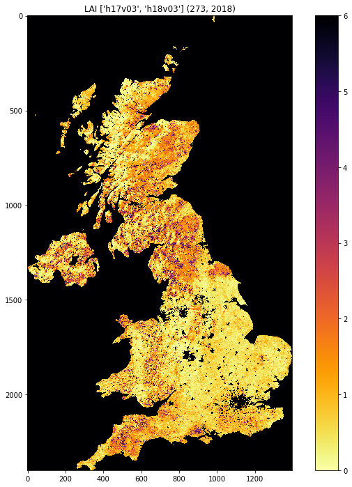

3.2 Accessing MODIS Data products
=================================

.. raw:: html

   <h1>

Table of Contents

.. raw:: html

   </h1>

.. container:: toc

   .. raw:: html

      <ul class="toc-item">

   .. raw:: html

      <li>

   3.2 Accessing MODIS Data products

   .. raw:: html

      <ul class="toc-item">

   .. raw:: html

      <li>

   3.2.1 Introduction

   .. raw:: html

      </li>

   .. raw:: html

      <li>

   3.2.2 Accessing NASA MODIS URLs

   .. raw:: html

      </li>

   .. raw:: html

      <li>

   3.2.2.1 datetime

   .. raw:: html

      <ul class="toc-item">

   .. raw:: html

      <li>

   3.2.2.2 html

   .. raw:: html

      </li>

   .. raw:: html

      </ul>

   .. raw:: html

      </li>

   .. raw:: html

      <li>

   3.2.3 MODIS filename format

   .. raw:: html

      </li>

   .. raw:: html

      <li>

   3.2.4 Saving binary data to a file

   .. raw:: html

      </li>

   .. raw:: html

      <li>

   3.2.4 downloading the data file

   .. raw:: html

      </li>

   .. raw:: html

      <li>

   3.2.5 Visualisation

   .. raw:: html

      </li>

   .. raw:: html

      <li>

   3.2.6 Summary

   .. raw:: html

      </li>

   .. raw:: html

      </ul>

   .. raw:: html

      </li>

   .. raw:: html

      </ul>

3.2.1 Introduction
------------------

[`up to 3.0 <Chapter3_1_GDAL.ipynb>`__]

In this section, you will learn how to:

-  scan the directories (on the Earthdata server) where the MODIS data
   are stored
-  get the dataset filename for a given tile, date and product
-  get to URL associated with the dataset
-  use the URL to pull the dataset over to store in the local file
   system

You should already know:

-  basic use of Python (sections 1 and 2)
-  the MODIS product grid system
-  the two tiles needed to cover the UK

   ::

        tiles = ['h17v03', 'h18v03']

-  what LAI is and the code for the MODIS LAI/FPAR product
   `MOD15 <https://modis.gsfc.nasa.gov/data/dataprod/mod15.php>`__
-  your username and password for `NASA
   Earthdata <https://urs.earthdata.nasa.gov/home>`__, or have
   previously entered this with ```cylog`` <geog0111/cylog.py>`__.

Let’s first just test your NASA login:

.. code:: python

    import geog0111.nasa_requests as nasa_requests
    from geog0111.cylog import cylog
    
    url = 'https://e4ftl01.cr.usgs.gov/MOTA/MCD15A3H.006/2018.09.30/' 
            
    # grab the HTML information
    try:
        html = nasa_requests.get(url).text
        # test a few lines of the html
        if html[:20] == '<!DOCTYPE HTML PUBLI':
            print('this seems to be ok ... ')
            print('use cylog().login() anywhere you need to specify the tuple (username,password)')
    except:
        print('login error ... try entering your username password again')
        print('then re-run this cell until it works')
        cylog(init=True)


.. parsed-literal::

    this seems to be ok ... 
    use cylog().login() anywhere you need to specify the tuple (username,password)


We use the local class ``geog0111.nrequests`` here, in place of the
usual ``requests`` as this lets the user avoid exposure to some of the
tricky bits of getting data from the NASA server.

3.2.2 Accessing NASA MODIS URLs
-------------------------------

Although you can access MODIS datasets through the `NASA
Earthdata <https://urs.earthdata.nasa.gov/home>`__ interface, there are
many occasions that we would want to just automatically pull datasets.
This is particularly true when you want a time series of data that might
involve many files. For example, for analysing LAI or other variables
over space/time) we will want to write code that pulls the time series
of data.

This is also something you will need to do the your assessed practical.

If the data we want to use are accessible to us as a URL, we can simply
use ``requests`` as in previous exercises.

Sometimes, we will be able to specify the parameters of the dataset we
want, e.g. using `JSON <https://www.json.org>`__. At othertimes (as in
the case here) we might need to do a little work ourselves to construct
the particular URL we want.

If you visit the site https://e4ftl01.cr.usgs.gov/MOTA/MCD15A3H.006, you
will see ‘date’ style links (e.g. ``2018.09.30``) through to
sub-directories.

In these,
e.g. \ https://e4ftl01.cr.usgs.gov/MOTA/MCD15A3H.006/2018.09.30/ you
will find URLs of a set of files.

The files pointed to by the URLs are the MODIS MOD15 4-day composite 500
m LAI/FPAR product
`MCD15A3H <https://lpdaac.usgs.gov/dataset_discovery/modis/modis_products_table/mcd15a3h_v006>`__.

There are links to several datasets on the page, including ‘quicklook
files’ that are jpeg format images of the datasets, e.g.:

.. figure:: https://e4ftl01.cr.usgs.gov/MOTA/MCD15A3H.006/2018.09.30/BROWSE.MCD15A3H.A2018273.h17v03.006.2018278143630.1.jpg
   :alt: MCD15A3H.A2018273.h17v03

   MCD15A3H.A2018273.h17v03

as well as ``xml`` files and ``hdf`` datasets.

3.2.2.1 ``datetime``
--------------------

The URL we have used above,
https://e4ftl01.cr.usgs.gov/MOTA/MCD15A3H.006/2018.09.30/ starts with a
call to the server directory ``MOTA``, so we can think of
``https://e4ftl01.cr.usgs.gov/MOTA`` asd the base level URL.

The rest of the directoy information ``MCD15A3H.006/2018.09.30`` tells
us:

-  the product name ``MCD15A3H``
-  the product version ``006``
-  the date of the dataset ``2018.09.30``

There are several ways we could specify the date information. The most
‘human readable’ is probably ``YYYY.MM.DD`` as given here.

Sometimes we will want to refer to it by ‘day of year’ (``doy``)
(sometimes mistakenly referred to as `Julian
day <https://en.wikipedia.org/wiki/Julian_day>`__) for a particular
year. Day of year will be an integer that goes from 1 to 365 or 366
(inclusive).

We can use the Python ``datetime`` to do this:

import datetime

year = 2018

for doy in [1,60,365,366]: # set it up as Jan 1st, plus doy - 1 d =
datetime.datetime(year,1,1) + datetime.timedelta(doy-1)

::

   # note the careful formatting to include zeros in datestr
   datestr = f'{d.year:4d}.{d.month:02d}.{d.day:02d}'

   print(f'doy {doy:3d} in {year} is {datestr}')

**Exercise 3.2.1**

-  copy the above code, and change the year to a leap year to see if it
   works as expected
-  write some code that loops over each day in the year and converts
   from ``doy`` to the format of ``datestr`` above.
-  modify the code so that it forms the full directory URL for the MODIS
   dataset,
   e.g. \ ``https://e4ftl01.cr.usgs.gov/MOTA/MCD15A3H.006/2018.09.30/``
   for each ``doy``
-  use what you have learned to write a function called ``get_url()``,
   which you give the year and day of year and which returns the full
   URL. It should use keywords to define ``product``, ``version`` and
   ``base_url``.
-  For homework, tidy up your function, making sure you document it
   properly. Think aboiut what might happen if you enter incorrect
   information.

**Hint**:

1. number of days in year

   ndays_in_year = (datetime.datetime(year,12,31) -
   datetime.datetime(year,1,1)).days + 1

Remember that ``doy`` goes from 1 to 365 or 366 (inclusive).

2. ``datestr`` format

We use ``datestr = f'{d.year:4d}.{d.month:02d}.{d.day:02d}'`` as the
date string format. The elements such as ``{d.year:4d}`` mean that
``d.year`` is interpreted as an integer (``d``) of length ``4``. When we
put a ``0`` in front, such as in ``02d`` the resultant string is
‘padded’ with ``0``. Try something like:

::

   value = 10
   print(f'{value:X10f}')

3. some bigger hints …

To get the full URL, you will probably want to define something along
the lines of:

::

   url = f'{base_url}/{product}.{version:03d}/{datestr}'

assuming version is an integer.

.. code:: python

    # do exercise here

3.2.2.2 html
~~~~~~~~~~~~

When we access this ‘listing’ (directory links such as
https://e4ftl01.cr.usgs.gov/MOTA/MCD15A3H.006/2018.09.30/) from Python,
we will obtain the information in
`HTML <https://www.w3schools.com/html/>`__. We don’t expect you to know
this language in any great depth, but knowing some of the basics is
oftem useful.

.. code:: python

    import geog0111.nasa_requests as nasa_requests
    from geog0111.get_url import get_url
    import datetime
    
    doy,year = 273,2018
    # use your get_url function
    # or the one supplied in geog0111
    url = get_url(doy,year).url
    print(url)
    
    # pull the html
    html = nasa_requests.get(url).text
    
    # print a few lines of the html
    print(html[:951])
    # etc
    print('\n','-'*30,'etc','-'*30)
    # at the end
    print(html[-964:])


.. parsed-literal::

    https://e4ftl01.cr.usgs.gov/MOTA/MCD15A3H.006/2018.09.30
    <!DOCTYPE HTML PUBLIC "-//W3C//DTD HTML 3.2 Final//EN">
    <html>
     <head>
      <title>Index of /MOTA/MCD15A3H.006/2018.09.30</title>
     </head>
     <body>
    <pre>
    ********************************************************************************
    
                             U.S. GOVERNMENT COMPUTER
    
    This US Government computer is for authorized users only.  By accessing this
    system you are consenting to complete monitoring with no expectation of privacy.
    Unauthorized access or use may subject you to disciplinary action and criminal
    prosecution.
    
    Attention user: You are downloading data from NASA's Land Processes Distributed
    Active Archive Center (LP DAAC) located at the USGS Earth Resources Observation and
    Science (EROS) Center.
    
    Downloading these data requires a NASA Earthdata Login username and password.
    To obtain a NASA Earthdata Login account, please visit
    <a href="https://urs.earthdata.nasa.gov/users/new">https://urs.earthdata.nasa.gov/users/new/</a>
    
     ------------------------------ etc ------------------------------
    
     <a href="MCD15A3H.A2018273.h35v08.006.2018278143649.hdf.xml">MCD15A3H.A2018273.h35v08.006.2018278143649.hdf.xml</a>      2018-10-05 09:42  7.6K  
     <a href="MCD15A3H.A2018273.h35v09.006.2018278143649.hdf">MCD15A3H.A2018273.h35v09.006.2018278143649.hdf</a>          2018-10-05 09:42  207K  
     <a href="MCD15A3H.A2018273.h35v09.006.2018278143649.hdf.xml">MCD15A3H.A2018273.h35v09.006.2018278143649.hdf.xml</a>      2018-10-05 09:42  7.6K  
     <a href="MCD15A3H.A2018273.h35v10.006.2018278143650.hdf">MCD15A3H.A2018273.h35v10.006.2018278143650.hdf</a>          2018-10-05 09:42  298K  
     <a href="MCD15A3H.A2018273.h35v10.006.2018278143650.hdf.xml">MCD15A3H.A2018273.h35v10.006.2018278143650.hdf.xml</a>      2018-10-05 09:42  7.6K  
    <hr></pre>
    </body></html>
    


In HTML the code text such as:

::

   <a href="MCD15A3H.A2018273.h35v10.006.2018278143650.hdf">MCD15A3H.A2018273.h35v10.006.2018278143650.hdf</a>  

specifies an HTML link, that will appear as

::

   MCD15A3H.A2018273.h35v10.006.2018278143650.hdf 2018-10-05 09:42  7.6K 

and link to the URL specified in the ``href`` field:
``MCD15A3H.A2018273.h35v10.006.2018278143650.hdf``.

We could interpret this information by searching for strings etc., but
the package ``BeautifulSoup`` can help us a lot in this.

.. code:: python

    import geog0111.nasa_requests as nasa_requests
    from geog0111.get_url import get_url
    from bs4 import BeautifulSoup
    
    doy,year = 273,2018
    url = get_url(doy,year).url
    html = nasa_requests.get(url).text
    
    # use BeautifulSoup
    # to get all urls referenced with
    # html code <a href="some_url">
    soup = BeautifulSoup(html,'lxml')
    links = [mylink.attrs['href'] for mylink in soup.find_all('a')]

**Exercise E3.2.2**

-  copy the code in the block above and print out some of the
   linformation in the list ``links`` (e.g. the last 20 entries)
-  using an implicit loop, make a list called ``hdf_filenames`` of only
   those filenames (links) that have ``hdf`` as their filename
   extension.

**Hint 1**: first you might select an example item from the ``links``
list:

::

   item = links[-1]
   print('item is',item)

and print:

::

   item[-3:]
       

but maybe better (why would this be?) is:

::

   item.split('.')[-1]

**Hint 2**: An implicit loop is a construct of the form:

::

   [item for item in links]

In an implicit for loop, we can actually add a conditional statement if
we like, e.g. try:

::

   hdf_filenames = [item for item in links if item[-5] == '4']

This will print out ``item`` if the condition ``item[-5] == '4'`` is
met. That’s a bit of a pointless test, but illustrates the pattern
required. Try this now with the condition you want to use to select
``hdf`` files.

.. code:: python

    # do exercise here

3.2.3 MODIS filename format
---------------------------

The ``hdf`` filenames are of the form:

::

   MCD15A3H.A2018273.h35v10.006.2018278143650.hdf

where:

-  the first field (``MCD15A3H``) gives the product code
-  the second (``A2018273``) gives the observation date: day of year
   ``273``, ``2018`` here
-  the third (``h35v10``) gives the ‘MODIS tile’ code for the data
   location
-  the remaining fields specify the product version number (``006``) and
   a code representing the processing date.

If we want a particular dataset, we would assume then that we know the
information to construct the first four fields.

We then have the task remaining of finding an address of the pattern:

::

   MCD15A3H.A2018273.h17v03.006.*.hdf

where ``*`` represents a wildcard (unknown element of the URL/filename).

Putting together the code from above to get a list of the ``hdf`` files:

.. code:: python

    #from geog0111.nasa_requests import nasa_requests
    from bs4 import BeautifulSoup
    from geog0111.get_url import get_url
    import geog0111.nasa_requests as nasa_requests
    
    doy,year = 273,2018
    url = get_url(doy,year).url
    html = nasa_requests.get(url).text
    soup = BeautifulSoup(html,'lxml')
    links = [mylink.attrs['href'] for mylink in soup.find_all('a')]
    
    # get all files that end 'hdf' as in example above
    hdf_filenames = [item for item in links if item.split('.')[-1] == 'hdf']

We now want to specify a particular tile or tiles to access.

In this case, we want to look at the field ``item.split('.')[-4]`` and
check to see if it is the list ``tiles``.

**Exercise 3.2.3**

-  copy the code above and print out the first 10 values in the list
   ``hdf_filenames``. Can you recognise where the tile information is in
   the string?

Now, let’s check what we get when we look at ``item.split('.')[-4]``.

-  set a variable called ``tiles`` containing the names of the UK tiles
   (as in Exercise 3.1.1)
-  write a loop ``for item in links:`` to loop over each item in the
   list ``links``
-  inside this loop set the condition
   ``if item.split('.')[-1] == 'hdf':`` to select only ``hdf`` files, as
   above
-  inside this conditional statement, print out ``item.split('.')[-4]``
   to see if it looks like the tile names
-  having confirmed that you are getting the right information, add
   another conditional statement to see if
   ``item.split('.')[-4] in tiles``, and then print only those filenames
   that pass both of your tests
-  see if you can combine the two tests (the two ``if`` statements) into
   a single one

**Hint 1**: if you print all of the tilenames, this will go on for quite
some time. Instead it may be better to use
``print(item.split('.')[-4],end=' ')``, which will put a space, rather
than a newline between each item printed.

**Hint 2**: recall what the logical statement ``(A and B)`` gives when
thinking about the combined ``if`` statement

.. code:: python

    # do exercise here

You should end up with something like:

.. code:: python

    import geog0111.nasa_requests as nasa_requests
    from bs4 import BeautifulSoup
    from geog0111.get_url import get_url
    
    doy,year = 273,2018
    tiles = ['h17v03', 'h18v03']
    
    url = get_url(doy,year).url
    html = nasa_requests.get(url).text
    soup = BeautifulSoup(html,'lxml')
    links = [mylink.attrs['href'] for mylink in soup.find_all('a')]
    
    tile_filenames = [item for item in links \
                          if (item.split('.')[-1] == 'hdf') and \
                             (item.split('.')[-4] in tiles)]

**Exercise E3.2.4**

-  print out the first 10 items in ``tile_filenames`` and check the
   result is as you expect.
-  write a function called ``modis_tiles()`` that takes as input
   ``doy``, ``year`` and ``tiles`` and returns a list of the modis tile
   **urls**.

**Hint**

1. Don’t forget to put in a mechanism to allow you to change the default
   ``base_url``, ``product`` and ``version`` (as you did for the
   function ``get_url()``)

2. In some circumstances, yopu can get repeats of filenames in the list.
   One way to get around this is to convert the list to a ``numpy``
   array, and use
   ```np.unique()`` <https://docs.scipy.org/doc/numpy-1.15.0/reference/generated/numpy.unique.html>`__
   to remove duplicates.

   ::

       import numpy as np
       tile_filenames = np.unique(tile_filenames)

.. code:: python

    # do exercise here

You should end up with something like:

.. code:: python

    from geog0111.modis_tiles import modis_tiles
    
    doy,year = 273,2018
    tiles = ['h17v03', 'h18v03']
    
    tile_urls = modis_tiles(doy,year,tiles)

**Exercise E3.2.5**

-  print out the first 10 items in ``tile_urls`` and check the result is
   as you expect.

.. code:: python

    # do exercise here

3.2.4 Saving binary data to a file
----------------------------------

We suppose that we want to save the dataset to a local file on the
system.

To do that, we need to know how to save a binary dataset to a file. To
do this well, we should also consider factors such as whether we want to
save a file we already have.

Before we go any further we should check:

-  that the directory exists (if not, create it)
-  that the file doesn’t already exist (else, don’t bother)

We can conveniently use methods in
```pathlib.Path`` <https://docs.python.org/3/library/pathlib.html>`__
for this.

So, import ``Path``:

::

   from pathlib import Path

We suppose we might want to put a file (variable ``filename``) into the
directory ``destination_folder``:

To test if a directory exists and create if not:

::

   dest_path = Path(destination_folder)
   if not dest_path.exists():
       dest_path.mkdir()
       

To make a compound name of ``dest_path`` and ``filename``:

::

   output_fname = dest_path.joinpath(filename)
       

To test if a file exists:

::

   if not output_fname.exists():
       print(f"{str(output_fname))} doesn't exist yet ..."})
       

**Exercise E3.2.6**

-  set a variable ``destination_folder`` to ``data`` and write code to
   create this folder (‘directory’) if it doesn’t already exist.
-  set a variable ``filename`` to ``test.bin`` and write code to check
   to see if this file is in the folder ``destination_folder``. If not,
   print a message to say so.

.. code:: python

    # do exercise here

We now try to read the binary file ``data/test_image.bin``.

This involves opening a binary file for reading:

::

   fp = open(input_fname, 'rb')

Then reading the data:

::

   data = fp.read()

Then close ``fp``

::

   fp.close()

.. code:: python

    input_fname = 'data/test_image.bin'
    fp = open(input_fname, 'rb')
    data = fp.read()
    fp.close()
    print(f'data read is {len(data)} bytes')


.. parsed-literal::

    data read is 9136806 bytes


And now, write the data as ``data/test.bin``.

This involves opening a binary file for writing:

::

   fp = open(output_fname, 'wb')

Then reading the data:

::

   d = fp.write(data)

and closing as before:

::

   fp.close()

.. code:: python

    output_fname = 'data/test.bin'
    fp = open(output_fname, 'wb')
    d = fp.write(data)
    print(f'data written is {d} bytes')


.. parsed-literal::

    data written is 9136806 bytes


We can avoid the need for the ``close`` by using the construct:

::

   with open(output_fname, 'wb') as fp:
       d = fp.write(data)

.. code:: python

    d = 0
    with open(output_fname, 'wb') as fp:
        d = fp.write(data)
    print(f'data written is {d} bytes')


.. parsed-literal::

    data written is 9136806 bytes


**Exercise E3.2.7**

With the ideas above, write some code to:

-  check to see if the output directory ``data`` exists
-  if not, create it
-  check to see if the input file ``data/test_image.bin`` exists
-  if so, read it in to ``data``
-  check to see if the output file ``data/test.bin`` exists
-  if not (and if you read data), save ``data`` to this file
-  once you are happy with the code operation, write a function:
   ``save_data(data,filename,destination_folder)`` that takes the binary
   dataset ``data`` and writes it to the file ``filename`` in directory
   ``destination_folder``. It should return the n umber of bytes
   written, and should check to see if files / directories exist and act
   accordingly.
-  add a keyword option to ``save_data()`` that will overwrite the
   filename, even if it already exists.

.. code:: python

    # do exercise here

You should now know how to save a binary data file.

3.2.4 downloading the data file
-------------------------------

The following code uses the ``nasa_requests`` library to pull some
binary data from a URL.

The response is tested (``r.ok``), and if it is ok, then we split the
url to derive the filename, and print this out.

The binary dataset is available as ``r.content``, which we store to the
variable ``data`` here:

.. code:: python

    import geog0111.nasa_requests as nasa_requests
    from geog0111.modis_tiles import modis_tiles
    from pathlib import Path
    
    doy,year = 273,2018
    tiles = ['h17v03', 'h18v03']
    destination_folder = 'data'
    
    tile_urls = modis_tiles(doy,year,tiles)
    
    # loop over urls
    for url in tile_urls:
        r = nasa_requests.get(url)
        
        # check response
        if r.ok:
            # get the filename from the url
            filename = url.split('/')[-1]
            # get the binary data
            data = r.content
            
            print(filename)
        else:
            print (f'response from {url} not good')


.. parsed-literal::

    MCD15A3H.A2018273.h17v03.006.2018278143630.hdf
    MCD15A3H.A2018273.h18v03.006.2018278143633.hdf


**Exercise E3.2.8**

-  use the code above to write a function ``get_modis_files()`` that
   takes as input ``doy``, ``year`` and ``tiles``, has a default
   ``destination_folder`` of ``data``, that downloads the appropriate
   datasets (if they don’t already exist). It should have similar
   defaults to ``modis_tiles()``. It should return a list of the output
   filenames.

.. code:: python

    # do exercise here

You should end up with something like:

.. code:: python

    import geog0111.nasa_requests as nasa_requests
    from geog0111.save_data import save_data
    
    doy,year = 273,2018
    tiles = ['h17v03', 'h18v03']
    destination_folder = 'data'
    
    tile_urls = modis_tiles(doy,year,tiles)
    
    # loop over urls
    for url in tile_urls:
        r = nasa_requests.get(url)
        
        # check response
        if r.ok:
            # get the filename from the url
            filename = url.split('/')[-1]
            # get the binary data
            d = save_data(r.content,filename,destination_folder)
            print(filename,d)
        else:
            print (f'response from {url} not good')


.. parsed-literal::

    MCD15A3H.A2018273.h17v03.006.2018278143630.hdf 0
    MCD15A3H.A2018273.h18v03.006.2018278143633.hdf 0


3.2.5 Visualisation
-------------------

We will learn more fully how to visualise these later, but just to show
that the datasets exist.

You might want to look at the
`FIPS <https://en.wikipedia.org/wiki/List_of_FIPS_country_codes>`__
country codes for selecting boundary data.

.. code:: python

    import requests
    import shutil 
    '''
    Get the world borders shapefile that we will need
    '''
    tm_borders_url = "http://thematicmapping.org/downloads/TM_WORLD_BORDERS-0.3.zip"
    
    r = requests.get(tm_borders_url)
    with open("data/TM_WORLD_BORDERS-0.3.zip", 'wb') as fp:
        fp.write (r.content)
    
    shutil.unpack_archive("data/TM_WORLD_BORDERS-0.3.zip",
                         extract_dir="data/")

.. code:: python

    from geog0111.get_modis_files import get_modis_files
    import gdal
    import matplotlib.pylab as plt
    import numpy as np
    
    def mosaic_and_mask_data(gdal_fnames, vector_file, vector_where):
        stitch_vrt = gdal.BuildVRT("", gdal_fnames)
        g = gdal.Warp("", stitch_vrt,
                     format = 'MEM', dstNodata=200,
                      cutlineDSName = vector_file,
                      cutlineWhere = vector_where)
        return g
    
    doy,year = 273,2018
    tiles = ['h17v03', 'h18v03']
    destination_folder = 'data'
    
    filenames = get_modis_files(doy,year,tiles,base_url='https://e4ftl01.cr.usgs.gov/MOTA',\
                                               version=6,\
                                               product='MCD15A3H')
    
    # this part is to access a particular dataset in the file
    gdal_fnames = [f'HDF4_EOS:EOS_GRID:"{file_name:s}":MOD_Grid_MCD15A3H:Lai_500m'
                   for file_name in filenames]
    
    
    g = mosaic_and_mask_data(gdal_fnames, "data/TM_WORLD_BORDERS-0.3.shp",
                             "FIPS='UK'")
    
    lai = np.array(g.ReadAsArray()).astype(float) * 0.1 # for LAI scaling
    # valid data mask
    mask = np.nonzero(lai < 20)
    min_y = mask[0].min()
    max_y = mask[0].max() + 1
    
    min_x = mask[1].min()
    max_x = mask[1].max() + 1
    
    lai = lai[min_y:max_y,
                   min_x:max_x]
    
    fig = plt.figure(figsize=(12,12))
    im = plt.imshow(lai, interpolation="nearest", vmin=0, vmax=6,
                 cmap=plt.cm.inferno_r)
    plt.title('LAI'+' '+str(tiles)+' '+str((doy,year)))
    plt.colorbar()


.. parsed-literal::

    <matplotlib.colorbar.Colorbar at 0x1196614a8>





.. code:: python

    from geog0111.get_modis_files import get_modis_files
    import gdal
    import matplotlib.pylab as plt
    import numpy as np
    
    def mosaic_and_mask_data(gdal_fnames, vector_file, vector_where):
        stitch_vrt = gdal.BuildVRT("", gdal_fnames)
        g = gdal.Warp("", stitch_vrt,
                     format = 'MEM', dstNodata=200,
                      cutlineDSName = vector_file,
                      cutlineWhere = vector_where)
        return g
    
    doy,year = 273,2018
    tiles = ['h17v03', 'h18v03']
    destination_folder = 'data'
    
    filenames = get_modis_files(doy,year,tiles,base_url='https://e4ftl01.cr.usgs.gov/MOTA',\
                                               version=6,\
                                               product='MCD15A3H')
    
    # this part is to access a particular dataset in the file
    gdal_fnames = [f'HDF4_EOS:EOS_GRID:"{file_name:s}":MOD_Grid_MCD15A3H:Lai_500m'
                   for file_name in filenames]
    
    g = mosaic_and_mask_data(gdal_fnames, "data/TM_WORLD_BORDERS-0.3.shp",
                             "FIPS='NL'")
    
    lai = np.array(g.ReadAsArray()).astype(float) * 0.1 # for LAI scaling
    # valid data mask
    mask = np.nonzero(lai < 20)
    min_y = mask[0].min()
    max_y = mask[0].max() + 1
    
    min_x = mask[1].min()
    max_x = mask[1].max() + 1
    
    lai = lai[min_y:max_y,
                   min_x:max_x]
    
    fig = plt.figure(figsize=(12,12))
    im = plt.imshow(lai, interpolation="nearest", vmin=0, vmax=6,
                 cmap=plt.cm.inferno_r)
    plt.title('LAI'+' '+str(tiles)+' '+str((doy,year)))
    plt.colorbar()


.. parsed-literal::

    <matplotlib.colorbar.Colorbar at 0x119591940>


.. image:: Chapter3_2_MODIS_download_files/Chapter3_2_MODIS_download_51_1.png


**Exercise 3.2.7 Homework**

-  Have a look at the information for ```MOD10A1``
   product <http://www.icess.ucsb.edu/modis/SnowUsrGuide/usrguide_1dtil.html>`__,
   which is the 500 m MODIS daily snow cover product.
-  Use what you have learned here to download the MOD10A product over
   the UK

**Hint**: \* The data are on a different server
``https://n5eil01u.ecs.nsidc.org/MOST`` \* the template for the snow
cover dataxset is
``f'HDF4_EOS:EOS_GRID:"{file_name:s}":MOD_Grid_Snow_500m:NDSI_Snow_Cover'``
\* today-10 may not be the best example doy: choose something in winter
\* valid snow cover values are 0 to 100 (use this to set
``vmin=0, vmax=100`` when plotting)

**N.B. You will be required to download this dataset for your assessed
practical, so it is a good idea to sort code for this now**

.. code:: python

    # do exercise here

3.2.6 Summary
-------------

In this session, we have learned how to download MODIS datasets from
NASA Earthdata.

We have developed and tested functions that group together the commands
we want, ultimately arriving at the function
``get_modis_files(doy,year,tiles,**kwargs)``.

We have seen ((if you’ve done the homework) that such code is re-useable
and can directly be used for your assessed practical.
