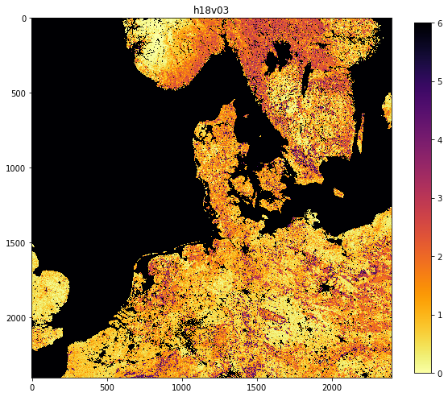
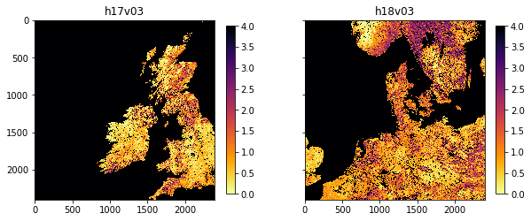
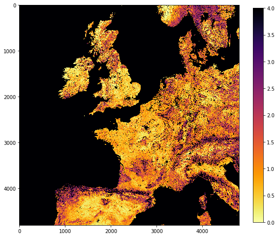
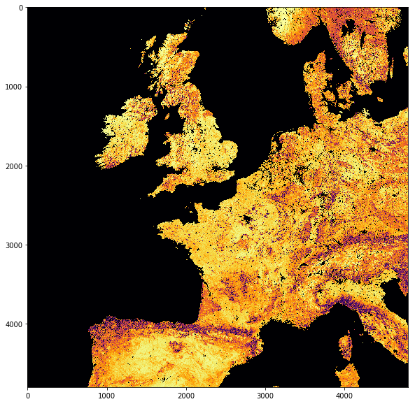
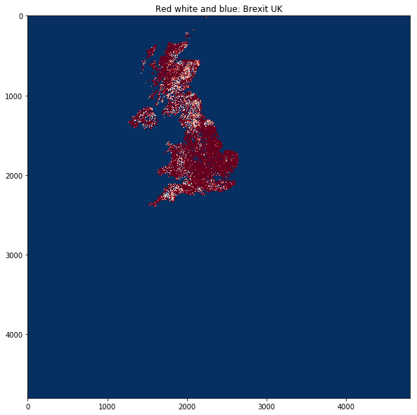
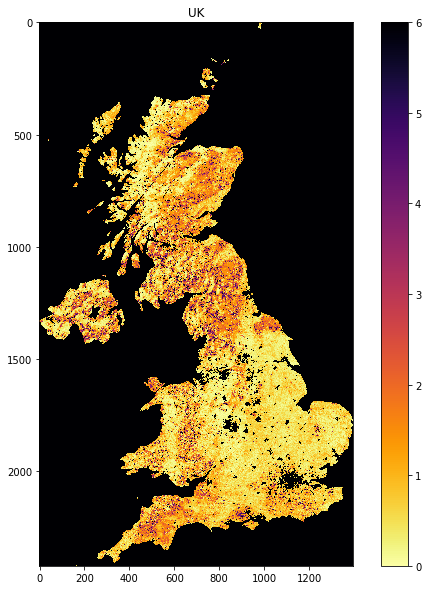

3.3 GDAL, and OGR masking
=========================

.. raw:: html

   <h1>

Table of Contents

.. raw:: html

   </h1>

.. container:: toc

   .. raw:: html

      <ul class="toc-item">

   .. raw:: html

      <li>

   3.3 GDAL, and OGR masking

   .. raw:: html

      <ul class="toc-item">

   .. raw:: html

      <li>

   3.3.1 The MODIS LAI data

   .. raw:: html

      <ul class="toc-item">

   .. raw:: html

      <li>

   3.3.1.1 try … except …

   .. raw:: html

      </li>

   .. raw:: html

      <li>

   3.3.1.2 Get data

   .. raw:: html

      </li>

   .. raw:: html

      <li>

   3.3.1.3 File Naming Convention

   .. raw:: html

      </li>

   .. raw:: html

      <li>

   3.3.1.2 Dataset Naming Convention

   .. raw:: html

      </li>

   .. raw:: html

      </ul>

   .. raw:: html

      </li>

   .. raw:: html

      <li>

   3.3.2 MODIS dataset access

   .. raw:: html

      <ul class="toc-item">

   .. raw:: html

      <li>

   3.3.2.1 gdal.ReadAsArray()

   .. raw:: html

      </li>

   .. raw:: html

      <li>

   3.3.2.2 Metadata

   .. raw:: html

      </li>

   .. raw:: html

      </ul>

   .. raw:: html

      </li>

   .. raw:: html

      <li>

   3.3.3 Reading and displaying data

   .. raw:: html

      <ul class="toc-item">

   .. raw:: html

      <li>

   3.3.3.1 glob

   .. raw:: html

      </li>

   .. raw:: html

      <li>

   3.3.3.2 reading and displaying image data

   .. raw:: html

      </li>

   .. raw:: html

      <li>

   3.3.3.3 subplot plotting

   .. raw:: html

      </li>

   .. raw:: html

      <li>

   3.3.3.3 tile stitching

   .. raw:: html

      </li>

   .. raw:: html

      <li>

   3.3.3.4 gdal virtual file

   .. raw:: html

      </li>

   .. raw:: html

      </ul>

   .. raw:: html

      </li>

   .. raw:: html

      <li>

   3.3.4 The country borders dataset

   .. raw:: html

      </li>

   .. raw:: html

      </ul>

   .. raw:: html

      </li>

   .. raw:: html

      </ul>

[`up to 3.0 <Chapter3_1_GDAL.ipynb>`__]

In this section, we’ll look at combining both raster and vector data to
provide a masked dataset ready to use. We will produce a combined
dataset of leaf area index (LAI) over the UK derived from the MODIS
sensor. The MODIS LAI product is produced every 4 days and it is
provided spatially tiled. Each tile covers around 1200 km x 1200 km of
the Earth’s surface. Below you can see a map showing the MODIS tiling
convention.

3.3.1 The MODIS LAI data
------------------------

Let’s first test your NASA login:

.. code:: ipython3

    import geog0111.nasa_requests as nasa_requests
    from geog0111.cylog import cylog
    %matplotlib inline
    
    url = 'https://e4ftl01.cr.usgs.gov/MOTA/MCD15A3H.006/2018.09.30/' 
            
    # grab the HTML information
    try:
        html = nasa_requests.get(url).text
        # test a few lines of the html
        if html[:20] == '<!DOCTYPE HTML PUBLI':
            print('this seems to be ok ... ')
            print('use cylog().login() anywhere you need to specify the tuple (username,password)')
    except:
        print('login error ... try entering your username password again')
        print('then re-run this cell until it works')
        cylog(init=True)


.. parsed-literal::

    this seems to be ok ... 
    use cylog().login() anywhere you need to specify the tuple (username,password)


3.3.1.1 ``try ... except ...``
~~~~~~~~~~~~~~~~~~~~~~~~~~~~~~

Note that we have used a ``try ... except`` structure above to trap any
errors.

.. code:: ipython3

    import sys
    try:
        # variable stupid not set
        print("I'm trying this but it will fail",stupid)
    except NameError:
        '''
        trap the error
        (and ideally define some sensible behaviour)
        '''
        print("unset variable:",sys.exc_info()[1])
    except:
        print("In case of other errors")
        print(sys.exc_info())
        # raise our own exception
        raise Exception('bad code')


.. parsed-literal::

    unset variable: name 'stupid' is not defined


Generally, you should try to foresee the types of error you might
generate, and provide specific traps for these so youy can control the
code better.

In the case above, we allow the code execution to continue with a
``NameError``, but raise a further exception in case of any other
errors.

``sys.exc_info()`` provides a tuple of information on what happened.

**Exercise**

-  Write some code using ``try ... except`` to trap a
   ``ZeroDivisionError``
-  provide a sensible result in such a case

**hint**

If you divide by zero, the result will be infinity, which is often not
what you want to happen. Instead, try dividing by a small number, such
as that provided by ``sys.float_info.epsilon``.

.. code:: ipython3

    # do exercise here

3.3.1.2 Get data
~~~~~~~~~~~~~~~~

You should by now be able to download MODIS data, but in this case, the
data are provided (or downloaded for you) in the ``data`` folder as
files ``MCD15A3H.A2018273.h17v03.006.2018278143630.hdf`` and
``MCD15A3H.A2018273.h18v03.006.2018278143633.hdf`` (and some files
``*v04*hdf`` we will need later) by running the code below.

.. code:: ipython3

    from geog0111.geog_data import *
    
    filenames = ['MCD15A3H.A2018273.h17v03.006.2018278143630.hdf', \
                'MCD15A3H.A2018273.h18v03.006.2018278143633.hdf',\
                'MCD15A3H.A2018273.h17v04.006.2018278143630.hdf',\
                'MCD15A3H.A2018273.h18v04.006.2018278143638.hdf']
    destination_folder="data"
    
    for file_name in filenames:
        f = procure_dataset(file_name,verbose=True,\
                            destination_folder=destination_folder)
        print(file_name,f)


.. parsed-literal::

    MCD15A3H.A2018273.h17v03.006.2018278143630.hdf True
    MCD15A3H.A2018273.h18v03.006.2018278143633.hdf True
    MCD15A3H.A2018273.h17v04.006.2018278143630.hdf True
    MCD15A3H.A2018273.h18v04.006.2018278143638.hdf True


We want to select the LAI layers, so let’s have a look at the contents
(‘sub datasets’) of one of the files.

To do this with ``gdal``:

-  make the full filename (folder name, plus the filename in that
   folder). Use ``Path`` for this, but convert to a string.
-  open the file, store as ``g``
-  get the list ``g.GetSubDatasets()`` and loop over this

.. code:: ipython3

    import gdal
    from pathlib import Path
    from geog0111.geog_data import *
    
    filenames = ['MCD15A3H.A2018273.h17v03.006.2018278143630.hdf', \
                'MCD15A3H.A2018273.h18v03.006.2018278143633.hdf']
    destination_folder="data"
    
    for file_name in filenames:
        # form full filename as a string
        # and print with an underline of = 
        file_name = Path(destination_folder).joinpath(file_name).as_posix()
        print(file_name)
        print('='*len(file_name))
        
        # open the file as g
        g = gdal.Open(file_name)
        # loop over the subdatasets
        for d in g.GetSubDatasets():
            print(d)


.. parsed-literal::

    data/MCD15A3H.A2018273.h17v03.006.2018278143630.hdf
    ===================================================
    ('HDF4_EOS:EOS_GRID:"data/MCD15A3H.A2018273.h17v03.006.2018278143630.hdf":MOD_Grid_MCD15A3H:Fpar_500m', '[2400x2400] Fpar_500m MOD_Grid_MCD15A3H (8-bit unsigned integer)')
    ('HDF4_EOS:EOS_GRID:"data/MCD15A3H.A2018273.h17v03.006.2018278143630.hdf":MOD_Grid_MCD15A3H:Lai_500m', '[2400x2400] Lai_500m MOD_Grid_MCD15A3H (8-bit unsigned integer)')
    ('HDF4_EOS:EOS_GRID:"data/MCD15A3H.A2018273.h17v03.006.2018278143630.hdf":MOD_Grid_MCD15A3H:FparLai_QC', '[2400x2400] FparLai_QC MOD_Grid_MCD15A3H (8-bit unsigned integer)')
    ('HDF4_EOS:EOS_GRID:"data/MCD15A3H.A2018273.h17v03.006.2018278143630.hdf":MOD_Grid_MCD15A3H:FparExtra_QC', '[2400x2400] FparExtra_QC MOD_Grid_MCD15A3H (8-bit unsigned integer)')
    ('HDF4_EOS:EOS_GRID:"data/MCD15A3H.A2018273.h17v03.006.2018278143630.hdf":MOD_Grid_MCD15A3H:FparStdDev_500m', '[2400x2400] FparStdDev_500m MOD_Grid_MCD15A3H (8-bit unsigned integer)')
    ('HDF4_EOS:EOS_GRID:"data/MCD15A3H.A2018273.h17v03.006.2018278143630.hdf":MOD_Grid_MCD15A3H:LaiStdDev_500m', '[2400x2400] LaiStdDev_500m MOD_Grid_MCD15A3H (8-bit unsigned integer)')
    data/MCD15A3H.A2018273.h18v03.006.2018278143633.hdf
    ===================================================
    ('HDF4_EOS:EOS_GRID:"data/MCD15A3H.A2018273.h18v03.006.2018278143633.hdf":MOD_Grid_MCD15A3H:Fpar_500m', '[2400x2400] Fpar_500m MOD_Grid_MCD15A3H (8-bit unsigned integer)')
    ('HDF4_EOS:EOS_GRID:"data/MCD15A3H.A2018273.h18v03.006.2018278143633.hdf":MOD_Grid_MCD15A3H:Lai_500m', '[2400x2400] Lai_500m MOD_Grid_MCD15A3H (8-bit unsigned integer)')
    ('HDF4_EOS:EOS_GRID:"data/MCD15A3H.A2018273.h18v03.006.2018278143633.hdf":MOD_Grid_MCD15A3H:FparLai_QC', '[2400x2400] FparLai_QC MOD_Grid_MCD15A3H (8-bit unsigned integer)')
    ('HDF4_EOS:EOS_GRID:"data/MCD15A3H.A2018273.h18v03.006.2018278143633.hdf":MOD_Grid_MCD15A3H:FparExtra_QC', '[2400x2400] FparExtra_QC MOD_Grid_MCD15A3H (8-bit unsigned integer)')
    ('HDF4_EOS:EOS_GRID:"data/MCD15A3H.A2018273.h18v03.006.2018278143633.hdf":MOD_Grid_MCD15A3H:FparStdDev_500m', '[2400x2400] FparStdDev_500m MOD_Grid_MCD15A3H (8-bit unsigned integer)')
    ('HDF4_EOS:EOS_GRID:"data/MCD15A3H.A2018273.h18v03.006.2018278143633.hdf":MOD_Grid_MCD15A3H:LaiStdDev_500m', '[2400x2400] LaiStdDev_500m MOD_Grid_MCD15A3H (8-bit unsigned integer)')


So we see that the data is in ``HDF4`` format, and that it has a number
of layers. The dataset/layer we’re interested in

``HDF4_EOS:EOS_GRID:"data/MCD15A3H.A2018273.h18v03.006.2018278143633.hdf":MOD_Grid_MCD15A3H:Lai_500m``.

3.3.1.3 File Naming Convention
~~~~~~~~~~~~~~~~~~~~~~~~~~~~~~

This section taken from `NASA MODIS product
page <https://nsidc.org/data/mod10a1>`__.

Example File Name:

``data/MOD10A1.A2000055.h15v01.006.2016061160800.hdf``

``FOLDER/MOD[PID].A[YYYY][DDD].h[NN]v[NN].[VVV].[yyyy][ddd][hhmmss].hdf``

Refer to Table 3.3.1 for descriptions of the file name variables listed
above.

+-----------------------------------+-----------------------------------+
| Variable                          | Description                       |
+===================================+===================================+
| FOLDER                            | folder/directory name of file     |
+-----------------------------------+-----------------------------------+
| MOD                               | MODIS/Terra (``MCD`` means        |
|                                   | combined)                         |
+-----------------------------------+-----------------------------------+
| PID                               | Product ID                        |
+-----------------------------------+-----------------------------------+
| A                                 | Acquisition date follows          |
+-----------------------------------+-----------------------------------+
| YYYY                              | Acquisition year                  |
+-----------------------------------+-----------------------------------+
| DDD                               | Acquisition day of year           |
+-----------------------------------+-----------------------------------+
| h[NN]v[NN]                        | Horizontal tile number and        |
|                                   | vertical tile number (see Grid    |
|                                   | for details.)                     |
+-----------------------------------+-----------------------------------+
| VVV                               | Version (Collection) number       |
+-----------------------------------+-----------------------------------+
| yyyy                              | Production year                   |
+-----------------------------------+-----------------------------------+
| ddd                               | Production day of year            |
+-----------------------------------+-----------------------------------+
| hhmmss                            | Production hour/minute/second in  |
|                                   | GMT                               |
+-----------------------------------+-----------------------------------+
| .hdf                              | HDF-EOS formatted data file       |
+-----------------------------------+-----------------------------------+

Table 3.3.1. Variables in the MODIS File Naming Convention

|image0|

3.3.1.2 Dataset Naming Convention
~~~~~~~~~~~~~~~~~~~~~~~~~~~~~~~~~

Example Dataset Name:

``HDF4_EOS:EOS_GRID:"data/MCD15A3H.A2018273.h18v03.006.2018278143633.hdf":MOD_Grid_MCD15A3H:Lai_500m``

``FORMAT:"FILENAME":MOD_Grid_PRODUCT:LAYER``

======== ======================================
Variable Description
======== ======================================
FORMAT   file format, ``HDF4_EOS:EOS_GRID``
FILENAME dataset file name, see below
PRODUCT  MODIS product code e.g. \ ``MCD15A3H``
LAYER    sub-dataset name e.g. \ ``Lai_500m``
======== ======================================

Table 3.3.2. Variables in the MODIS Dataset Naming Convention

**Exercise E3.3.1**

-  Check you’re happy that the other datasets (e.g. ``LaiStdDev_500m``)
   follow the same convention as ``Lai_500m``
-  work out what the dataset/layer name would be for the dataset product
   ``MOD10A1`` version ``6`` for the :math:`1^{st}` January 2018, for
   tile ``h25v06`` for the layer ``NDSI_Snow_Cover``. You will find
   product information `on the relevant NASA
   page <https://nsidc.org/data/mod10a1>`__. You may not be able to
   access the production date/time, but just put a placeholder for that
   now.
-  phrase the filename and layer name as ‘``f``’ strings, e.g. starting
   ``f'HDF4_EOS:EOS_GRID:"{filename}":MOD_Grid_{}'`` etc.

**Hint**:

You can explore the filenames by looking into the `Earthdata
link <https://n5eil01u.ecs.nsidc.org/MOSA/>`__.

|image1|

.. |image0| image:: https://nsidc.org/sites/nsidc.org/files/images/modis-sin-grid.png
.. |image1| image:: images/BROWSE.MYD10A1.A2018001.h25v05.006.2018003025825.1.jpg

.. code:: ipython3

    # do exercise here

3.3.2 MODIS dataset access
--------------------------

3.3.2.1 ``gdal.ReadAsArray()``
~~~~~~~~~~~~~~~~~~~~~~~~~~~~~~

We can now access the dataset names and open the datasets in ``gdal``
directly, e.g.:

``HDF4_EOS:EOS_GRID:"data/MCD15A3H.A2018273.h18v03.006.2018278143633.hdf":MOD_Grid_MCD15A3H:Lai_500m``

We can read the dataset with ``g.ReadAsArray()``, after we have opened
it. It returns a numpy array.

.. code:: ipython3

    import gdal
    import numpy as np
    
    filename = 'data/MCD15A3H.A2018273.h17v03.006.2018278143630.hdf'
    dataset_name = f'HDF4_EOS:EOS_GRID:"{filename:s}":MOD_Grid_MCD15A3H:Lai_500m'
    print(f"dataset: {dataset_name}")
    
    g = gdal.Open(dataset_name)
    data = g.ReadAsArray()
    
    print(type(data))
    print('max:',data.max())
    print('max:',data.min())
    # get unique values, for interst
    print('unique values:',np.unique(data))


.. parsed-literal::

    dataset: HDF4_EOS:EOS_GRID:"data/MCD15A3H.A2018273.h17v03.006.2018278143630.hdf":MOD_Grid_MCD15A3H:Lai_500m
    <class 'numpy.ndarray'>
    max: 255
    max: 0
    unique values: [  0   1   2   3   4   5   6   7   8   9  10  11  12  13  14  15  16  17
      18  19  20  21  22  23  24  25  26  27  28  29  30  31  32  33  34  35
      36  37  38  39  40  41  42  43  44  45  46  47  48  49  50  51  52  53
      54  55  56  57  58  59  60  61  62  63  64  65  66  67  68  69  70 250
     253 254 255]


**Exercise E3.3.2**

-  print out some further summary statistics of the dataset
-  print out the data type and ``shape``
-  how many rows and columns does the dataset have?

.. code:: ipython3

    # do exercise here

3.3.2.2 Metadata
~~~~~~~~~~~~~~~~

There will generally be a set of metadata associated with a geospatial
dataset. This will describe e.g. the processing chain, special codes in
the dataset, and projection and other information.

In ``gdal``, w access the metedata using ``g.GetMetadata()``. A
dictionary is returned.

.. code:: ipython3

    filename = 'data/MCD15A3H.A2018273.h17v03.006.2018278143630.hdf'
    dataset_name = f'HDF4_EOS:EOS_GRID:"{filename:s}":MOD_Grid_MCD15A3H:Lai_500m'
    g = gdal.Open(dataset_name)
    
    print ("\nMetedata Keys:\n")
    # get the metadata dictionary keys
    for k in g.GetMetadata().keys():
        print(k)


.. parsed-literal::

    
    Metedata Keys:
    
    add_offset
    add_offset_err
    ALGORITHMPACKAGEACCEPTANCEDATE
    ALGORITHMPACKAGEMATURITYCODE
    ALGORITHMPACKAGENAME
    ALGORITHMPACKAGEVERSION
    ASSOCIATEDINSTRUMENTSHORTNAME.1
    ASSOCIATEDINSTRUMENTSHORTNAME.2
    ASSOCIATEDPLATFORMSHORTNAME.1
    ASSOCIATEDPLATFORMSHORTNAME.2
    ASSOCIATEDSENSORSHORTNAME.1
    ASSOCIATEDSENSORSHORTNAME.2
    AUTOMATICQUALITYFLAG.1
    AUTOMATICQUALITYFLAGEXPLANATION.1
    calibrated_nt
    CHARACTERISTICBINANGULARSIZE500M
    CHARACTERISTICBINSIZE500M
    DATACOLUMNS500M
    DATAROWS500M
    DAYNIGHTFLAG
    DESCRREVISION
    EASTBOUNDINGCOORDINATE
    ENGINEERING_DATA
    EXCLUSIONGRINGFLAG.1
    GEOANYABNORMAL
    GEOESTMAXRMSERROR
    GLOBALGRIDCOLUMNS500M
    GLOBALGRIDROWS500M
    GRANULEBEGINNINGDATETIME
    GRANULEDAYNIGHTFLAG
    GRANULEENDINGDATETIME
    GRINGPOINTLATITUDE.1
    GRINGPOINTLONGITUDE.1
    GRINGPOINTSEQUENCENO.1
    HDFEOSVersion
    HORIZONTALTILENUMBER
    identifier_product_doi
    identifier_product_doi_authority
    INPUTPOINTER
    LOCALGRANULEID
    LOCALVERSIONID
    LONGNAME
    long_name
    MAXIMUMOBSERVATIONS500M
    MOD15A1_ANC_BUILD_CERT
    MOD15A2_FILLVALUE_DOC
    MOD15A2_FparExtra_QC_DOC
    MOD15A2_FparLai_QC_DOC
    MOD15A2_StdDev_QC_DOC
    NADIRDATARESOLUTION500M
    NDAYS_COMPOSITED
    NORTHBOUNDINGCOORDINATE
    NUMBEROFGRANULES
    PARAMETERNAME.1
    PGEVERSION
    PROCESSINGCENTER
    PROCESSINGENVIRONMENT
    PRODUCTIONDATETIME
    QAPERCENTCLOUDCOVER.1
    QAPERCENTEMPIRICALMODEL
    QAPERCENTGOODFPAR
    QAPERCENTGOODLAI
    QAPERCENTGOODQUALITY
    QAPERCENTINTERPOLATEDDATA.1
    QAPERCENTMAINMETHOD
    QAPERCENTMISSINGDATA.1
    QAPERCENTOTHERQUALITY
    QAPERCENTOUTOFBOUNDSDATA.1
    RANGEBEGINNINGDATE
    RANGEBEGINNINGTIME
    RANGEENDINGDATE
    RANGEENDINGTIME
    REPROCESSINGACTUAL
    REPROCESSINGPLANNED
    scale_factor
    scale_factor_err
    SCIENCEQUALITYFLAG.1
    SCIENCEQUALITYFLAGEXPLANATION.1
    SHORTNAME
    SOUTHBOUNDINGCOORDINATE
    SPSOPARAMETERS
    SYSTEMFILENAME
    TileID
    UM_VERSION
    units
    valid_range
    VERSIONID
    VERTICALTILENUMBER
    WESTBOUNDINGCOORDINATE
    _FillValue


Let’s look at some of these metadata fields:

.. code:: ipython3

    import gdal
    import numpy as np
    
    filename = 'data/MCD15A3H.A2018273.h17v03.006.2018278143630.hdf'
    dataset_name = f'HDF4_EOS:EOS_GRID:"{filename:s}":MOD_Grid_MCD15A3H:Lai_500m'
    print(f"dataset: {dataset_name}")
    
    g = gdal.Open(dataset_name)
    # get the metadata dictionary keys
    for k in ["LONGNAME","CHARACTERISTICBINSIZE500M",\
              "MOD15A2_FILLVALUE_DOC",\
              "GRINGPOINTLATITUDE.1","GRINGPOINTLONGITUDE.1",\
              'scale_factor']:
        print(k,g.GetMetadata()[k])


.. parsed-literal::

    dataset: HDF4_EOS:EOS_GRID:"data/MCD15A3H.A2018273.h17v03.006.2018278143630.hdf":MOD_Grid_MCD15A3H:Lai_500m
    LONGNAME MODIS/Terra+Aqua Leaf Area Index/FPAR 4-Day L4 Global 500m SIN Grid
    CHARACTERISTICBINSIZE500M 463.312716527778
    MOD15A2_FILLVALUE_DOC MOD15A2 FILL VALUE LEGEND
    255 = _Fillvalue, assigned when:
        * the MOD09GA suf. reflectance for channel VIS, NIR was assigned its _Fillvalue, or
        * land cover pixel itself was assigned _Fillvalus 255 or 254.
    254 = land cover assigned as perennial salt or inland fresh water.
    253 = land cover assigned as barren, sparse vegetation (rock, tundra, desert.)
    252 = land cover assigned as perennial snow, ice.
    251 = land cover assigned as "permanent" wetlands/inundated marshlands.
    250 = land cover assigned as urban/built-up.
    249 = land cover assigned as "unclassified" or not able to determine.
    
    GRINGPOINTLATITUDE.1 49.7394264948349, 59.9999999946118, 60.0089388384779, 49.7424953501575
    GRINGPOINTLONGITUDE.1 -15.4860189105775, -19.9999999949462, 0.0325645816155362, 0.0125638874822839
    scale_factor 0.1


So we see that the datasets use the MODIS Sinusoidal projection. Also we
see that the pixel spacing is around 463m, there is a scale factor of
0.1 to be applied etc.

**Exercise E3.3.3**

look at the metadata to discover:

-  the number of rows and columns in the dataset
-  the range of valid values

.. code:: ipython3

    # do exercise here

3.3.3 Reading and displaying data
---------------------------------

3.3.3.1 ``glob``
~~~~~~~~~~~~~~~~

Let us now suppose that we want to examine an ``hdf`` file that we have
previously downloaded and stored in the directiory ``data``.

How can we get a view into this directory to the the names of the files
there?

The answer to this is ``glob``, which we can access from the ``pathlib``
module.

Let’s look in the ``data`` directory:

.. code:: ipython3

    from pathlib import Path
    
    # look in this directory
    in_directory = Path('data')
    
    filenames = in_directory.glob('*')
    print('files in the directory',in_directory,':')
    for f in filenames:
        print(f.name)


.. parsed-literal::

    files in the directory data :
    MCD15A3H.A2016005.h17v04.006.2016013011406.hdf
    MCD15A3H.A2016001.h18v04.006.2016007073726.hdf
    MCD15A3H.A2016021.h18v03.006.2016026124743.hdf
    MCD15A3H.A2018273.h17v04.006.2018278143630.hdf
    MCD15A3H.A2016021.h17v03.006.2016026124738.hdf
    MCD15A3H.A2016013.h17v03.006.2016020015242.hdf
    airtravel.csv
    MCD15A3H.A2016033.h17v04.006.2016043140634.hdf
    MCD15A3H.A2016009.h18v03.006.2016014073048.hdf
    test_image.bin
    MCD15A3H.A2016033.h18v03.006.2016043140641.hdf
    MCD15A3H.A2018273.h18v03.006.2018278143633.hdf
    MCD15A3H.A2016021.h18v04.006.2016026124707.hdf
    MCD15A3H.A2016005.h17v03.006.2016013012017.hdf
    satellites-1957-2019.gz
    MCD15A3H.A2016017.h17v04.006.2016027192758.hdf
    TM_WORLD_BORDERS-0.3.prj
    MCD15A3H.A2016029.h17v03.006.2016043140323.hdf
    saved_daymet.csv
    TM_WORLD_BORDERS-0.3.zip
    MCD15A3H.A2016013.h17v04.006.2016020020246.hdf
    MCD15A3H.A2016009.h18v04.006.2016014074158.hdf
    MCD15A3H.A2016017.h17v03.006.2016027192752.hdf
    MCD15A3H.A2018273.h18v04.006.2018278143638.hdf
    MCD15A3H.A2016029.h18v04.006.2016043140353.hdf
    MCD15A3H.A2016025.h17v03.006.2016034034334.hdf
    MCD15A3H.A2016013.h18v03.006.2016020014424.hdf
    MCD15A3H.A2016025.h18v03.006.2016034034341.hdf
    MCD15A3H.A2016009.h17v04.006.2016014072006.hdf
    daymet_tmax.csv
    MCD15A3H.A2016021.h17v04.006.2016026124414.hdf
    MCD15A3H.A2016017.h18v03.006.2016027193558.hdf
    MCD15A3H.A2016029.h17v04.006.2016043140330.hdf
    MCD15A3H.A2016025.h17v04.006.2016034035837.hdf
    MCD15A3H.A2016013.h18v04.006.2016020014435.hdf
    MCD15A3H.A2016001.h17v03.006.2016007075833.hdf
    MCD15A3H.A2016017.h18v04.006.2016027193356.hdf
    TM_WORLD_BORDERS-0.3.dbf
    MCD15A3H.A2016029.h18v03.006.2016043140341.hdf
    Readme.txt
    test.bin
    TM_WORLD_BORDERS-0.3.shx
    NOAA.csv
    MCD15A3H.A2016025.h18v04.006.2016034034846.hdf
    MCD15A3H.A2016033.h18v04.006.2016043140709.hdf
    TM_WORLD_BORDERS-0.3.shp
    MCD15A3H.A2016033.h17v03.006.2016043140622.hdf
    MCD15A3H.A2016005.h18v03.006.2016013012348.hdf
    MCD15A3H.A2016005.h18v04.006.2016013012025.hdf
    MCD15A3H.A2016037.h17v03.006.2016043140850.hdf
    MCD15A3H.A2016009.h17v03.006.2016014071957.hdf
    MCD15A3H.A2018273.h17v03.006.2018278143630.hdf
    MCD15A3H.A2016001.h17v04.006.2016007074809.hdf
    MCD15A3H.A2016001.h18v03.006.2016007073724.hdf


We use the argument ``'data/*'`` where ``*`` is a wildcard. Any
filenames that match this pattern will be returned as a list.

If we want the list sorted, we need to use the ``sorted()`` method. This
is similar to the list ``sort`` we have seen previously, but returns the
sorted list.

The wildcard ``*`` here means a match to zero or more characters, so
this is matching all names in the directory ``data``. The wildcard
``**`` would mean `all files here and all
sub-directories <https://docs.python.org/3/library/pathlib.html#pathlib.Path.glob>`__.

We could be more subtle with this, e.g. matching only files ending
``hdf``:

.. code:: ipython3

    from pathlib import Path
    
    filenames = sorted(Path('data').glob('*'))
    
    for f in filenames:
        print(f.name)


.. parsed-literal::

    MCD15A3H.A2016001.h17v03.006.2016007075833.hdf
    MCD15A3H.A2016001.h17v04.006.2016007074809.hdf
    MCD15A3H.A2016001.h18v03.006.2016007073724.hdf
    MCD15A3H.A2016001.h18v04.006.2016007073726.hdf
    MCD15A3H.A2016005.h17v03.006.2016013012017.hdf
    MCD15A3H.A2016005.h17v04.006.2016013011406.hdf
    MCD15A3H.A2016005.h18v03.006.2016013012348.hdf
    MCD15A3H.A2016005.h18v04.006.2016013012025.hdf
    MCD15A3H.A2016009.h17v03.006.2016014071957.hdf
    MCD15A3H.A2016009.h17v04.006.2016014072006.hdf
    MCD15A3H.A2016009.h18v03.006.2016014073048.hdf
    MCD15A3H.A2016009.h18v04.006.2016014074158.hdf
    MCD15A3H.A2016013.h17v03.006.2016020015242.hdf
    MCD15A3H.A2016013.h17v04.006.2016020020246.hdf
    MCD15A3H.A2016013.h18v03.006.2016020014424.hdf
    MCD15A3H.A2016013.h18v04.006.2016020014435.hdf
    MCD15A3H.A2016017.h17v03.006.2016027192752.hdf
    MCD15A3H.A2016017.h17v04.006.2016027192758.hdf
    MCD15A3H.A2016017.h18v03.006.2016027193558.hdf
    MCD15A3H.A2016017.h18v04.006.2016027193356.hdf
    MCD15A3H.A2016021.h17v03.006.2016026124738.hdf
    MCD15A3H.A2016021.h17v04.006.2016026124414.hdf
    MCD15A3H.A2016021.h18v03.006.2016026124743.hdf
    MCD15A3H.A2016021.h18v04.006.2016026124707.hdf
    MCD15A3H.A2016025.h17v03.006.2016034034334.hdf
    MCD15A3H.A2016025.h17v04.006.2016034035837.hdf
    MCD15A3H.A2016025.h18v03.006.2016034034341.hdf
    MCD15A3H.A2016025.h18v04.006.2016034034846.hdf
    MCD15A3H.A2016029.h17v03.006.2016043140323.hdf
    MCD15A3H.A2016029.h17v04.006.2016043140330.hdf
    MCD15A3H.A2016029.h18v03.006.2016043140341.hdf
    MCD15A3H.A2016029.h18v04.006.2016043140353.hdf
    MCD15A3H.A2016033.h17v03.006.2016043140622.hdf
    MCD15A3H.A2016033.h17v04.006.2016043140634.hdf
    MCD15A3H.A2016033.h18v03.006.2016043140641.hdf
    MCD15A3H.A2016033.h18v04.006.2016043140709.hdf
    MCD15A3H.A2016037.h17v03.006.2016043140850.hdf
    MCD15A3H.A2018273.h17v03.006.2018278143630.hdf
    MCD15A3H.A2018273.h17v04.006.2018278143630.hdf
    MCD15A3H.A2018273.h18v03.006.2018278143633.hdf
    MCD15A3H.A2018273.h18v04.006.2018278143638.hdf
    NOAA.csv
    Readme.txt
    TM_WORLD_BORDERS-0.3.dbf
    TM_WORLD_BORDERS-0.3.prj
    TM_WORLD_BORDERS-0.3.shp
    TM_WORLD_BORDERS-0.3.shx
    TM_WORLD_BORDERS-0.3.zip
    airtravel.csv
    daymet_tmax.csv
    satellites-1957-2019.gz
    saved_daymet.csv
    test.bin
    test_image.bin


**Exercise 3.3.4**

-  adapt the code above to return only hdf filenames for the tile
   ``h18v03``

.. code:: ipython3

    # do exercise here

3.3.3.2 reading and displaying image data
~~~~~~~~~~~~~~~~~~~~~~~~~~~~~~~~~~~~~~~~~

Let’s now read some data as above.

we do this with:

::

   g.Open(gdal_fname)
   data = g.ReadAsArray()

Originally the data are ``uint8`` (unsigned 8 bit data), but we need to
multiply them by ``scale_factor`` (0.1 here) to convert to physical
units. This also casts the data type to ``float``.

We can straightforwardly plot the images using ``matplotlib``. We first
importt the library:

::

   import matplotlib.pylab as plt

Then set up the figure size:

::

   plt.figure(figsize=(10,10))

Plot the image:

::

   plt.imshow( data, vmin=0, vmax=6,cmap=plt.cm.inferno_r)

where here ``data`` is a 2-D dataset. We can set limits to the image
scaling (``vmin``, ``vmax``), so that we emphasise a particular range of
values, and we can apply custom colourmaps (``cmap=plt.cm.inferno_r``).

Finally here, we set a title, and plot a colour wedge to show the data
scale. The ``scale=0.8`` here allows us to align the size of the scale
with the plotted image size.

::

   plt.title(dataset_name)
   plt.colorbar(shrink=0.8)

If we want to save the plotted image to a file, e.g. in the directory
``images``, we use:

::

   plt.savefig(out_filename)

.. code:: ipython3

    import gdal
    from pathlib import Path
    import matplotlib.pylab as plt
    
    # get only v03 hdf names
    filenames = sorted(Path('data').glob('*2018*v03*.hdf'))
    
    
    out_directory = Path('images')
    
    for filename in filenames:
        # pull the tile name from the filename
        # to use as plot title
        tile = filename.name.split('.')[2]
        
        dataset_name = f'HDF4_EOS:EOS_GRID:"{str(filename):s}\":MOD_Grid_MCD15A3H:Lai_500m'
        g = gdal.Open(dataset_name)
        data = g.ReadAsArray()
        scale_factor = float(g.GetMetadata()['scale_factor'])
        
        print(dataset_name,scale_factor)
        print('*'*len(dataset_name))
        print(type(data),data.dtype,data.shape,'\n')
        
        data = data * scale_factor
        print(type(data),data.dtype,data.shape,'\n')
        plt.figure(figsize=(10,10))
        plt.imshow( data, vmin=0, vmax=6,cmap=plt.cm.inferno_r)
        plt.title(tile)
        plt.colorbar(shrink=0.8)
        
        # save figure as png
        plot_name = filename.stem + '.png'
        print(plot_name)
        out_filename = out_directory.joinpath(plot_name)
        plt.savefig(out_filename)


.. parsed-literal::

    HDF4_EOS:EOS_GRID:"data/MCD15A3H.A2018273.h17v03.006.2018278143630.hdf":MOD_Grid_MCD15A3H:Lai_500m 0.1
    **************************************************************************************************
    <class 'numpy.ndarray'> uint8 (2400, 2400) 
    
    <class 'numpy.ndarray'> float64 (2400, 2400) 
    
    MCD15A3H.A2018273.h17v03.006.2018278143630.png
    HDF4_EOS:EOS_GRID:"data/MCD15A3H.A2018273.h18v03.006.2018278143633.hdf":MOD_Grid_MCD15A3H:Lai_500m 0.1
    **************************************************************************************************
    <class 'numpy.ndarray'> uint8 (2400, 2400) 
    
    <class 'numpy.ndarray'> float64 (2400, 2400) 
    
    MCD15A3H.A2018273.h18v03.006.2018278143633.png


.. image:: Chapter3_3_GDAL_masking_files/Chapter3_3_GDAL_masking_34_1.png





.. code:: ipython3

    # Let's check the images we saved are there!
    # and access some file info while we are here
    # using pathlib
    from pathlib import Path
    from datetime import datetime
    
    for f in Path('images').glob('MCD*2018*v03*.png'):
        
        # get the file size in bytes 
        size_in_B = f.stat().st_size
        
        # get the file modification time (ns)
        mod_date_ns = f.stat().st_mtime_ns
        mod_date = datetime.fromtimestamp(mod_date_ns // 1000000000)
        
        print(f'{f} {size_in_B} Bytes {mod_date}')


.. parsed-literal::

    images/MCD15A3H.A2018273.h18v03.006.2018278143633.png 297318 Bytes 2018-10-19 16:59:20
    images/MCD15A3H.A2018273.h17v03.006.2018278143630.png 142654 Bytes 2018-10-19 16:59:19


3.3.3.3 subplot plotting
~~~~~~~~~~~~~~~~~~~~~~~~

Often, we want to have several figures on the same plot. We can do this
with ``plt.subplots()``:

The way we set the title and other features is slightly diifferent, but
there are many example of different plot types on the web we can follow
as examples.

.. code:: ipython3

    import gdal
    from pathlib import Path
    import matplotlib.pylab as plt
    import numpy as np
    
    filenames = sorted(Path('data').glob('*2018*v03*.hdf'))
    
    out_directory = Path('images')
    
    '''
    Set up subplots of 1 row x 2 columns
    '''
    fig, axs = plt.subplots(nrows=1, ncols=2, sharex=True, sharey=True,
                           figsize=(10,5))
    # need to force axs collapse to a 2D array
    # for indexing to be easy T here is transpose
    # to get row/col the right way around
    axs = np.array(axs).T.flatten()
    
    for i,filename in enumerate(filenames):
        # pull the tile name from the filename
        # to use as plot title
        tile = filename.name.split('.')[2]
        
        
        dataset_name = f'HDF4_EOS:EOS_GRID:"{str(filename):s}\":MOD_Grid_MCD15A3H:Lai_500m'
        g = gdal.Open(dataset_name)
        data = g.ReadAsArray() * float(g.GetMetadata()['scale_factor'])
    
        img = axs[i].imshow(data, interpolation="nearest", vmin=0, vmax=4,
                     cmap=plt.cm.inferno_r)
        axs[i].set_title(tile)
        plt.colorbar(img,ax=axs[i],shrink=0.7)
        
    # save figure as pdf this time
    plot_name = 'joinedup.pdf'
    print(plot_name)
    out_filename = out_directory.joinpath(plot_name)
    plt.savefig(out_filename)


.. parsed-literal::

    joinedup.pdf





**Exercise 3.3.5**

We now want to use the additional files:

::

   MCD15A3H.A2018273.h17v04.006.2018278143630.hdf  
   MCD15A3H.A2018273.h18v04.006.2018278143638.hdf

-  copy and change the code above to use files of the pattern
   ``*v0[3,4]*.hdf``
-  use subplot as above to plot a 2x2 set of subplots of these data.

**Hint**

The code should look much like that above, but you need to give the
fiuller list of filenames and set the subplot shape.

The code ``[3,4]`` in the pattern ``*v0[3,4]*.hdf`` means match either
``3`` or ``4``, so the pattern must be ``*v03*.hdf`` or ``*v03*.hdf``.

The result should look like:

|image0|

.. |image0| image:: images/joinedup4.pdf

.. code:: ipython3

    # do exercise here

3.3.3.3 tile stitching
~~~~~~~~~~~~~~~~~~~~~~

You may want to generate a single view of the 4 tiles.

We could achieve this by stitching things together “by hand”…

**recipe:**

-  First, lets generate a 3D dataset with all 4 tiles, so we have the
   images stored as members of a list
   ``data[0]``,\ ``data[1]``,\ ``data[2]`` and ``data[3]``:

   ::

        data = []
        for filename in filenames:
            dataname = f'HDF4_EOS:EOS_GRID:"{str(filename):s}":MOD_Grid_MCD15A3H:Lai_500m'
            g = gdal.Open(dataname)
            data.append(g.ReadAsArray() * scale)

-  then, we produce vertical stacks of the first two and last two files.
   This can be done in various ways, but it is perhaps clearest to use
   ``np.vstack()``

   ::

        top = np.vstack([data[0],data[1]])
        bot = np.vstack([data[2],data[3]])

-  then, produce a horizontal stack of these stacks:

   ::

        lai_stich = np.hstack([top,bot])

and plot the dataset

.. code:: ipython3

    import gdal
    from pathlib import Path
    import matplotlib.pylab as plt
    
    scale = 0.1
    
    filenames = sorted(Path('data').glob('*2018*v0*.hdf'))
    
    data = []
    for filename in filenames:
        dataname = f'HDF4_EOS:EOS_GRID:"{str(filename)}":MOD_Grid_MCD15A3H:Lai_500m'
        g = gdal.Open(dataname)
        # append each image to the data list
        data.append(g.ReadAsArray() * scale)
    
    top = np.vstack([data[0],data[1]])
    bot = np.vstack([data[2],data[3]])
    
    lai_stich = np.hstack([top,bot])
    
    plt.figure(figsize=(10,10))
    plt.imshow(lai_stich, interpolation="nearest", vmin=0, vmax=4,
              cmap=plt.cm.inferno_r)
    plt.colorbar(shrink=0.8)


.. parsed-literal::

    <matplotlib.colorbar.Colorbar at 0x126b0fac8>





**Exercise 3.3.6**

-  examine how the ``vstack`` and ``hstack`` methods work. Print out the
   shape of the array after stacking to appreciate this.
-  how big (in pixels) is the whole dataset now?
-  If a ``float`` is 64 bits, how many bytes is this data array likely
   to be?

.. code:: ipython3

    # do exercise here

3.3.3.4 ``gdal`` virtual file
~~~~~~~~~~~~~~~~~~~~~~~~~~~~~

However, stitching in this way is problematic if you want to mosaic many
tiles, as you need to read in all the data in memory. Also,some tiles
may be missing. GDAL allows you to create a mosaic as `virtual file
format <https://www.gdal.org/gdal_vrttut.html>`__, using gdal.BuildVRT
(check the documentation).

This function takes two inputs: the output filename (``stitch_up.vrt``)
and a set of GDAL format filenames. It returns the open output dataset,
so that we can check what it looks like with e.g. \ ``gdal.Info``

.. code:: ipython3

    import gdal
    from pathlib import Path
    
    # need to convert filenames to strings
    # which we can do with p.as_posix() or str(p)
    filenames = sorted([p.as_posix() for p in Path('data').glob('*273*v0[3,4]*.hdf')])
    datanames = [f'HDF4_EOS:EOS_GRID:"{str(filename)}":MOD_Grid_MCD15A3H:Lai_500m' \
                    for filename in filenames]
    stitch_vrt = gdal.BuildVRT("stitch_up.vrt", datanames)
    
    print(gdal.Info(stitch_vrt))


.. parsed-literal::

    Driver: VRT/Virtual Raster
    Files: stitch_up.vrt
    Size is 4800, 4800
    Coordinate System is:
    PROJCS["unnamed",
        GEOGCS["Unknown datum based upon the custom spheroid",
            DATUM["Not specified (based on custom spheroid)",
                SPHEROID["Custom spheroid",6371007.181,0]],
            PRIMEM["Greenwich",0],
            UNIT["degree",0.0174532925199433]],
        PROJECTION["Sinusoidal"],
        PARAMETER["longitude_of_center",0],
        PARAMETER["false_easting",0],
        PARAMETER["false_northing",0],
        UNIT["Meter",1]]
    Origin = (-1111950.519667000044137,6671703.117999999783933)
    Pixel Size = (463.312716527916677,-463.312716527708290)
    Corner Coordinates:
    Upper Left  (-1111950.520, 6671703.118) ( 20d 0' 0.00"W, 60d 0' 0.00"N)
    Lower Left  (-1111950.520, 4447802.079) ( 13d 3'14.66"W, 40d 0' 0.00"N)
    Upper Right ( 1111950.520, 6671703.118) ( 20d 0' 0.00"E, 60d 0' 0.00"N)
    Lower Right ( 1111950.520, 4447802.079) ( 13d 3'14.66"E, 40d 0' 0.00"N)
    Center      (       0.000, 5559752.598) (  0d 0' 0.01"E, 50d 0' 0.00"N)
    Band 1 Block=128x128 Type=Byte, ColorInterp=Gray
      NoData Value=255
    


So we see that we now have 4800 columns by 4800 rows dataset, centered
around 0 degrees North, 0 degrees W. Let’s plot the data…

.. code:: ipython3

    # stitch_vrt is an already opened GDAL dataset, needs to be read in
    plt.figure(figsize=(10,10))
    plt.imshow(stitch_vrt.ReadAsArray()*0.1,
               interpolation="nearest", vmin=0, vmax=6, 
              cmap=plt.cm.inferno_r)


.. parsed-literal::

    <matplotlib.image.AxesImage at 0x10a0ecda0>





3.3.4 The country borders dataset
---------------------------------

A number of vectors with countries and administrative subdivisions are
available. The `TM_WORLD_BORDERS
shapefile <http://thematicmapping.org/downloads/TM_WORLD_BORDERS-0.3.zip>`__
is popular and in the public domain. You can see it, and have a look at
the data
`here <https://koordinates.com/layer/7354-tm-world-borders-03/>`__. We
need to download and unzip this file… We’ll use requests as before, and
we’ll unpack the zip file using
```shutil.unpack_archive`` <https://docs.python.org/3/library/shutil.html#shutil.unpack_archive>`__

.. code:: ipython3

    import requests
    import shutil 
    
    tm_borders_url = "http://thematicmapping.org/downloads/TM_WORLD_BORDERS-0.3.zip"
    
    r = requests.get(tm_borders_url)
    with open("data/TM_WORLD_BORDERS-0.3.zip", 'wb') as fp:
        fp.write (r.content)
    
    shutil.unpack_archive("data/TM_WORLD_BORDERS-0.3.zip",
                         extract_dir="data/")

Make sure you have the relevant files available in your ``data`` folder!
We can then inspect the dataset using the command line tool ``ogrinfo``.
We can call it from the shell by appending the ``!`` symbol, and select
that we want to check only the data for the UK (stored in the ``FIPS``
field with value ``UK``):

It is worth noting that using OGR’s queries trying to match a string,
the string needs to be surrounded by ``'``. You can also use more
complicated SQL queries if you wanted to.

.. code:: ipython3

    !ogrinfo -nomd -geom=NO -where "FIPS='UK'"  data/TM_WORLD_BORDERS-0.3.shp TM_WORLD_BORDERS-0.3 


.. parsed-literal::

    INFO: Open of `data/TM_WORLD_BORDERS-0.3.shp'
          using driver `ESRI Shapefile' successful.
    
    Layer name: TM_WORLD_BORDERS-0.3
    Geometry: Polygon
    Feature Count: 1
    Extent: (-180.000000, -90.000000) - (180.000000, 83.623596)
    Layer SRS WKT:
    GEOGCS["GCS_WGS_1984",
        DATUM["WGS_1984",
            SPHEROID["WGS_84",6378137.0,298.257223563]],
        PRIMEM["Greenwich",0.0],
        UNIT["Degree",0.0174532925199433],
        AUTHORITY["EPSG","4326"]]
    FIPS: String (2.0)
    ISO2: String (2.0)
    ISO3: String (3.0)
    UN: Integer (3.0)
    NAME: String (50.0)
    AREA: Integer (7.0)
    POP2005: Integer64 (10.0)
    REGION: Integer (3.0)
    SUBREGION: Integer (3.0)
    LON: Real (8.3)
    LAT: Real (7.3)
    OGRFeature(TM_WORLD_BORDERS-0.3):206
      FIPS (String) = UK
      ISO2 (String) = GB
      ISO3 (String) = GBR
      UN (Integer) = 826
      NAME (String) = United Kingdom
      AREA (Integer) = 24193
      POP2005 (Integer64) = 60244834
      REGION (Integer) = 150
      SUBREGION (Integer) = 154
      LON (Real) = -1.600
      LAT (Real) = 53.000
    


We inmediately see that the coordinates for the UK are in several
polygons, and in WGS84 (Latitude and Longitude in decimal degrees). This
is incompatible with the MODIS data (SIN projection), but fortunately
GDAL understands about coordinate systems.

We can use GDAL to quickly apply the vector feature for the UK as a
mask. There are several ways of doing this, but the simplest is to use
`gdal.Warp <https://www.gdal.org/gdalwarp.html>`__ (the link is to the
command line tool). In this case, we just want to create:

-  an in-memory (i.e. not saved to a file) dataset. We can use the
   format ``MEM``, so no file is written out.
-  where the ``FIPS`` field is equal to ``'UK'``, we want the LAI to
   show, elsewhere, we set it to some value to indicate “no data”
   (e.g. -999)

The mosaicked version of the MODIS LAI product is in called
``stitch_up.vrt``. Since we’re not saving the output to a file (``MEM``
output option), we can leave the output as an empty string ``""``. The
shapefile comes with the ``cutline`` options:

-  ``cutlineDSName`` that’s the name of the vector file we want to use
   as a cutline
-  ``cutlineWhere`` that’s the selection statement for the attribute
   table in the dataset.

To set the no data value to 200, we can use the option
``dstNodata=200``. This is because very large values in the LAI product
are already indicated to be invalid.

We can then just very quickly perform this and check…

.. code:: ipython3

    import gdal
    import matplotlib.pylab as plt
    from pathlib import Path
    
    filenames = sorted([p.as_posix() for p in Path('data').glob('*2018*v0*.hdf')])
    datanames = [f'HDF4_EOS:EOS_GRID:"{str(filename)}":MOD_Grid_MCD15A3H:Lai_500m' \
                    for filename in filenames]
    stitch_vrt = gdal.BuildVRT("stitch_up.vrt", datanames)
    
    
    g = gdal.Warp("", "stitch_up.vrt",
             format = 'MEM',dstNodata=200,
              cutlineDSName = 'data/TM_WORLD_BORDERS-0.3.shp', cutlineWhere = "FIPS='UK'")
    
    # read and plot data
    masked_lai = g.ReadAsArray()*0.1
    plt.figure(figsize=(10,10))
    plt.title('Red white and blue: Brexit UK')
    plt.imshow(masked_lai, interpolation="nearest", vmin=1, vmax=3, 
              cmap=plt.cm.RdBu)


.. parsed-literal::

    <matplotlib.image.AxesImage at 0x126942320>





So that works as expected, but since we haven’t actually told GDAL
anything about the output (other than apply the mask), we still have a
4800 pixel wide dataset.

You may want to crop it by looking for where the original dataset is
valid (0 to 100 here). This will generally save a lot of computer
memory. You’ll be pleased to know that this is a great slicing
application!

.. code:: ipython3

    import numpy as np
    
    lai = g.ReadAsArray()
    
    # data valid where lai <= 100 here
    valid_mask = np.where(lai <= 100)
    
    # work out the bounds of valid_mask
    min_y      = valid_mask[0].min()
    max_y      = valid_mask[0].max() + 1
    
    min_x      = valid_mask[1].min()
    max_x      = valid_mask[1].max() + 1
    
    # now slice, and scale LAI
    lai = lai[min_y:max_y,
              min_x:max_x]*0.1
    
    plt.figure(figsize=(10,10))
    plt.imshow(lai, vmin=0, vmax=6,
               cmap=plt.cm.inferno_r)
    plt.title('UK')
    plt.colorbar()


.. parsed-literal::

    <matplotlib.colorbar.Colorbar at 0x12a6486d8>





**Exercise 3.3.7** **Homework**

-  Develop a function that takes the list of dataset names and the
   information you passed to ``gdal.Warp`` (or a subset of this) and
   returns a cropped image of valid data.
-  Use this function to show separate images of: France, Belgium, the
   Netherlands

.. code:: ipython3

    # do exercise here

**Exercise 3.3.8** **Homework**

-  Download data for these same four tiles from the **MODIS snow cover**
   dataset for some particular date (in winter). Check the related
   quicklooks to see that the dataset isn’t all covered in cloud.
-  show the snow cover for one or more selected countries.
-  calculate summary statistics for the datasets.

**Hint** the codes would be very similar to above, but watch out for the
scaling factor not being the same (no scaling for the snow cover!).
Also, watch out for the dataset being on a different NASA server to the
LAI data (as in exercise above).

When you calculate summary statistics, make sure you ignore all invalid
pixels. You could do that by generating a mask of the dataset (after you
have clipped it) using ``np.where()``, and only process those pixels,
e.g.:

::

   image[np.where(image<=100)].mean()

rather than

::

   image.mean()

as the latter would include invalid pixels.

.. code:: ipython3

    # do exercise here
