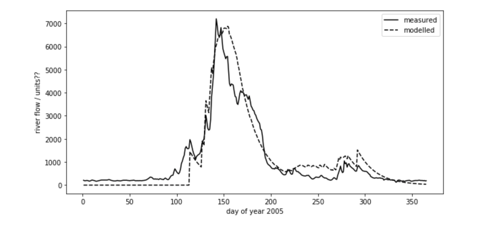
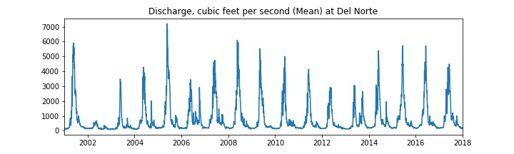
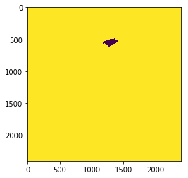
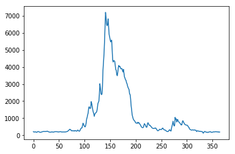

.. raw:: html

   <h1>

Table of Contents

.. raw:: html

   </h1>

.. container:: toc

   .. raw:: html

      <ul class="toc-item">

   .. raw:: html

      <li>

   4. Assessed Practical

   .. raw:: html

      <ul class="toc-item">

   .. raw:: html

      <li>

   4.1 Introduction

   .. raw:: html

      <ul class="toc-item">

   .. raw:: html

      <li>

   4.1.1 Task overview

   .. raw:: html

      </li>

   .. raw:: html

      </ul>

   .. raw:: html

      </li>

   .. raw:: html

      <li>

   4.1.2 Purpose of the work

   .. raw:: html

      <ul class="toc-item">

   .. raw:: html

      <li>

   4.2.1.1 Del Norte

   .. raw:: html

      </li>

   .. raw:: html

      <li>

   4.2.1.2 Discharge dataset

   .. raw:: html

      </li>

   .. raw:: html

      <li>

   4.2.1.3 Temperature dataset

   .. raw:: html

      </li>

   .. raw:: html

      <li>

   4.2.1.4 Snow cover dataset

   .. raw:: html

      </li>

   .. raw:: html

      <li>

   4.2.2 Data Advice

   .. raw:: html

      <ul class="toc-item">

   .. raw:: html

      <li>

   4.2.2.1 MODIS snow cover data

   .. raw:: html

      </li>

   .. raw:: html

      <li>

   4.2.3.2 Boundary Data

   .. raw:: html

      </li>

   .. raw:: html

      <li>

   4.2.3.3 Discharge Data

   .. raw:: html

      </li>

   .. raw:: html

      <li>

   4.2.3.4 Temperature data

   .. raw:: html

      </li>

   .. raw:: html

      </ul>

   .. raw:: html

      </li>

   .. raw:: html

      </ul>

   .. raw:: html

      </li>

   .. raw:: html

      <li>

   4.3 Coursework

   .. raw:: html

      <ul class="toc-item">

   .. raw:: html

      <li>

   6.3.1 Summary of coursework requirements

   .. raw:: html

      </li>

   .. raw:: html

      <li>

   4.3.2 Summary of Advice

   .. raw:: html

      </li>

   .. raw:: html

      <li>

   4.3.3 Further advice

   .. raw:: html

      </li>

   .. raw:: html

      <li>

   4.3.4 Structure of the Report

   .. raw:: html

      </li>

   .. raw:: html

      <li>

   4.3.5 Computer Code

   .. raw:: html

      <ul class="toc-item">

   .. raw:: html

      <li>

   General requirements

   .. raw:: html

      </li>

   .. raw:: html

      <li>

   Degree of original work required and plagiarism

   .. raw:: html

      </li>

   .. raw:: html

      <li>

   Documentation

   .. raw:: html

      </li>

   .. raw:: html

      <li>

   Word limit

   .. raw:: html

      </li>

   .. raw:: html

      <li>

   Code style

   .. raw:: html

      </li>

   .. raw:: html

      </ul>

   .. raw:: html

      </li>

   .. raw:: html

      </ul>

   .. raw:: html

      </li>

   .. raw:: html

      </ul>

   .. raw:: html

      </li>

   .. raw:: html

      </ul>

4. Assessed Practical
=====================

4.1 Introduction
----------------

4.1.1 Task overview
~~~~~~~~~~~~~~~~~~~

These notes describe the practical work you must submit for assessment
in this course.

The practical comes in two parts: (1) data preparation (50%); (2)
modelling (50%).

**It is important that you complete both parts of this exercise.**

The submission for Part 1 of the coursework (worth 50% of the marks) is
the Monday after Reading week (12:00 Noon). That is Monday
:math:`12^{th}` November 2018.

The submission for Part 2 will be :math:`7^{th}` January 2019 (12:00
Noon). Submission is through the usual Turnitin link on the `course
Moodle
page <https://moodle-1819.ucl.ac.uk/course/view.php?id=2796#section-4>`__.

-  **Part 1: Data Preparation**

   The first task you must complete is to produce a dataset of the
   proportion of HUC catchment 13010001 (Rio Grande headwaters in
   Colorado, USA) that is covered by snow for **two years** (not
   necessarily consecutive), along with associated datasets on
   temperature (in C) and river discharge at the Del Norte monitoring
   station. You will use these data in the modelling work in Part 2 of
   the coursework.

   You **may not** use data from the years 2005 or 2006, as this will be
   given to you in illustrations of the material.

   The dataset you produce must have a value for **the mean snow cover,
   temperature and discharge in the catchment for every day over each
   year.**

   Your write up **must** include fully labelled graph(s) of snow cover,
   temperature and discharge for the catchment for each year (with units
   as appropriate), along with some summary statistics (e.g. mean or
   median, minimum, maximum, and the timing of these).

   You **must** provide evidence of how you got these data (i.e. the
   code and commands you ran to produce the data).

**Checklist:**

::

   * provide fully commented/documented code for all operations.
   * provide two years of **daily** data (not 2005 or 2006)
   * Generate datasets of:
       * mean snow cover (0.0 to 1.0) for the catchment for each day of the year
       * temperature (C) at the Del Norte monitoring station for each day of the year
       * river discharge at the Del Norte monitoring station for each day of the year
   * Produce a table of summary statistics for each of the 3 datasets (one for easch year)
   * produce graphs of the 3 datasets for each year (as function of day of year)
   * produce an `npz` file containing the 3 datasets, one for each year.
   * produce images of snow cover spatial data for the catchment for **13 samples** spaced equally through the year, one set of images for each year. You need to do this for the data pre-interpolation and aftyer you have done the interpolation.

-  **Part 2: Modelling**

   You will have prepared two years of data in Part 1 of the work.

   If, for some reason, you have failed to generate an appropriate
   dataset, you may use datasets that will be provided for you for the
   years 2005 and 2006. There will be no penalty for that in your Part 2
   submission: failure to gernerate the datasets will be accounted for
   in marks allocated for Part 1.

   You will be given a simple hydrological model of snowmelt.

   Use one of these years to calibrate the (snowmelt) hydrological model
   and one year to test it.

   The model parameter estimate *must* be objective (i.e. you can’t just
   arbitrarily choose a set) and optimal in some way you must define
   (you *must* state the equation of the cost function you will try to
   minimise and explain the approach used).

   You **must** state the values of the model parameters that you have
   estimated and show evidence for how you went about calculating them.
   Ideally, you should also state the uncertainty in these parameter
   estimates (not critical to pass this section though).

   You **must** quantify the goodness of fit between your measured flow
   data and that produced by your model, both for the calibration
   exercise and the validation.

**Checklist:**

::

   * Provide a site intoduction and an introduction to the purpose of the exercise ('Introduction')
   * Provide an introduction to the modelling and calibration/validation ('Method') 
   * provide code that reads in the datasets and performs the model calibration and validation ('Code')
   * Provide a table of results on model parameter calibration (and ideally, uncertainty) ('Results')
   * Provide graphs of the observed and modelled river discharge data for the calibration year ('Results')
   * Provide graphs of the observed and modelled river discharge data for the validation year ('Results')
   * Assess the accuracy of the calibration and validation ('Results')
   * Discuss the results in the light of the introduction ('Discussion')
   * Draw conclusions about issues associated with modelling of this sort ('Conclusion')

You **must** work individually on this task. If you do not, it will be
treated as plagiarism. By reading these instructions for this exercise,
we assume that you are aware of the UCL rules on plagiarism. You can
find more information on this matter in your student handbook. If in
doubt about what might constitute plagiarism, ask one of the course
convenors.

4.1.2 Purpose of the work
-------------------------

The hydrology of the Rio Grande Headwaters in Colorado, USA is snowmelt
dominated. It varies considerably from year to year and may very further
under a changing climate.

We can build a mathemetical (‘environmental’) model to describe the main
physical processes affecting hydrology in the catchment. Such a model
could help understand current behaviour and allow some prediction about
possible future scenarios.

**What you are going to do is to build, calibrate and test a (snowmelt)
hydrological model, driven by observations in the Rio Grande Headwaters
in Colorado, USA**

|image0|

|image1|

The purpose of the model will be to describe the streamflow at the Del
Norte measurement station, just on the edge of the catchment. You will
use environmental (temperature) data and snow cover observations to
drive the model. You will perform calibration and testing by comparing
model output with observed streamflow data.

4.2.1.1 Del Norte
~~~~~~~~~~~~~~~~~

The average climate for Del Norte is:

|image2|

Further general information is available from various
`websites <http://www.usclimatedata.com/climate.php?location=USCO0103>`__,
including `NOAA <http://www.ncdc.noaa.gov>`__.

.. figure:: http://www.coloradofishing.net/images/fishtails/ft_riogrande3.jpg
   :alt: www.coloradofishing.net

   www.coloradofishing.net

You can visualise the site Del Norte 2E
`here <http://mesonet.agron.iastate.edu/sites/site.php?station=CO2184&network=COCLIMATE>`__.


.. |image1| image:: https://www.blm.gov/sites/blm.gov/files/hero_backgrounds/NM_Rio_Grande_del_Norte_Sign_640.jpg
.. |image2| image:: images/usco0103climatedelnorte.png

4.2.1.2 Discharge dataset
~~~~~~~~~~~~~~~~~~~~~~~~~

First we should look at the streamflow/discharge data.

The link for downloading data from 2001 onwards (but not the current
year until the end of the year):
`http://waterdata.usgs.gov <http://waterservices.usgs.gov/nwis/dv/?sites=08220000&format=rdb&startDT=2001-01-01&parameterCd=00060>`__.

|image0|

You should examine all of the streamflow data and use that to make a
decision on which years data you want to use in your experiments. You
must justify your decision. You choice coul;d be based on the fact that
some particular year shows ‘typical’ behaviour, or that some set of
years seems to encompass the bounds of behaviour. The choies you make
here will impact your ability to generalise from your results, so make
sure you comment on this.

**write some code to download the data, select one of the years that you
want, and load the data into numpy arrays of time and streamflow
(discharge).**

**run the code for the two years of data that you have selected and save
the datasets to a file.**

4.2.1.3 Temperature dataset
~~~~~~~~~~~~~~~~~~~~~~~~~~~

Go to the Colorado State `Climate data
site <http://climate.colostate.edu/data_access.html>`__, select the Del
Norte 2E site, and the period for which you want your data (typically,
Jan :math:`1^{st}` to Dec :math:`31^{st}` for the years you want.

You can obtain data on maximum and mimimum temperatures, as well as
snowfall and precipitation.

As the site doesn’t provide a data download mechanism, you will need to
save the data, most easily by copying and pasting the data columns into
a file. Make a note of what you did here, to include in your write up.

You only really need the maximum temperature dataset, but you may find
the others helpful for interpretation or to improve your model.



4.2.1.4 Snow cover dataset
~~~~~~~~~~~~~~~~~~~~~~~~~~

|image0|

You need to calculate the **daily snow cover** (values between 0 and 1
for the proportion of the catchment covered in snow) for the catchment
(**HUC feature 2** (catchment 13010001)).

You would want to use a **daily** snow product for this task, such as
that available from MODIS, so make sure you know what that is and
explore the characteristics of the dataset.

You will notice from the figure above (the figure should give you some
clue as to a suitable data product) that there will be areas of each
image for which you have no information (described in the dataset QC).
You will need to decide what to do about ‘missing data’. For instance,
you might consider interpolating over missing values.

The simplest thing you might think of might be to produce a mean snow
cover over what samples are available (ignoring the missing values). But
that would be rather poor. Really, you should apply some sort of
interpolation (in time).

However you decide to process the data, you must give a rationale for
why you have taken the approach you have done.

You will notice that if you use MODIS data, you have access to both data
from Terra (MOD10A) and Aqua (MYD10A), which potentially gives you two
samples per day. Think about how to take that into account. Again, the
simplest thing to do might be to just use one of these. That is likely
to be sufficient, but it would be much better to include both datasets.

.. |image0| image:: images/snow.png

.. code:: python

    # load a pre-cooked version of the data for 2005 (NB -- Dont use this year!!!
    # except perhaps for testing)
    
    # load the data from a pickle file
    import pickle
    import pylab as plt
    import numpy as np
    %matplotlib inline
    
    with open('data/data.pkl', 'rb') as f:
        data = pickle.load(f, encoding='latin1') 
    
    # set up plot
    plt.figure(figsize=(10,5))
    plt.xlim(data['doy'][0],data['doy'][-1]+1)
    plt.xlabel('day of year 2005')
    
    # plot data
    plt.plot(data['doy'],data['temp'],'r',label='temperature / C')
    plt.plot(data['doy'],data['snowprop']*100,'b',label='snow cover %')
    plt.plot(data['doy'],100-data['snowprop']*100,'c',label='snow free cover %')
    plt.plot(data['doy'],data['flow']/100.,'g',label='river flow / 100')
    plt.legend(loc='best')


.. parsed-literal::

    <matplotlib.legend.Legend at 0x10725edd8>


.. image:: Chapter4_Practical_Part1_files/Chapter4_Practical_Part1_8_1.png


we have plotted the streamflow (scaled) in green, the snow cover in
blue, and the non snow cover in cyan and the temperature in red. It
should be apparent that thge hydrology is snow melt dominated, and to
describe this (i.e. to build the simplest possible model) we can
probably just apply some time lag function to the snow cover.

4.2.2 Data Advice
~~~~~~~~~~~~~~~~~

4.2.2.1 MODIS snow cover data
^^^^^^^^^^^^^^^^^^^^^^^^^^^^^

For MODIS data, you will need to work out which data product you want
and how to download it. To help you with this, the ‘pattern’ of the URLs
is:

.. code:: python

   info = {'YEAR':2007,'MONTH':1,'DAY':1}
   url = 'https://n5eil01u.ecs.nsidc.org/MOST/MOD10A1.006/' + \
       '{YEAR}.{MONTH:02d}.DAY:02d}/MYD*h09v05.006*hdf'.format(**info)

You should have codes from previous practicals sessions that allow you
to download such data and you should then store the daily datasets in
you local file system.

We can use the usual tools to explore the MODIS hdf files:

.. code:: python

    import gdal
    modis_file = 'data/MOD10A1.A2016001.h09v05.006.2016183123533.hdf'
    g = gdal.Open(modis_file)
    if g is None:
        print ('error opening file: HDF4 problem with GDAL?')
    else:
        # note this has changed in collection 6
        data_layer = 'MOD_Grid_Snow_500m:NDSI_Snow_Cover'
    
        subdatasets = g.GetSubDatasets()
        for fname, name in subdatasets:
            print (name)
            print ("\t", fname)
    
        fname = 'HDF4_EOS:EOS_GRID:"%s":%s'%(modis_file,data_layer)
        raster = gdal.Open(fname)


.. parsed-literal::

    [2400x2400] NDSI_Snow_Cover MOD_Grid_Snow_500m (8-bit unsigned integer)
    	 HDF4_EOS:EOS_GRID:"data/MOD10A1.A2016001.h09v05.006.2016183123533.hdf":MOD_Grid_Snow_500m:NDSI_Snow_Cover
    [2400x2400] NDSI_Snow_Cover_Basic_QA MOD_Grid_Snow_500m (8-bit unsigned integer)
    	 HDF4_EOS:EOS_GRID:"data/MOD10A1.A2016001.h09v05.006.2016183123533.hdf":MOD_Grid_Snow_500m:NDSI_Snow_Cover_Basic_QA
    [2400x2400] NDSI_Snow_Cover_Algorithm_Flags_QA MOD_Grid_Snow_500m (8-bit unsigned integer)
    	 HDF4_EOS:EOS_GRID:"data/MOD10A1.A2016001.h09v05.006.2016183123533.hdf":MOD_Grid_Snow_500m:NDSI_Snow_Cover_Algorithm_Flags_QA
    [2400x2400] NDSI MOD_Grid_Snow_500m (16-bit integer)
    	 HDF4_EOS:EOS_GRID:"data/MOD10A1.A2016001.h09v05.006.2016183123533.hdf":MOD_Grid_Snow_500m:NDSI
    [2400x2400] Snow_Albedo_Daily_Tile MOD_Grid_Snow_500m (8-bit unsigned integer)
    	 HDF4_EOS:EOS_GRID:"data/MOD10A1.A2016001.h09v05.006.2016183123533.hdf":MOD_Grid_Snow_500m:Snow_Albedo_Daily_Tile
    [2400x2400] orbit_pnt MOD_Grid_Snow_500m (8-bit integer)
    	 HDF4_EOS:EOS_GRID:"data/MOD10A1.A2016001.h09v05.006.2016183123533.hdf":MOD_Grid_Snow_500m:orbit_pnt
    [2400x2400] granule_pnt MOD_Grid_Snow_500m (8-bit unsigned integer)
    	 HDF4_EOS:EOS_GRID:"data/MOD10A1.A2016001.h09v05.006.2016183123533.hdf":MOD_Grid_Snow_500m:granule_pnt


4.2.3.2 Boundary Data
^^^^^^^^^^^^^^^^^^^^^

Boundary data, such as catchments, might typically come as `ESRI
shapefiles <http://en.wikipedia.org/wiki/Shapefile>`__ or may be in
other vector formats. There tends to be variable quality among different
databases, but a reliable source for catchment data the USA is the
`USGS <http://water.usgs.gov/GIS/huc.html>`__. One set of catchments in
the tile we have is the Rio Grande headwaters, which we can
`see <http://water.usgs.gov/GIS/huc_rdb.html>`__ has a HUC 8-digit code
of 13010001. The full dataset is easily found from the
`USGS <http://water.usgs.gov/GIS/dsdl/huc250k_shp.zip>`__ or
`locally <files/data/huc250k_shp.zip>`__. Literature and associated data
concerning this area can be found
`here <http://water.usgs.gov/lookup/getwatershed?13010001>`__.
Associated `GIS data are
here <http://water.usgs.gov/lookup/getgislist?type=huc&value=13010001>`__,
including the `watershed boundary
data <http://water.usgs.gov/GIS/dsdl/ds573_wbdhuc8.ZIP>`__.

Data more specific to our particular catchment of interest can be found
on the `Rio Grande Data Project
pages <https://www.ibwc.gov/Files/CF_URG_Reclamation_042315.pdf>`__.

You should use the file
`Hydrologic_Units.zip <data/Hydrologic_Units.zip>`__. You may need to
``unzip`` this file to get at the shapefile
```Hydrologic_Units/HUC_Polygons.shp`` <data/Hydrologic_Units/HUC_Polygons.shp>`__
within it.

You can explore the shape file with the following:

.. code:: python

    !ogrinfo data/Hydrological_Units/HUC_Polygons.shp HUC_Polygons -nomd -geom=NO -where "HUC=13010001"


.. parsed-literal::

    INFO: Open of `data/Hydrological_Units/HUC_Polygons.shp'
          using driver `ESRI Shapefile' successful.
    
    Layer name: HUC_Polygons
    Geometry: Polygon
    Feature Count: 1
    Extent: (-1207861.193700, -1295788.385400) - (-115932.919500, 152769.254400)
    Layer SRS WKT:
    PROJCS["USA_Contiguous_Albers_Equal_Area_Conic",
        GEOGCS["GCS_North_American_1983",
            DATUM["North_American_Datum_1983",
                SPHEROID["GRS_1980",6378137.0,298.257222101]],
            PRIMEM["Greenwich",0.0],
            UNIT["Degree",0.0174532925199433],
            AUTHORITY["EPSG","4269"]],
        PROJECTION["Albers_Conic_Equal_Area"],
        PARAMETER["False_Easting",0.0],
        PARAMETER["False_Northing",0.0],
        PARAMETER["longitude_of_center",-96.0],
        PARAMETER["Standard_Parallel_1",29.5],
        PARAMETER["Standard_Parallel_2",45.5],
        PARAMETER["latitude_of_center",37.5],
        UNIT["Meter",1.0]]
    HUC: Integer (9.0)
    REG_NAME: String (50.0)
    SUB_NAME: String (51.0)
    ACC_NAME: String (36.0)
    CAT_NAME: String (60.0)
    HUC2: Integer (4.0)
    HUC4: Integer (4.0)
    HUC6: Integer (9.0)
    REG: Integer (4.0)
    SUB: Integer (4.0)
    ACC: Integer (9.0)
    CAT: Integer (9.0)
    CAT_NUM: String (8.0)
    Shape_Leng: Real (19.11)
    Shape_Area: Real (19.11)
    OGRFeature(HUC_Polygons):2
      HUC (Integer) = 13010001
      REG_NAME (String) = Rio Grande Region
      SUB_NAME (String) = Rio Grande Headwaters
      ACC_NAME (String) = Rio Grande Headwaters
      CAT_NAME (String) = Rio Grande Headwaters. Colorado.
      HUC2 (Integer) = 13
      HUC4 (Integer) = 1301
      HUC6 (Integer) = 130100
      REG (Integer) = 13
      SUB (Integer) = 1301
      ACC (Integer) = 130100
      CAT (Integer) = 13010001
      CAT_NUM (String) = 13010001
      Shape_Leng (Real) = 313605.66409400001
      Shape_Area (Real) = 3458016895.23000001907
    


The catchment is only a small proportion of the total dataset, so make
sure you apply masking and cropping appropriately.

**You will need to develop code to load the time series of snow cover
data into a 3D numpy array, cropped to the required catchment**

**You will then need to develop code to interpolate over any missing
data, so that there is an estimate of snow cover for every pixel in the
catchment for all days**

**You will need to produce images (i.e. fully labelled plots) of snow
cover spatial data for the catchment for 13 samples spaced equally
through the year, one set of images for each year.** This will be used
to demonstrate that you have achieved this interpolation, so you should
show the datyasets for both pre- and post-interpolation.

.. code:: python

    from geog0111.raster_mask import raster_mask2
    import pylab as plt
    %matplotlib inline
    
    m = raster_mask2(fname,\
                    target_vector_file="data/Hydrological_Units/HUC_Polygons.shp",\
                    attribute_filter=2)
    plt.imshow(m)


.. parsed-literal::

    <matplotlib.image.AxesImage at 0x12646fe80>





4.2.3.3 Discharge Data
^^^^^^^^^^^^^^^^^^^^^^

A sample of the river discharge data are in the file
```data/delnorte.dat`` <data/delnorte.dat>`__.

If you examine the file:

.. code:: python

    f = open('data/delnorte.dat').readlines()
    for i in range(40):
        print(f[i],end='')


.. parsed-literal::

    # ---------------------------------- WARNING ----------------------------------------
    # Provisional data are subject to revision. Go to
    # http://help.waterdata.usgs.gov/policies/provisional-data-statement for more information.
    #
    # File-format description:  http://help.waterdata.usgs.gov/faq/about-tab-delimited-output
    # Automated-retrieval info: http://help.waterdata.usgs.gov/faq/automated-retrievals
    #
    # Contact:   gs-w_support_nwisweb@usgs.gov
    # retrieved: 2016-11-02 04:17:13 -04:00	(natwebsdas01)
    #
    # Data for the following 1 site(s) are contained in this file
    #    USGS 08220000 RIO GRANDE NEAR DEL NORTE, CO
    # -----------------------------------------------------------------------------------
    #
    # TS_ID - An internal number representing a time series.
    # IV_TS_ID - An internal number representing the Instantaneous Value time series from which the daily statistic is calculated.
    #
    # Data provided for site 08220000
    #    TS_ID       Parameter    Statistic  IV_TS_ID       Description
    #    18268       00060        00003      -1             Discharge, cubic feet per second (Mean)
    #
    # Data-value qualification codes included in this output:
    #     A  Approved for publication -- Processing and review completed.
    #     e  Value has been edited or estimated by USGS personnel and is write protected.
    #
    agency_cd	site_no	datetime	18268_00060_00003	18268_00060_00003_cd
    5s	15s	20d	14n	10s
    USGS	08220000	2005-01-01	210	A:e
    USGS	08220000	2005-01-02	190	A:e
    USGS	08220000	2005-01-03	190	A:e
    USGS	08220000	2005-01-04	200	A:e
    USGS	08220000	2005-01-05	200	A:e
    USGS	08220000	2005-01-06	190	A:e
    USGS	08220000	2005-01-07	170	A:e
    USGS	08220000	2005-01-08	180	A:e
    USGS	08220000	2005-01-09	200	A:e
    USGS	08220000	2005-01-10	220	A:e
    USGS	08220000	2005-01-11	210	A:e
    USGS	08220000	2005-01-12	200	A:e
    USGS	08220000	2005-01-13	190	A:e


you will see comment lines that start with ``#``, followed by data
lines.

The easiest way to read these data would be to use:

.. code:: python

    import numpy as np
    file = 'data/delnorte.dat'
    data = np.loadtxt(file,usecols=(2,3),unpack=True,dtype=str)

.. code:: python

    # so you have the dates in
    # print the first 100
    print (data[0][:100])
    # and data in 
    print (data[1][:100])
    # but the data start in column 3 so use [2:]


.. parsed-literal::

    ['datetime' '20d' '2005-01-01' '2005-01-02' '2005-01-03' '2005-01-04'
     '2005-01-05' '2005-01-06' '2005-01-07' '2005-01-08' '2005-01-09'
     '2005-01-10' '2005-01-11' '2005-01-12' '2005-01-13' '2005-01-14'
     '2005-01-15' '2005-01-16' '2005-01-17' '2005-01-18' '2005-01-19'
     '2005-01-20' '2005-01-21' '2005-01-22' '2005-01-23' '2005-01-24'
     '2005-01-25' '2005-01-26' '2005-01-27' '2005-01-28' '2005-01-29'
     '2005-01-30' '2005-01-31' '2005-02-01' '2005-02-02' '2005-02-03'
     '2005-02-04' '2005-02-05' '2005-02-06' '2005-02-07' '2005-02-08'
     '2005-02-09' '2005-02-10' '2005-02-11' '2005-02-12' '2005-02-13'
     '2005-02-14' '2005-02-15' '2005-02-16' '2005-02-17' '2005-02-18'
     '2005-02-19' '2005-02-20' '2005-02-21' '2005-02-22' '2005-02-23'
     '2005-02-24' '2005-02-25' '2005-02-26' '2005-02-27' '2005-02-28'
     '2005-03-01' '2005-03-02' '2005-03-03' '2005-03-04' '2005-03-05'
     '2005-03-06' '2005-03-07' '2005-03-08' '2005-03-09' '2005-03-10'
     '2005-03-11' '2005-03-12' '2005-03-13' '2005-03-14' '2005-03-15'
     '2005-03-16' '2005-03-17' '2005-03-18' '2005-03-19' '2005-03-20'
     '2005-03-21' '2005-03-22' '2005-03-23' '2005-03-24' '2005-03-25'
     '2005-03-26' '2005-03-27' '2005-03-28' '2005-03-29' '2005-03-30'
     '2005-03-31' '2005-04-01' '2005-04-02' '2005-04-03' '2005-04-04'
     '2005-04-05' '2005-04-06' '2005-04-07' '2005-04-08']
    ['18268_00060_00003' '14n' '210' '190' '190' '200' '200' '190' '170' '180'
     '200' '220' '210' '200' '190' '170' '170' '180' '190' '200' '210' '220'
     '220' '220' '220' '220' '220' '220' '230' '240' '230' '210' '200' '190'
     '180' '180' '180' '190' '200' '190' '190' '180' '190' '200' '210' '210'
     '210' '210' '210' '200' '200' '190' '200' '203' '205' '213' '207' '191'
     '190' '196' '190' '195' '196' '194' '189' '201' '201' '208' '218' '233'
     '262' '285' '320' '350' '340' '320' '272' '257' '272' '255' '266' '255'
     '245' '277' '270' '255' '248' '239' '284' '305' '270' '243' '235' '275'
     '344' '401' '424' '430' '576' '705']


.. code:: python

    # and the stream flow in data[1][2:]
    plt.plot(data[1][2:].astype(float))


.. parsed-literal::

    [<matplotlib.lines.Line2D at 0x1270929b0>]





You will need to convert the date field (i.e. the data in ``data[0]``)
into the day of year.

This is readily accomplished using ``datetime``:

.. code:: python

    import datetime
    # transform the first one, which is data[0][2:]
    
    ds = np.array(data[0][2].split('-')).astype(int)
    print (ds)
    year,doy = datetime.datetime(ds[0],ds[1],ds[2]).strftime('%Y %j').split()
    print (year,doy)


.. parsed-literal::

    [2005    1    1]
    2005 001


4.2.3.4 Temperature data
^^^^^^^^^^^^^^^^^^^^^^^^

We can directly access temperature data from
`here <http://ccc.atmos.colostate.edu/cgi-bin/dlydb.pl?yrbeg=2000&yrend=2020&station=52184+DEL+NORTE&proc=2+-+List+Format+%28see+docs%29>`__.

The format of ```delNorteT.dat`` <files/data/delNorteT.dat>`__ is given
here.

The first three fields are date fields (``YEAR``, ``MONTH`` and
``DAY``), followed by ``TMAX``, ``TMIN``, ``PRCP``, ``SNOW``, ``SNDP``.

You should read in the temperature data for the days and years that you
want.

For temperature, you might take a **mean of TMAX and TMIN**.

**Note that these are in Fahrenheit. You should convert them to
Celcius.**

Note also that there are missing data (values ``9998`` and ``9999``).
You will need to filter these and interpolate the data in some way. A
median might be a good approach, but any interpolation will suffice.

With that processing then, you should have a dataset, Temperature that
will look something like (in cyan, for the year 2005):

|image0|

.. |image0| image:: files/images/temperature.png

4.3 Coursework
--------------

You need to submit you coursework in the usual manner by the usual
submission date.

You **must** work individually on this task. If you do not, it will be
treated as plagiarism. By reading these instructions for this exercise,
we assume that you are aware of the UCL rules on plagiarism. You can
find more information on this matter in your student handbook. If in
doubt about what might constitute plagiarism, ask one of the course
convenors.

6.3.1 Summary of coursework requirements
~~~~~~~~~~~~~~~~~~~~~~~~~~~~~~~~~~~~~~~~

-  **Part 1: Data Preparation**

   The first task you must complete is to produce a dataset of the
   proportion of HUC catchment 13010001 (Rio Grande headwaters in
   Colorado, USA) that is covered by snow for **two years** (not
   necessarily consecutive), along with associated datasets on
   temperature (in C) and river discharge at the Del Norte monitoring
   station. You will use these data in the modelling work in Part 2 of
   the coursework.

   You **may not** use data from the years 2005 or 2006, as this will be
   given to you in illustrations of the material.

   The dataset you produce must have a value for **the mean snow cover,
   temperature and discharge in the catchment for every day over each
   year.**

   Your write up **must** include fully labelled graph(s) of snow cover,
   temperature and discharge for the catchment for each year (with units
   as appropriate), along with some summary statistics (e.g. mean or
   median, minimum, maximum, and the timing of these).

   You **must** provide evidence of how you got these data (i.e. the
   code and commands you ran to produce the data).

**Checklist:**

::

   * provide fully commented/documented code for all operations.
   * provide two years of **daily** data (not 2005 or 2006)
   * Generate datasets of:
       * mean snow cover (0.0 to 1.0) for the catchment for each day of the year
       * temperature (C) at the Del Norte monitoring station for each day of the year
       * river discharge at the Del Norte monitoring station for each day of the year
   * Produce a table of summary statistics for each of the 3 datasets (one for easch year)
   * produce graphs of the 3 datasets for each year (as function of day of year)
   * produce an `npz` file containing the 3 datasets, one for each year.
   * produce images of snow cover spatial data for the catchment for **13 samples** spaced equally through the year, one set of images for each year. You need to do this for the data pre-interpolation and aftyer you have done the interpolation.

4.3.2 Summary of Advice
~~~~~~~~~~~~~~~~~~~~~~~

The first task involves pulling datasets from different sources. No
individual part of that should be too difficult, but you must put this
together from the material we have done so far. It is more a question of
organisation then.

Perhaps think first about where you want to end up with on this (the
‘output’). This might for example be a dictionary with keys ``temp``,
``doy``, ``snow`` and ``flow``, where each of these would be an array
with 365 values (or 366 in a leap year).

Then consider the datasets you have: these are: (i) a stack of MODIS
data with daily observations; (ii) temperature data in a file; (iii)
flow data in a file.

It might be a little fiddly getting the data you want from the flow and
temperature data files, but its not very complicated. You will need to
consider flagging invalid observations and perhaps interpolating between
these.

Processing the MODIS data might take a little more thought, but it is
much the same process. Again, we read the datasets in, trying to make
this efficient on data size by only using the area of the vector data
mask as in a previous exercise. The data reading will be very similar to
reading the MODIS LAI product, but you need to work out and implement
what changes are necessary. As advised abovem you should use the
``raster_mask2()`` function for creating the spatial data masks. Again,
you will need to interpolate or perhaps smooth between observations, and
then process the snow cover proportions to get an average over the
catchment.

The second task revolves around using the model that we have developed
above in the function ``model_accum()``. You have been through previous
examples in Python where you attempt to estimate some model parameters
given an initial estimate of the parameters and some cost function to be
minimised. Solving the model calibration part of problem should follow
those same lines then. Testing (validation) should be easy enough. Don’t
forget to include the estimated parameters (and other relevant
information, e.g. your initial estimate, uncertainties if available) in
your write up.

There is quite a lot of data presentation here, and you need to provide
*evidence* that you have done the task. Make sure you use images
(e.g. of snow cover varying), graphs (e.g. modelled and predicted flow,
etc.), and tables (e.g. model parameter estimates) throughout, as
appropriate.

If, for some reason, you are unable to complete the first part of the
practical, you should submit what you can for that first part, and
continue with calibrating the model using the 2005 dataset that we used
above. This would be far from ideal as you would not have completed the
required elements for either part in that case, but it would generall be
better than not submitting anything.

4.3.3 Further advice
~~~~~~~~~~~~~~~~~~~~

There is plenty of scope here for going beyond the basic requirements,
if you get time and are interested (and/or want a higher mark!).

You will be given credit for all additional work included in the write
up, **once you have achieved the basic requirements**. So, there is no
point (i.e. you will not get credit for) going off on all sorts of
interesting lines of exploration here *unless* you have first completed
the core task.

4.3.4 Structure of the Report
~~~~~~~~~~~~~~~~~~~~~~~~~~~~~

The required elements of the report are:

::

       1. Code for temperature and river discharge data download, reading and saving, with running of code and datasets for 2 years of daily data, and appropriate plots showing the datasets (10%)
           * temperature (C) at the Del Norte monitoring station for each day of the year
           * river discharge at the Del Norte monitoring station for each day of the year

      2. Code for downloading MODIS snow cover data, masking, cropping and extracting the data into a 3D numpy array, storing the data, running the code for 2 years data, and appropiate plots. (20%)
       
      3. Code for interpolating MODIS snow cover data and calculating mean snow cover over the catchment, saving the data, running the code for 2 years data, and appropiate plots. (15%)

      4. Produce a table of summary statistics for each of the datasets (one for each year) and a `npz` file containing all of the datasets (5%)
     
      For parts 2 and 3, make sure to produce images of snow cover spatial data for the catchment for **13 samples** spaced equally through the year, one set of images for each year. You need to do this for the data pre-interpolation (part 2) and after you have done the interpolation (part 3).

The figures in brackets indicate the percentage of marks that we will
award for each section of the report.

4.3.5 Computer Code
~~~~~~~~~~~~~~~~~~~

General requirements
^^^^^^^^^^^^^^^^^^^^

You will obviously need to submit computer codes as part of this
assessment. Some flexibility in the style of these codes is to be
expected. For example, some might write a class that encompasses the
functionality for all tasks. Some poeple might have multiple versions of
codes with different functionality. All of these, and other reasonable
variations are allowed.

All codes needed to demonstrate that you have performed the core tasks
are required to be included in the submission. You should include all
codes that you make use of in the main body of the text in the main
body. Any other codes that you want to refer to (e.g. something you
tried out as an enhancement and didn’t quite get there) you can include
in appendices.

All codes should be well-commented. Part of the marks you get for code
will depend on the adequacy of the commenting.

Degree of original work required and plagiarism
^^^^^^^^^^^^^^^^^^^^^^^^^^^^^^^^^^^^^^^^^^^^^^^

If you use a piece of code verbatim that you have taken from the course
pages or any other source, **you must acknowledge this** in comments in
your text. **Not to do so is plagiarism**. Where you have taken some
part (e.g. a few lines) of someone else’s code, **you should also
indicate this**. If some of your code is heavily based on code from
elsewhere, **you must also indicate that**.

Some examples.

The first example is guilty of strong plagiarism, it does not seek to
acknowledge the source of this code, even though it is just a direct
copy, pasted into a method called ``model()``:

.. code:: python

    def model(tempThresh=9.0,K=2000.0,p=0.96):
        '''need to comment this further ...
    
        '''
        import numpy as np
        meltDays = np.where(temperature > tempThresh)[0]
        accum = snowProportion*0.
        for d in meltDays:
            water = K * snowProportion[d]
            n = np.arange(len(snowProportion)) - d
            m = p ** n
            m[np.where(n<0)]=0
            accum += m * water
        return accum

This is **not** acceptable.

This should probably be something along the lines of:

.. code:: python

    def model(tempThresh=9.0,K=2000.0,p=0.96):
        '''need to comment this further ...
    
        This code is taken directly from
        "Modelling delay in a hydrological network"
        by P. Lewis http://www2.geog.ucl.ac.uk/~plewis/geogg122/DelNorte.html
        and wrapped into a method.
        '''
        # my code: make sure numpy is imported
        import numpy as np
    
        # code below verbatim from Lewis
        meltDays = np.where(temperature > tempThresh)[0]
        accum = snowProportion*0.
        for d in meltDays:
            water = K * snowProportion[d]
            n = np.arange(len(snowProportion)) - d
            m = p ** n
            m[np.where(n<0)]=0
            accum += m * water
        # my code: return accumulator
        return accum

Now, we acknowledge that this is in essence a direct copy of someone
else’s code, and clearly state this. We do also show that we have added
some new lines to the code, and that we have wrapped this into a method.

In the next example, we have seen that the way m is generated is in fact
rather inefficient, and have re-structured the code. It is partially
developed from the original code, and acknowledges this:

.. code:: python

    def model(tempThresh=9.0,K=2000.0,p=0.96):
        '''need to comment this further ...
    
        This code after the model developed in
        "Modelling delay in a hydrological network"
        by P. Lewis
        http://www2.geog.ucl.ac.uk/~plewis/geogg122/DelNorte.html
    
        My modifications have been to make the filtering more efficient.
        '''
        # my code: make sure numpy is imported
        import numpy as np
    
        # code below verbatim from Lewis unless otherwise indicated
        meltDays = np.where(temperature > tempThresh)[0]
        accum = snowProportion*0.
    
        # my code: pull the filter block out of the loop
        n = np.arange(len(snowProportion))
        m = p ** n
    
        for d in meltDays:
            water = K * snowProportion[d]
    
            # my code: shift the filter on by one day
            # ...do something clever to shift it on by one day
    
            accum += m * water
        # my code: return accumulator
        return accum

This example makes it clear that significant modifications have been
made to the code structure (and probably to its efficiency) although the
basic model and looping comes from an existing piece of code. It clearly
highlights what the actual modifications have been. Note that this is
not a working example!!

Although you are supposed to do this piece of work on your own, there
might be some circumstances under which someone has significantly helped
you to develop the code (e.g. written the main part of it for you &
you’ve just copied that with some minor modifications). You **must**
acknowledge in your code comments if this has happened. On the whole
though, this should not occur, as you **must** complete this work on
your own.

If you take a piece of code from somewhere else and all you do is change
the variable names and/or other cosmetic changes, you **must**
acknowledge the source of the original code (with a URL if available).

Plagiarism in coding is a tricky issue. One reason for that is that
often the best way to learn something like this is to find an example
that someone else has written and adapt that to your purposes. Equally,
if someone has written some tool/library to do what you want to do, it
would generally not be worthwhile for you to write your own but to
concentrate on using that to achieve something new. Even in general code
writing (i.e. when not submitting it as part of your assessment) you and
anyone else who ever has to read your code would find it of value to
make reference to where you found the material to base what you did on.
The key issue to bear in mind in this work, as it is submitted ‘as your
own work’ is that, to avoid being accused of plagiarism and to allow a
fair assessment of what you have done, you must clearly acknowledge
which parts of it are your own, and the degree to which you could claim
them to be your own.

For example, based on … is absolutely fine, and you would certainly be
given credit for what you have done. In many circumstances ‘taken
verbatim from …’ would also be fine (provided it is acknowledged) but
then you would be given credit for what you had done with the code that
you had taken from elsewhere (e.g. you find some elegant way of doing
the graphs that someone has written and you make use of it for
presenting your results).

The difference between what you submit here and the code you might write
if this were not a piece submitted for assessment is that you the vast
majority of the credit you will gain for the code will be based on the
degree to which you demonstrate that you can write code to achieve the
required tasks. There would obviously be some credit for taking codes
from the coursenotes and bolting them together into something that
achieves the overall aim: provided that worked, and you had commented it
adequately and acknowledge what the extent of your efforts had been, you
should be able to achieve a pass in that component of the work. If there
was no original input other than vbolting pieces of existing code
together though, you be unlikely to achieve more than a pass. If you get
less than a pass in another component of the coursework, that then puts
you in danger of an overall fail.

Provided you achieve the core tasks, the more original work that you
do/show (that is of good quality), the higher the mark you will get.
Once you have achieved the core tasks, even if you try something and
don’t quite achieve it, is is probably worth including, as you may get
marks for what you have done (or that fact that it was a good or
interesting thing to try to do).

Documentation
^^^^^^^^^^^^^

Note: All methods/functions and classes must be documented for the code
to be adequate. Generally, this will contain:

-  some text on the purpose of the method (/function/class)

-  some text describing the inputs and outputs, including reference to
   any relevant details such as datatype, shape etc where such things
   are of relevance to understanding the code.

-  some text on keywords, e.g.:

.. code:: python

    def complex(real=0.0, imag=0.0):
        """Form a complex number.
    
        Keyword arguments:
        real -- the real part (default 0.0)
        imag -- the imaginary part (default 0.0)
    
        Example taken verbatim from:
        http://www.python.org/dev/peps/pep-0257/
        """
        if imag == 0.0 and real == 0.0: return complex_zero


You should look at the `document on good docstring
conventions <http://www.python.org/dev/peps/pep-0257/>`__ when
considering how to document methods, classes etc.

To demonstrate your documentation, you **must** include the help text
generated by your code after you include the code. e.g.:

.. code:: python

    def print_something(this,stderr=False):
        '''This does something.
    
        Keyword arguments:
        stderr -- set to True to print to stderr (default False)
        '''
    
        if stderr:
            # import sys.stderr
            from sys import stderr
    
            # print to stderr channel, converting this to str
            print >> stderr,str(this)
    
            # job done, return
            return
    
        # print to stdout, converting this to str
        print (str(this))
    
        return


Then the help text would be:

.. code:: python

    help(print_something)


.. parsed-literal::

    Help on function print_something in module __main__:
    
    print_something(this, stderr=False)
        This does something.
        
        Keyword arguments:
        stderr -- set to True to print to stderr (default False)
    


The above example represents a ‘good’ level of commenting as the code
broadly adheres to the style suggestions and most of the major features
are covered. It is not quite ‘very good/excellent’ as the description of
the purpose of the method (rather important) is trivial and it fails to
describe the input this in any way. An excellent piece would do all of
these things, and might well tell us about any dependencies
(e.g. requires sys if stderr set to True).

An inadequate example would be:

.. code:: python

    def print_something(this,stderr=False):
        '''This prints something'''
        if stderr:
            from sys import stderr
            print >> stderr,str(this)
            return
        print (str(this))

It is inadequate because it still only has a trivial description of the
purpose of the method, it tells us nothing about inputs/outputs and
there is no commenting inside the method.

Word limit
^^^^^^^^^^

There is no word limit per se on the computer codes, though as with all
writing, you should try to be succint rather than overly verbose.

Code style
^^^^^^^^^^

A good to excellent piece of code would take into account issues raised
in the `style guide <http://www.python.org/dev/peps/pep-0008/>`__. The
‘degree of excellence’ would depend on how well you take those points on
board.
