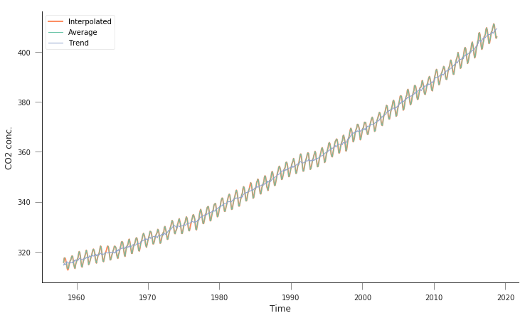
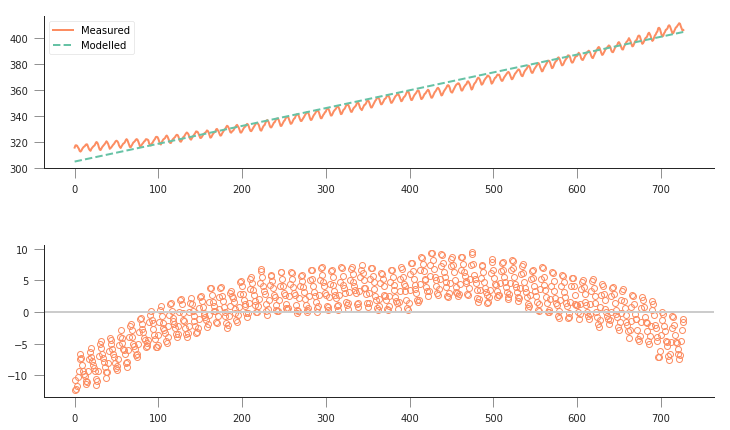
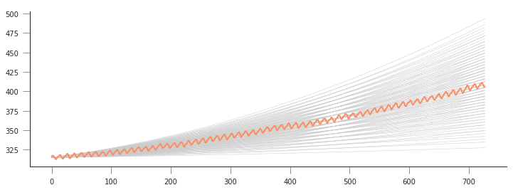
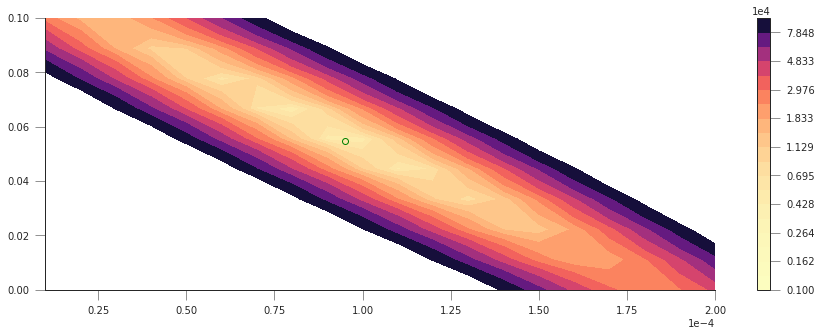
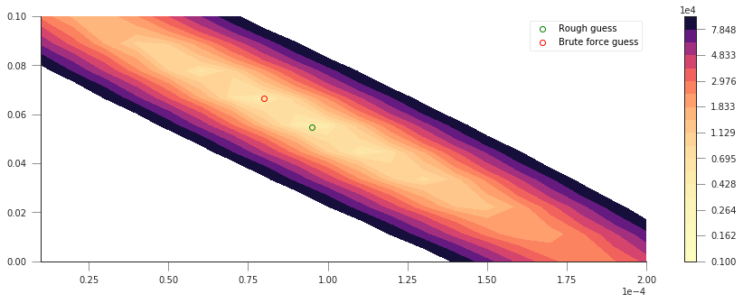
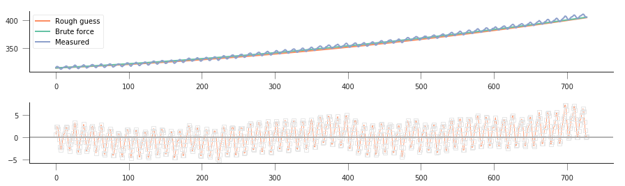
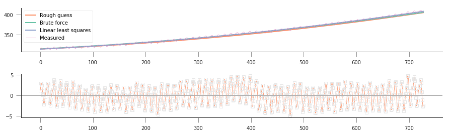
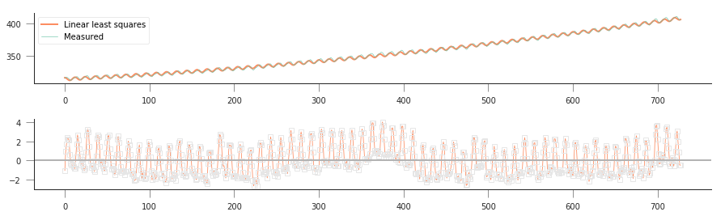
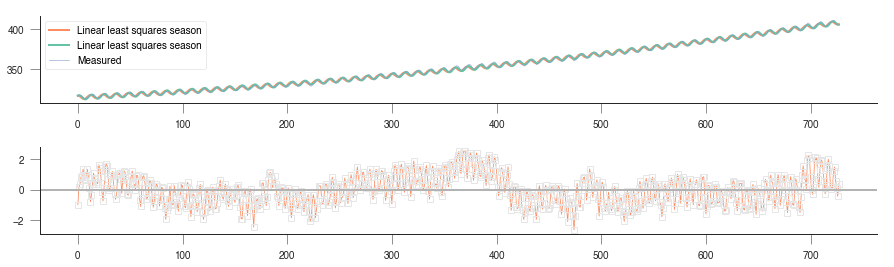
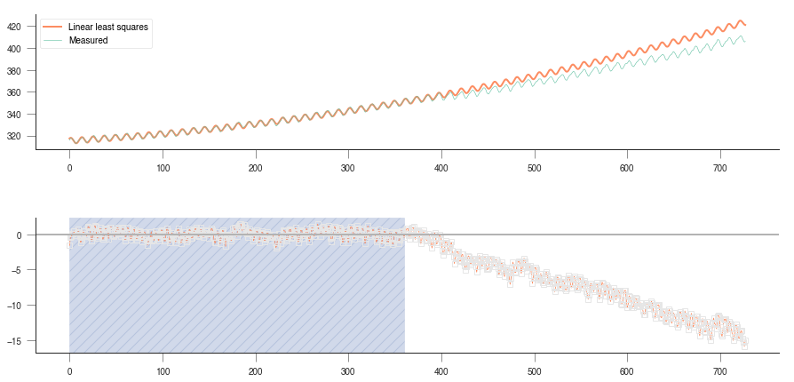

Table of Contents
=================

.. raw:: html

   <p>

.. container:: lev1 toc-item

   1  Fitting to the Mauna Loa :math:`CO_2` record

.. container:: lev2 toc-item

   1.1  Introduction

.. container:: lev2 toc-item

   1.2  Obtaining the data

.. container:: lev3 toc-item

   1.2.1  Downloading the data

.. container:: lev3 toc-item

   1.2.2  Exploring the data

.. container:: lev2 toc-item

   1.3  Loading the data into Python

.. container:: lev2 toc-item

   1.4  A model for :math:`CO_2` concentration

.. container:: lev3 toc-item

   1.4.1  A linear trend model

.. container:: lev3 toc-item

   1.4.2  A quadratic model

.. container:: lev2 toc-item

   1.5  Solving the problem using linear algebra

.. container:: lev3 toc-item

   1.5.1  Solution using np.linalg.lstsq

.. container:: lev2 toc-item

   1.6  A model with seasonality

Fitting to the Mauna Loa :math:`CO_2` record
============================================

Introduction
------------

:math:`CO_2` concentration in the atmosphere has been steadily
increasing. The flask measurements collected in Mauna Loa provide a
fairly long time series that allows us to see the temporal evolution of
this trace gas.

.. container:: alert alert-success

   Why is CO2 important?

The time series looks like this

.. figure:: https://www.pmel.noaa.gov/co2/files/co2_data_mlo_med.jpg
   :alt: Mauna Loa CO2 record

   Mauna Loa CO2 record

.. container:: alert alert-success

   Knowing that Mauna Loa is in Hawaii (Northern Hemisphere), can you
   broadly explain what’s going on?

In today’s session, we shall consider how to “model” the :math:`CO_2`
record. We’ll develop some simple models of :math:`CO_2` as a function
of time, and will try to “fit” them to the data.

.. container:: alert alert-success

   Can you think why fitting some models based on time to the Mauna Loa
   record might not be particularly insightful?

We first have an import cell that deals with importing all the usual
modules that we’ll require: numpy, matplotlib as well as pandas to read
the data file. If you put all your imports at the top and run them
first, they should be available for all other cells…

.. code:: python

    from pathlib import Path  # Checks for files and so on
    import numpy as np  # Numpy for arrays and so on
    import pandas as pd
    import sys
    import matplotlib.pyplot as plt  # Matplotlib for plotting
    # Ensure the plots are shown in the notebook
    %matplotlib inline
    
    # Instead of using requests, we might as well use Python's buil-in
    # HTTP downloader
    from urllib.request import urlretrieve

Obtaining the data
------------------

Downloading the data
~~~~~~~~~~~~~~~~~~~~

The data are available on line from
`NOAA <https://www.esrl.noaa.gov/gmd/ccgg/trends/data.html>`__. We want
the monthly average dataset, which can be found there. If the data is
not yet available in your system, the next Python cell will download it
from
```ftp://aftp.cmdl.noaa.gov/products/trends/co2/co2_mm_mlo.txt`` <ftp://aftp.cmdl.noaa.gov/products/trends/co2/co2_mm_mlo.txt>`__.
In this case, because the url is an FTP one we will use the ``urllib2``
package rather than requests, that doesn’t deal with FTP. We will save
it to a file with the same name locally:

.. code:: python

    # The remote URL for the data file is address:
    address = 'ftp://aftp.cmdl.noaa.gov/products/trends/co2/'
    # We'll create a folder if it doesn't exist in the data folder for
    # the data
    dest_path = Path("data/Mauna_Loa/").mkdir(parents=True, exist_ok=True)
    fname = Path("data/Mauna_Loa/co2_mm_mlo.txt")
    if not fname.exists():
        # Data file not present, let's download it
        print("Downloading remote file")
        urlretrieve(f"{address:s}/{fname.name:s}", fname.as_posix())
        print(f"Remote file downloaded to {fname.name:s}")
    else:
        print(f"{fname.name:s} already present, no need to download again")


.. parsed-literal::

    co2_mm_mlo.txt already present, no need to download again


Exploring the data
~~~~~~~~~~~~~~~~~~

We can have a peek at the text file. We note that most of the first few
lines are “comments” (lines start by ``#``), which describe useful
*metadata*. We note that we have several columns of data:

1. The year
2. The month
3. The decimal date
4. The monthly mean CO2 mole fraction determined from daily averages

We will mostly be bothered about columns three and four.

We can peek at the data (first 73 lines) using the UNIX shell
```head`` <http://www.linfo.org/head.html>`__ command (this will not
work on Windows, but will probably work on OSX):

.. code:: python

    !head -n 73 co2_mm_mlo.txt


.. parsed-literal::

    head: cannot open ‘co2_mm_mlo.txt’ for reading: No such file or directory


Loading the data into Python
----------------------------

This is quite straightforward using
```np.loadtxt`` <https://scipython.com/book/chapter-6-numpy/examples/using-numpys-loadtxt-method/>`__\ …

We will also “mask” if the data is missing checking for the value
-99.99…

.. code:: python

    hdr = [
        "year", "month", "decimal_date", "average", "interpolated", "trend", "days"
    ]
    co2 = pd.read_csv(
        fname,
        comment='#',
        delim_whitespace=True,
        names=hdr,
        na_values=[-99.99, -1])
    
    plt.figure(figsize=(12, 7))
    plt.plot(co2.decimal_date, co2.interpolated, '-', lw=2, label="Interpolated")
    plt.plot(co2.decimal_date, co2.average, '-', lw=1, label="Average")
    plt.plot(co2.decimal_date, co2.trend, '-', lw=1, label="Trend")
    plt.xlabel("Time")
    plt.ylabel("CO2 conc.")
    plt.legend(loc="best")


.. parsed-literal::

    <matplotlib.legend.Legend at 0x7f00481c2160>


.. parsed-literal::

    /home/ucfajlg/miniconda3/envs/python3/lib/python3.6/site-packages/matplotlib/font_manager.py:1328: UserWarning: findfont: Font family ['sans-serif'] not found. Falling back to DejaVu Sans
      (prop.get_family(), self.defaultFamily[fontext]))





So this is quite similar to what we had above. There’s an average line,
an interpolated line, as well as some smoothed trend line. We’re
interested in the interpolated line.

A model for :math:`CO_2` concentration
--------------------------------------

A linear trend model
~~~~~~~~~~~~~~~~~~~~

We might be curious about a simple model for :math:`CO_2` concentration.
Perhaps the simplest model is a linear trend, which we can write as the
concentration at some time step :math:`i`, :math:`W_i` being just a
linear scaling of the time :math:`t_i`:

.. math::


   W_i = m \cdot t_i + c.

We can define a Python function for this very easily:

.. code:: python

    def linear_model(p, t):
        m, c = p
        return m * t + c

We can now try to plot some model trajectories and the data by supplying
parameters for the slope (:math:`m`) and intercept (:math:`c`). Let’s
start by assuming that the slope can be approximated by the difference
between minimum and maximum concentrations divided by the number of
timesteps:

.. math::


   m \approx  \frac{411-310}{728}

:math:`c` is the minimum value, so :math:`c\approx 310`.

.. code:: python

    n_times = co2.interpolated.shape[0]
    max_co2 = co2.interpolated.max()
    min_co2 = co2.interpolated.min()
    print(f"There are {n_times:d} steps in the data")
    print(f"Maximum CO2 concentration {max_co2:f}")
    print(f"Minimum CO2 concentration {min_co2:f}")
    x = np.arange(n_times)
    fig, axs = plt.subplots(nrows=2, ncols=1, figsize=(12, 7))
    axs[0].plot(x, co2.interpolated, '-', label="Measured")
    m = (403. - 305.) / 716
    c = 305.
    axs[0].plot(x, linear_model([m, c], x), '--', label="Modelled")
    axs[0].legend(loc="best")
    axs[1].plot(x, linear_model([m, c], x) - co2.interpolated, 'o', mfc="none")
    axs[1].axhline(y=0, lw=2, c="0.8")
    S = np.sum((linear_model([m, c], x) - co2.interpolated)**2)
    print("Sum of squared residuals: {}".format(S))


.. parsed-literal::

    There are 728 steps in the data
    Maximum CO2 concentration 411.240000
    Minimum CO2 concentration 312.660000
    Sum of squared residuals: 14997.256482063598


.. parsed-literal::

    /home/ucfajlg/miniconda3/envs/python3/lib/python3.6/site-packages/matplotlib/font_manager.py:1328: UserWarning: findfont: Font family ['sans-serif'] not found. Falling back to DejaVu Sans
      (prop.get_family(), self.defaultFamily[fontext]))





So, not really a great fit… The overall shape is a bit off, and the
model isn’t really fitting the annual seasonality in the curve. The
residuals plot tells us that the residuals aren’t really noise around
zero: they show a very clear trend, suggesting that **the model is too
simple to fit the data**.

A quadratic model
~~~~~~~~~~~~~~~~~

Maybe we need a higher order model, like a quadratic model:

.. math::


   W_i = a_0 \cdot t_i^2  + a_1 \cdot t_i + a_2.

In this case, it is a bit harder to eyeball what good starting
parameters for :math:`\left[a_0, a_1, a_2\right]` would be. A strategy
for this would be to consider what a good fit would look like, and then
use this to define a metric of good fit. A good fit would basically
overlap the measurements, being indistinguishable from them. The
*residual* is the difference between the measurement and the model. In
this case, it can be positive or negative (whether the model over- or
undershoots the observations), but by squaring the residual we get rid
of the sign. Then we can add up all the squared residuals, and the best
fit will be the one that has the lowest sum of squares. This is in
essence the `method of least
squares <https://en.wikipedia.org/wiki/Least_squares>`__. Let’s see how
this works *intuitevely*: we’ll loop over the parameters and plot the
different predicted concentrations… First we need our model function…

.. code:: python

    def quadratic_model(p, t):
        a0, a1, a2 = p
        return a0 * t**2 + a1 * t + a2

We can get a feeling of what the parameters might be just by eyeballing
reading up some points from the graph, and then solving the system
manually:

.. math::


   \begin{aligned}
   403 &= a_0\cdot (728)^2 + a_1\cdot (728) + a_2\\
   340 &= a_0\cdot (300)^2 + a_1\cdot (300) + a_2\\
   315 &= a_0\cdot (0)^2 + a_1\cdot (0) + a_2\\
   \end{aligned}

From this, we can get some rough estimates, which in this case are

.. math::


   \begin{aligned}
   a_0 &= 9.5\cdot 10^{-5}\\
   a_1 &= 5.48\cdot 10^{-2}\\
   a_2 &= 315.\\
   \end{aligned}

We can just basically run the model around these numbers and plot the
different model predictions with a loop over :math:`a_0` and another one
over :math:`a_1` (assuming :math:`a_2` is well defined)

.. code:: python

    plt.figure(figsize=(12, 4))
    
    a2 = 315.
    for a0 in np.linspace(1e-5, 20e-5, 10):
        for a1 in np.linspace(1e-2, 10e-2, 10):
            plt.plot(x, quadratic_model([a0, a1, a2], x), '-', lw=0.5, c="0.8")
    
    plt.plot(x, co2.interpolated, '-', label="Measured")


.. parsed-literal::

    [<matplotlib.lines.Line2D at 0x7f00480047b8>]


.. parsed-literal::

    /home/ucfajlg/miniconda3/envs/python3/lib/python3.6/site-packages/matplotlib/font_manager.py:1328: UserWarning: findfont: Font family ['sans-serif'] not found. Falling back to DejaVu Sans
      (prop.get_family(), self.defaultFamily[fontext]))





This is quite complicated, we can see that there might be a good line of
fit, but we don’t see clearly what parameters provide it! We can store
the goodness of fit metric (sum of squared residuals) in a 2D array and
then plot it as an image. It should be more obvious where the minimum
lies…

.. code:: python

    # Define a 2D array for the sum of squares (sos)
    sos = np.zeros((10, 20))
    # the time axis redefined again, in case it got confused with something else
    x = np.arange(n_times)
    
    # first loop is over a0, 20 steps between 1e-5 and 20e-5
    for ii, a0 in enumerate(np.linspace(1e-5, 20e-5, 20)):
        # 2nd loop is over a1, 10 steps between 1e-2 and 10e-2
        for jj, a1 in enumerate(np.linspace(1e-2, 10e-2, 10)):
            # for the current values of a0 and a1, calculate the residual
            residual = quadratic_model([a0, a1, a2], x) - co2.interpolated
            sq_residual = residual * residual
            sum_of_residuals = sq_residual.sum()
            # Store the sum_of_residuals into our array
            sos[jj, ii] = np.sum(
                (quadratic_model([a0, a1, a2], x) - co2.interpolated)**2)
    
    # Plotting!
    plt.figure(figsize=(15, 5))
    # Set up the x and y axis for the plot
    yy = np.linspace(1e-5, 20e-5, 20)
    xx = np.linspace(1e-5, 10e-2, 10)
    # Do a contour plot. The logspace bit basically defines the location
    # of 20 contour lines
    c = plt.contourf(yy, xx, sos, np.logspace(3, 5, 20), cmap=plt.cm.magma_r)
    # Colorbar
    plt.colorbar()
    # Now, just plot the rough guess of a0 and a1 into this plot
    # We want to plot an empty circle with a green edge
    plt.plot(9.51242659e-05, 5.47960536e-02, 'o', mfc="None", mec="g")


.. parsed-literal::

    [<matplotlib.lines.Line2D at 0x7f00422d7cc0>]


.. parsed-literal::

    /home/ucfajlg/miniconda3/envs/python3/lib/python3.6/site-packages/matplotlib/font_manager.py:1328: UserWarning: findfont: Font family ['sans-serif'] not found. Falling back to DejaVu Sans
      (prop.get_family(), self.defaultFamily[fontext]))





So that’s pretty interesting, we get a very clear “valley”, with a
minimum pretty close to where our first rough guess is… The shape is
quite interesting: if we start at the first guess point, and move along
the :math:`x-` or :math:`y-` axes, we quickly go into areas of large
error. However, if we move along the diagonal line, we will be in the
“trough” of the cost function, provided that when you move “up”
(positive :math:`a_0`), you also move “left” (negative :math:`a_1`), or
if you move “down” (negative :math:`a_0`), you also move “right”
(positive :math:`a_1`). Basically, the cost function does not change if
you can get the two parameters to co-operate and compensate the effect
of each other.

Let’s find out where the actual minimum from our brute-force approach
is. We can do this quickly by creating a mask where all the elements are
``False`` except where the minimum value of ``sos`` is located. We can
then use this mask to multiply our ``x`` and ``y`` axes and just select
the unique values that are larger than 0.

.. code:: python

    print(f"Best SoS: {sos.min():g}")
    sos_mask = sos == sos.min()
    u1 = np.unique(yy[None, :] * sos_mask)
    yy_opt = u1[u1 > 0]
    u2 = np.unique(xx[:, None] * sos_mask)
    xx_opt = u2[u2 > 0]


.. parsed-literal::

    Best SoS: 4182.24


The Sum of Squares of the first example was around 15000, so we’ve
improved our modelling by adding an extra (quadratic term). This is
usually the case: you can improve your goodness of fit by adding extra
terms, but usually at the cost of *specialising* your model too much to
the training data. This will usually result in poor predictive abilities
for the model outside the training region. Which isn’t cool.

We can plot now the cost function, as well as our first rough guess and
the final guess:

.. code:: python

    # Plotting!
    plt.figure(figsize=(15, 5))
    # Set up the x and y axis for the plot
    yy = np.linspace(1e-5, 20e-5, 20)
    xx = np.linspace(1e-5, 10e-2, 10)
    # Do a contour plot. The logspace bit basically defines the location
    # of 20 contour lines
    c = plt.contourf(yy, xx, sos, np.logspace(3, 5, 20), cmap=plt.cm.magma_r)
    # Colorbar
    plt.colorbar()
    # Now, just plot the rough guess of a0 and a1 into this plot
    # We want to plot an empty circle with a green edge
    plt.plot(
        9.51242659e-05,
        5.47960536e-02,
        'o',
        mfc="None",
        mec="g",
        label="Rough guess")
    plt.plot(yy_opt, xx_opt, 'o', mfc="None", mec="r", label="Brute force guess")
    plt.legend(loc="best")


.. parsed-literal::

    <matplotlib.legend.Legend at 0x7f00421ad470>


.. parsed-literal::

    /home/ucfajlg/miniconda3/envs/python3/lib/python3.6/site-packages/matplotlib/font_manager.py:1328: UserWarning: findfont: Font family ['sans-serif'] not found. Falling back to DejaVu Sans
      (prop.get_family(), self.defaultFamily[fontext]))





That’s not *too bad*! But althogh we found a minimum, we haven’t shown
how well our model really fits the observations! Let’s plot the
prediction (with the “optimised parameters” as well as the roughly
guessed ones):

.. code:: python

    fig, axs = plt.subplots(nrows=2, ncols=1, figsize=(15, 4))
    
    a2 = 315.
    axs[0].plot(
        x,
        quadratic_model([9.51242659e-05, 5.47960536e-02, a2], x),
        '-',
        label="Rough guess")
    axs[0].plot(
        x, quadratic_model([yy_opt, xx_opt, a2], x), '-', label="Brute force")
    
    axs[0].plot(x, co2.interpolated, '-', label="Measured")
    axs[0].legend(loc="best")
    
    axs[1].plot(
        x,
        co2.interpolated - quadratic_model([yy_opt, xx_opt, a2], x),
        's-',
        lw=0.8,
        mfc="none",
        mec="0.9")
    axs[1].axhline(0, color="0.7")


.. parsed-literal::

    <matplotlib.lines.Line2D at 0x7f00420cd940>


.. parsed-literal::

    /home/ucfajlg/miniconda3/envs/python3/lib/python3.6/site-packages/matplotlib/font_manager.py:1328: UserWarning: findfont: Font family ['sans-serif'] not found. Falling back to DejaVu Sans
      (prop.get_family(), self.defaultFamily[fontext]))





So solvng by brute force with a quadratic appears to have worked better
than fitting with our linear model. The residuals now mostly lie in the
-5 to 5 units range, whereas the linear model had residuals floating
around -12 and 12 or thereabouts. It is also clear that we’re missing
out on the seasonality, and some rates of growth (particularly at the
end) seem to be underemphasised.

Solving the problem using linear algebra
----------------------------------------

So we can see that our brute force search has given us a better fit than
eyeballing it, which is what one might expect. It should be possible to
solve this analytically. Let’s write this as a matrix problem:

.. math::


   \begin{aligned}
   \mathbf{A}\cdot\vec{x}&=\vec{y}\\
   \mathbf{A}&=\begin{bmatrix} 
   t_1^2 & t_1 & 1 \\
   t_2^2 & t_2 & 1 \\
   t_3^2 & t_3 & 1 \\
   \vdots & \vdots \vdots \\
   t_N^{2} & t_N & 1 \\\end{bmatrix}\\
   \vec{x} &=\begin{bmatrix}a_0\\a_1\\a_2 \end{bmatrix}\\
   \vec{y} &=\begin{bmatrix}W_1\\W_2\\W_3\\ \vdots \\W_N \end{bmatrix}\\
   \end{aligned}

.. container:: alert alert-success

   Spend some time satisfying yourself that you understand how the
   previous matrices and vectors work together.

So, we see that this is really an overdetermined linear problem, where
we’ve got more observations (:math:`N`) than parameters (3). We can
solve this by calculating the pseudo inverse:

.. math::


   \vec{x} = \left[\mathbf{A}^{\top}\mathbf{A}  \right]^{-1}\mathbf{A}^{\top}\vec{y},

where :math:`^{\top}` is the **transpose**, and :math:`^{-1}` is the
inverse matrix. We can solve this problem easily in Python, which can
deal with linear algebra nicely. The
```np.linalg.lstsq`` <https://docs.scipy.org/doc/numpy-1.13.0/reference/generated/numpy.linalg.lstsq.html>`__
method has a direct solver, or you can also work it out by calculating
the inverse matrix yourself. The latter approach is usually numerically
more unstable, so we won’t be looking into it.

Solution using ``np.linalg.lstsq``
~~~~~~~~~~~~~~~~~~~~~~~~~~~~~~~~~~

In this case, we need to define the matrix :math:`\mathbf{A}`. The
observations vector :math:`\vec{y}` is already defined. What is needed
is to weed out the invalid measurements in both :math:`\mathbf{A}` and
:math:`\vec{y}`. We then use
```np.linalg.lstsq`` <https://docs.scipy.org/doc/numpy-1.13.0/reference/generated/numpy.linalg.lstsq.html>`__
to solve the linear overdetermined system. This returns a number of
things:

1. The solution vector.
2. The sum of squared residuals.
3. The rank of the matrix :math:`\mathbf{A}`.
4. The eigenvalues.

We’re really only interested in the first two (the other two outputs are
important, but this is not your methods course!).

.. code:: python

    # We create the A matrix
    x = np.arange(n_times)
    A = np.array([x**2, x, np.ones_like(x)])
    # Now put the observations into y
    y = co2.interpolated
    
    # Call lstsq
    xopt, sum_of_residuals, r, evals = np.linalg.lstsq(A.T, y)
    rough_guess = [9.51242659e-05, 5.47960536e-02, 315]
    brute_force = [yy_opt, xx_opt, 315]
    print("Parameter   Matrix       Brute force     Rough guess")
    for par in range(3):
        print("a{}:         {:08.5e}\t {:08.5e}\t {:08.5e}".format(
            par, xopt[par], float(brute_force[par]), rough_guess[par]))
    print("Sum of residuals: {:g}".format(float(sum_of_residuals)))


.. parsed-literal::

    Parameter   Matrix       Brute force     Rough guess
    a0:         8.79184e-05	 8.00000e-05	 9.51243e-05
    a1:         6.53383e-02	 6.66700e-02	 5.47961e-02
    a2:         3.14462e+02	 3.15000e+02	 3.15000e+02
    Sum of residuals: 3563.41


.. parsed-literal::

    /home/ucfajlg/miniconda3/envs/python3/lib/python3.6/site-packages/ipykernel_launcher.py:8: FutureWarning: `rcond` parameter will change to the default of machine precision times ``max(M, N)`` where M and N are the input matrix dimensions.
    To use the future default and silence this warning we advise to pass `rcond=None`, to keep using the old, explicitly pass `rcond=-1`.
      


The parameters we got from the linear solver are very similar to the
brute force method. If we had used a finer grid in the brute force
model, we’d get even closer, but at the price of incresing the number of
model evaluations. We can also see that using the analytic least squares
solution results in the actual minimum of the cost function, not a value
close to it.

In the linear algebra case, the procedure is very simple, and provided
the matrix :math:`\mathbf{A}` is invertible, one is mostly guaranteed a
good solution.

As usual, let’s us plot model, data and residuals and see what we can
spot…

.. code:: python

    fig, axs = plt.subplots(nrows=2, ncols=1, figsize=(15, 4))
    x = np.arange(n_times)
    a2 = 315.
    
    axs[0].plot(x, quadratic_model(rough_guess, x), '-', label="Rough guess")
    axs[0].plot(
        x, quadratic_model([yy_opt, xx_opt, a2], x), '-', label="Brute force")
    axs[0].plot(x, quadratic_model(xopt, x), '-', label="Linear least squares")
    axs[0].plot(x, co2.interpolated, '-', lw=0.6, label="Measured")
    axs[0].legend(loc="best")
    
    axs[1].plot(
        x,
        co2.interpolated - quadratic_model(xopt, x),
        's-',
        lw=0.8,
        mfc="none",
        mec="0.9")
    axs[1].axhline(0, color="0.7")


.. parsed-literal::

    <matplotlib.lines.Line2D at 0x7f00401834a8>


.. parsed-literal::

    /home/ucfajlg/miniconda3/envs/python3/lib/python3.6/site-packages/matplotlib/font_manager.py:1328: UserWarning: findfont: Font family ['sans-serif'] not found. Falling back to DejaVu Sans
      (prop.get_family(), self.defaultFamily[fontext]))





So we can see that the optimal value is quite similar to the other two
solutions, but results in a better fit (3470 versus 4090). We can see
that with this method we can solve for all three parameters, even though
our first guess of 315 for :math:`a_2` was pretty close to the true
solution.

.. container:: alert alert-danger

   Try to use the linear least squares method to fit the first order
   linear model that we fitted “by eye” at the start of the notebook.

A model with seasonality
------------------------

While the quadratic model appears to go through the centre of the Mauna
Loa curve, it clearly misses an important feature: the seasonality of
the :math:`CO_2` concentration. We can’t really emulate that behaviour
with a simple quadratic function, but need a different model, one that
deals with the seasonality. We can think that the seasonality is an
additive cosine term, so that our model for :math:`CO_2` concentration
is now

.. math::


   W_i = a_0\cdot t_i^2 + a_1\cdot t_i + a_2 + a_3\cdot \cos\left(2\pi\frac{t_i}{T}  \right),

where :math:`T` is the period of the seasonality, in this case, annual
so :math:`T=12`.

Although the model looks quite ugly, we see that we can write it like a
sum (or a *linear combination*) of some functions (:math:`t^2,\,t,`, the
cosine term) weighted by the model parameters :math:`a_0, \cdots, a_3`.
So this is a linear model like the ones we’ve seen before and with which
you should be familiar.

In this case, the :math:`\mathbf{A}` matrix is now given by

.. math::


   \mathbf{A}=\begin{bmatrix}  
   t_1^2 & t_1 & 1 & \cos \left( 2\pi\frac{t_1}{T}\right)\\
   t_2^2 & t_2 & 1 & \cos \left( 2\pi\frac{t_2}{T}\right)\\
   t_3^2 & t_3 & 1 & \cos \left( 2\pi\frac{t_3}{T}\right)\\
   \vdots & \vdots & \vdots & \vdots \\
   t_N^2 & t_N & 1 & \cos \left( 2\pi\frac{t_N}{T}\right)\\
   \end{bmatrix}.

We can still solve the problem by making use of ``lstsq``. Let’s see how
that works!

.. code:: python

    def quadratic_with_season(p, t, period=12.):
        a0, a1, a2, a3 = p
        return a0 * t * t + a1 * t + a2 + a3 * np.cos(2 * np.pi * (t / period))
    
    
    period = 12.
    # We create the A matrix
    x = np.arange(n_times)
    A = np.array([x * x, x, np.ones_like(x),
                  np.cos(2 * np.pi * (x / period))])
    # Now put the observations into y
    y = co2.interpolated
    
    # Call lstsq
    xopt, sum_of_residuals, r, evals = np.linalg.lstsq(A.T, y)
    for par in range(4):
        print("a{}:         {:08.5e}".format(par, xopt[par]))
    print(f"Sum of squares: {float(sum_of_residuals):g}")


.. parsed-literal::

    a0:         8.80710e-05
    a1:         6.52761e-02
    a2:         3.14461e+02
    a3:         2.28764e+00
    Sum of squares: 1654.67


.. parsed-literal::

    /home/ucfajlg/miniconda3/envs/python3/lib/python3.6/site-packages/ipykernel_launcher.py:15: FutureWarning: `rcond` parameter will change to the default of machine precision times ``max(M, N)`` where M and N are the input matrix dimensions.
    To use the future default and silence this warning we advise to pass `rcond=None`, to keep using the old, explicitly pass `rcond=-1`.
      from ipykernel import kernelapp as app


Let’s do some plots of the function fitting and residuals, and compare
to previous results…

.. container:: alert alert-danger

   Doing these sort of plots should be second nature to you by now. So
   do them!

.. code:: python

    fig, axs = plt.subplots(nrows=2, ncols=1, figsize=(15, 4))
    x = np.arange(n_times)
    a2 = 315.
    
    axs[0].plot(x, quadratic_with_season(xopt, x), '-', label="Linear least squares")
    axs[0].plot(x, co2.interpolated, '-', lw=0.6, label="Measured")
    axs[0].legend(loc="best")
    
    axs[1].plot(
        x,
        co2.interpolated - quadratic_with_season(xopt, x),
        's-',
        lw=0.8,
        mfc="none",
        mec="0.9")
    axs[1].axhline(0, color="0.7")


.. parsed-literal::

    <matplotlib.lines.Line2D at 0x7f00400fb4a8>


.. parsed-literal::

    /home/ucfajlg/miniconda3/envs/python3/lib/python3.6/site-packages/matplotlib/font_manager.py:1328: UserWarning: findfont: Font family ['sans-serif'] not found. Falling back to DejaVu Sans
      (prop.get_family(), self.defaultFamily[fontext]))





So that’s pretty good: by adding a simple cosine term, we can now start
to model the annual seasonality in the measurements, and the sum of
squared residuals is now further shrunk to around 1500. This is good,
but in some ways unsurprising: you’re now solving for 4 parameters,
rather than 3 or 2 (for the simple linear case), so you have more
degrees of freedom, and you expect to be able to fit your data better.

A phase shift
-------------

Looking at the residuals, we might decide that there’s some mileage in
shifting the cosine term a bit to get a better fit. We could do this by
adding a phase shift so that the cosine terms would look like

.. math::


   \cos\left[ \frac{2\pi}{T}(t+\phi)\right]

However, it’d be hard to guess :math:`\phi` (we’ve effectively assumed
it was 0 radians above!). So we’d need to use some non-linear solving
approach. However, we might exploit the following trigonometrical
identity:

.. math::


   A\cos(\theta) + B\sin(\theta)=C\sin(\theta + \phi),

.. container:: alert alert-success

   Can you prove the above identity?

This means that we can just add (drumroll…) yet another term to our
model (a sine term), and the ratio of the cosine and sine terms will
result in a phase shift. As we’re adding another term, we expect a
better result, but in this case, we hope that the aim of adding this
extra term is to have **uncorrelated residuals around 0**.

.. container:: alert alert-danger

   You should be able to do this yourself, including model fitting and
   plotting.

.. code:: python

    def quadratic_with_season_shift(p, t, period=12.):
        a0, a1, a2, a3, a4 = p
        return a0 * t * t + a1 * t + a2 + \
                    a3 * np.cos(2 * np.pi * (t / period)) + \
                    a4 * np.sin(2 * np.pi * (t / period)) 
    
    
    
    period = 12.
    # We create the A matrix
    x = np.arange(n_times)
    A = np.array([x * x, x, np.ones_like(x),
                  np.cos(2 * np.pi * (x / period)),
                  np.sin(2 * np.pi * (x / period))])
    # Now put the observations into y
    y = co2.interpolated
    
    # Call lstsq
    xopt, sum_of_residuals, r, evals = np.linalg.lstsq(A.T, y)
    for par in range(5):
        print("a{}:         {:08.5e}".format(par, xopt[par]))
    print(f"Sum of squares: {float(sum_of_residuals):g}")


.. parsed-literal::

    a0:         8.76557e-05
    a1:         6.55875e-02
    a2:         3.14413e+02
    a3:         2.28558e+00
    a4:         1.66696e+00
    Sum of squares: 645.521


.. parsed-literal::

    /home/ucfajlg/miniconda3/envs/python3/lib/python3.6/site-packages/ipykernel_launcher.py:17: FutureWarning: `rcond` parameter will change to the default of machine precision times ``max(M, N)`` where M and N are the input matrix dimensions.
    To use the future default and silence this warning we advise to pass `rcond=None`, to keep using the old, explicitly pass `rcond=-1`.


The squared sum of residuals is now around 645, again an improvement on
the solution. We can see the fit and residuals I got (yours should be
similar) here



   quadratic with seasonal shift

We’re now within the +/- 2 units band, which is a reasonable estimate.

Prediction
----------

A model isn’t very good if you don’t challenge it to predict phenomean
outside the training range. We could just extend the :math:`x-` axis
further left or right and see what the model predicts, but we’d be
**extrapolating**.

.. container:: alert alert-success

   Given the simplicity of the model, and what you know about
   :math:`CO_2` dynamics over the past ~100 years, would you trust these
   extrapolations?

We can sort of mimic this behaviour by fitting the model only to a
subset of years, and then test it for the rest of the available time
series. For example, fit for the first 20 years, and then forecasat the
remaining years. Or fit the last 20 years and forecast the previous
years until the 1950s… If the model is successful in its predictions,
then we can say that the model is probably OK, but if the quality of the
predictions is poor, then we need to start thinking about **discarding**
the model, and looking for alternatives!

.. container:: alert alert-danger

   Fit the model to the first 30 years of data, and then use it to
   predict the complete time series. Your result should look something
   like below. Can you explain what’s going on there?



   Extrapolation plot

Uncertainty
-----------

We have not said anything about how the model predictions are
*uncertain*: we only used a limited dataset, with measurements errors
associated to it. Even within the training period, the residuals are not
0, so we can expect that the model has some bits of reality missing from
it (it *is* a model, after all!). Uncertainty would allow us to quantify
how good or bad the predictions from the model are, but so far, we have
ignored it…

.. container:: alert alert-success

   In the 30 year training experiment, can you sketch how you think
   uncertainty should look like?

.. code:: python

    def quadratic_with_season_shift(p, t, period=12.):
        a0, a1, a2, a3, a4 = p
        return a0 * t * t + a1 * t + a2 + \
                    a3 * np.cos(2 * np.pi * (t / period)) + \
                    a4 * np.sin(2 * np.pi * (t / period)) 
    
    
    
    period = 12.
    # We create the A matrix
    x = np.arange(n_times)[:12*30]
    A = np.array([x * x, x, np.ones_like(x),
                  np.cos(2 * np.pi * (x / period)),
                  np.sin(2 * np.pi * (x / period))])
    # Now put the observations into y
    y = co2.interpolated[:12*30]
    
    # Call lstsq
    xopt, sum_of_residuals, r, evals = np.linalg.lstsq(A.T, y)
    for par in range(5):
        print("a{}:         {:08.5e}".format(par, xopt[par]))
    print(f"Sum of squares: {float(sum_of_residuals):g}")


.. parsed-literal::

    a0:         1.37489e-04
    a1:         4.93777e-02
    a2:         3.15199e+02
    a3:         2.10176e+00
    a4:         1.70324e+00
    Sum of squares: 166.009


.. parsed-literal::

    /home/ucfajlg/miniconda3/envs/python3/lib/python3.6/site-packages/ipykernel_launcher.py:17: FutureWarning: `rcond` parameter will change to the default of machine precision times ``max(M, N)`` where M and N are the input matrix dimensions.
    To use the future default and silence this warning we advise to pass `rcond=None`, to keep using the old, explicitly pass `rcond=-1`.

