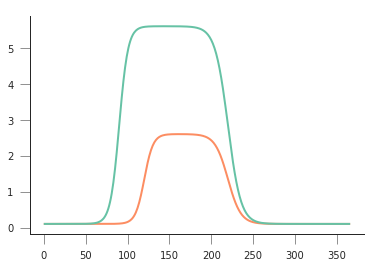
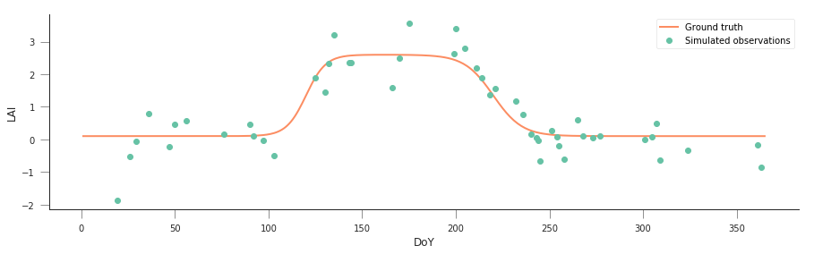
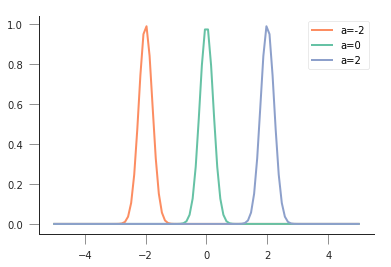
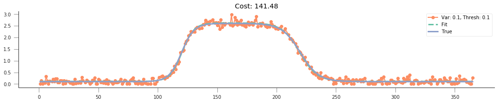
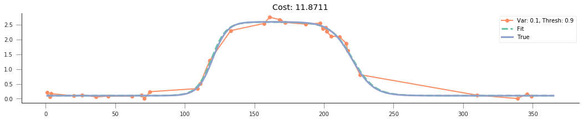
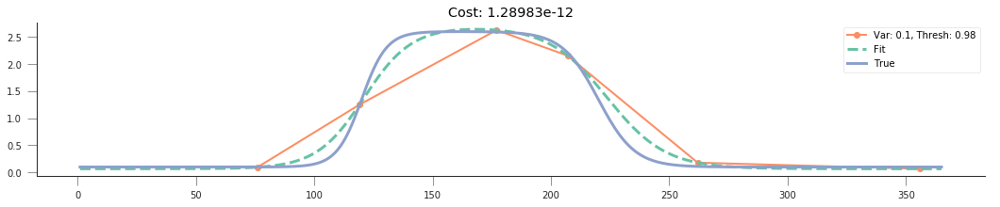
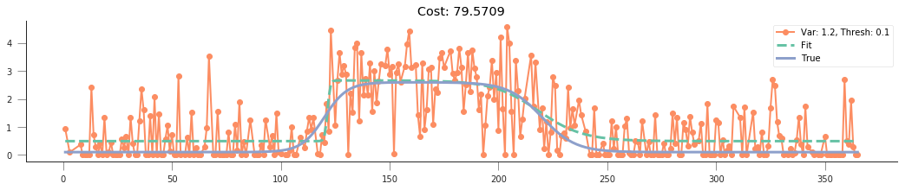
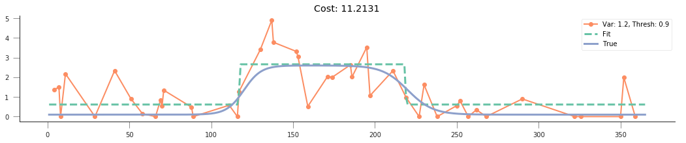
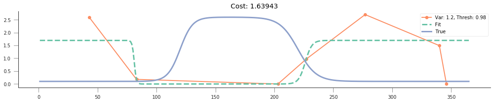
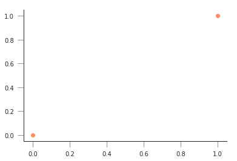

.. code:: ipython3

    # All imports go here. Run me first!
    import datetime
    from pathlib import Path  # Checks for files and so on
    import numpy as np  # Numpy for arrays and so on
    import pandas as pd
    import sys
    import matplotlib.pyplot as plt  # Matplotlib for plotting
    # Ensure the plots are shown in the notebook
    %matplotlib inline
    
    import gdal
    import osr
    import numpy as np
    %matplotlib inline

Fitting non-linear models
=========================

In the previous session, we looked at fitting linear models to
observations. While this is a very common task, complex processes might
require models which are non-linear.

.. container:: alert alert-success

   Can you think of any non-linear models that you have come across?

One non-linear model is modelling LAI as a function of time (or
temperature). In the Nothern Hemisphere, and for temperate latitudes,
there is a clear seasonal cycle in vegetation, particularly visible in
leaf area index (LAI). LAI dynamics can possibly be depicted by a
“double logistic” curve. Mathematically, the double logistic looks like
this

.. figure:: https://camo.githubusercontent.com/7a664a29ec5bc190d71d8ba5ec391bcf98848df7/687474703a2f2f777777322e67656f672e75636c2e61632e756b2f7e706c657769732f67656f67673132342f5f696d616765732f7a68616e67312e706e67
   :alt: A double logistic

   A double logistic

Mathematically, the function predicts the e.g. LAI (or some vegetation
index) as

.. math::


   y = p_0 - p_1\cdot\left[\frac{1}{1+\exp\left(p_2\cdot(t-p_3)\right)} + \frac{1}{1+\exp\left(-p_4\cdot(t-p_5)\right)} - 1\right].

If we inspect this form, we can probably guess that :math:`p_0` and
:math:`p_1` scale the vertical span of the function, whereas :math:`p_3`
and :math:`p_5` are some sort of temporal shift, and the remaining
parameters :math:`p_2` and :math:`p_4` control the slope of the two
flanks. Something that will give rise to a self-respecting LAI curve
might be

-  :math:`p_0= 0.1`
-  :math:`p_1= 2.5`
-  :math:`p_2=0.19`
-  :math:`p_3= 120`
-  :math:`p_4= 0.13`
-  :math:`p_5= 220`

.. container:: alert alert-danger

   .. raw:: html

      <p>

   Write a function that produces the double logistic when passed an
   array of time steps (e.g. 1 to 365), and an array with six
   parameters.

   .. raw:: html

      </p>

   .. raw:: html

      <p>

   Do some plots and try to get some intuition on the model parameters!

   .. raw:: html

      </p>

.. code:: ipython3

    def dbl_sigmoid_function(p, t):
    
        sigma1 = 1./(1+np.exp(p[2]*(t-p[3])))
        sigma2 = 1./(1+np.exp(-p[4]*(t-p[5])))
        y = p[0] - p[1]*(sigma1 + sigma2 - 1)
        return y
    
    p = np.array([0.1, 2.5, 0.19, 120, 0.13, 220])
    t = np.arange(1, 366)
    y = dbl_sigmoid_function(p, t)
    plt.plot(t, y)
    
    
    p = np.array([0.1, 5.5, 0.19, 90, 0.13, 220])
    t = np.arange(1, 366)
    y = dbl_sigmoid_function(p, t)
    plt.plot(t, y)


.. parsed-literal::

    [<matplotlib.lines.Line2D at 0x7f49fc222e80>]


.. parsed-literal::

    /home/ucfajlg/miniconda3/envs/python3/lib/python3.6/site-packages/matplotlib/font_manager.py:1328: UserWarning: findfont: Font family ['sans-serif'] not found. Falling back to DejaVu Sans
      (prop.get_family(), self.defaultFamily[fontext]))





A synthetic experiment
----------------------

A first step is to do a synthetic experiment. This has the marked
advantage of being a situation where we’re in control of everything.

.. code:: ipython3

    def dbl_sigmoid_function(p, t):
    
        sigma1 = 1./(1+np.exp(p[2]*(t-p[3])))
        sigma2 = 1./(1+np.exp(-p[4]*(t-p[5])))
        y = p[0] - p[1]*(sigma1 + sigma2 - 1)
        return y
    
    t = np.arange(1, 366)
    p = np.array([0.1, 2.5, 0.19, 120, 0.13, 220])
    y = dbl_sigmoid_function(p, t)
    yn = y + np.random.randn(len(t))*0.6
    
    selector = np.random.rand(365)
    
    passer = np.where(selector > 0.9, True, False)
    
    tn = t[passer]
    yn = yn[passer]
    
    fig = plt.figure(figsize=(15, 4))
    _ = plt.plot(t, y, '-', label="Ground truth")
    _ = plt.plot(tn, yn, 'o', label="Simulated observations")
    plt.legend(loc="best")
    plt.xlabel("DoY")
    plt.ylabel("LAI")
    


.. parsed-literal::

    Text(0,0.5,'LAI')


.. parsed-literal::

    /home/ucfajlg/miniconda3/envs/python3/lib/python3.6/site-packages/matplotlib/font_manager.py:1328: UserWarning: findfont: Font family ['sans-serif'] not found. Falling back to DejaVu Sans
      (prop.get_family(), self.defaultFamily[fontext]))





We know that the “true parameters” are given by
``p = np.array([0.1, 2.5, 0.19, 120, 0.13, 220])``, but we see that the
data is quite noisy and has significant gaps. As per last session, we
could try to modify the parameters “by hand”, and see how far we get,
but given that it’s 6, with different ranges, it looks a bit daunting.
Also, we’d need to assess how good the solution is for a particular set
of parameters, in other words, select a metric to quantify the goodness
of fit.

It is useful to consider a model of the incomplete, noisy observations
of LAI (:math:`y_n`) and the true value of LAI, :math:`y`. For
overlapping time steps, the noisy data are just the “true” data plus
some random Gaussian value with zero mean and a given variance
:math:`\sigma_{obs}^2` (in the experiment above,
:math:`\sigma_{obs}=0.6`):

.. math::


   y_n^{i} = y^{i} + \mathcal{N}(0, \sigma_{obs}^2).

Rearranging things, we have that :math:`y_n - y` should be a zero mean
Gaussian distribution with known variance. We have assumed that our
model is :math:`f(\vec{p})=y`, so we can write the *likelihood
function*, :math:`l(\vec{p})`

.. math::


   l(\vec{p}) = \left[\frac{1}{\sqrt{2\pi\sigma_{obs}^2}}\right]^{N}\displaystyle{\prod_{i=1}^{N} \exp\left[-\frac{(y_n^{i}-f(\vec{p})^{i})^2}{2\sigma_{obs}^2}   \right]}.

It is convenient to take a logarithm of :math:`l(\vec{p})`, so that we
have the **log-likelihood**:

.. math::


   L(\vec{p}) = -\displaystyle{\sum_{i=1}^{N} \left[\frac{(y_n^{i}-f(\vec{p})^{i})^2}{2\sigma_{obs}^2}   \right]} + \textrm{Const.}

.. container:: alert alert-success

   Think about the likelihood and log-likelihood… Think (and possibly
   plot) how a negative exponential curve looks like, and what
   conditions are for some interesting points.

.. code:: ipython3

    x = np.linspace(-5, 5, 100)
    for a in [-2, 0, 2]:
        plt.plot(x, np.exp(-(x-a)**2/0.1), '-', label=f"a={a:g}")
    plt.legend(loc="best")


.. parsed-literal::

    <matplotlib.legend.Legend at 0x7f49fbee64e0>


.. parsed-literal::

    /home/ucfajlg/miniconda3/envs/python3/lib/python3.6/site-packages/matplotlib/font_manager.py:1328: UserWarning: findfont: Font family ['sans-serif'] not found. Falling back to DejaVu Sans
      (prop.get_family(), self.defaultFamily[fontext]))





So for a sum of squares, the most likely result would be if all the
mismatches were zero, which means that the log-likelihood is 0, and the
likelihood, :math:`exp(0)=1`!

However, the mismatch might not be 0, due to the added noise. So what
we’re effectively looking for is a **maximum** in the log-likelihood, or
a **minimum** of its negative as a function of :math:`\vec{p}`:

.. math::


   \frac{\partial (-L(\vec{p}))}{\partial \vec{p}} \triangleq \min

So, we can try our brute force guessing approach by **minimising the
cost function given by :math:`L(\vec{p})`**

.. container:: alert alert-danger

   Write the cost function! Test it possibly shifting one parameter over
   some range of values

.. code:: ipython3

    def cost_function(p, t, y_obs, passer, sigma_obs, func=dbl_sigmoid_function):
        y_pred = func(p, t)
        cost = -0.5* (y_pred[passer]-y_obs)**2/sigma_obs**2
        return -cost.sum()
    
    # Let's switch p3
    p = np.array([0.1, 2.5, 0.19, 120, 0.13, 220])
    for ps in [60, 90, 120, 150, 180]:
        pa = p*1
        pa[3] = ps
        print(f"p_3: {ps:g}=> " + 
              f"Cost: {cost_function(pa, t, yn, passer, 0.6):g}")
        
    
    
        
        


.. parsed-literal::

    p_3: 60=> Cost: 66.0294
    p_3: 90=> Cost: 42.9216
    p_3: 120=> Cost: 20.4129
    p_3: 150=> Cost: 51.5062
    p_3: 180=> Cost: 76.2889


The easiest way to obtain the solution is to use numerical optimisation
techniques to minimise the cost function. In scipy, there’s `a good
selection of function
optimisers <https://docs.scipy.org/doc/scipy/reference/optimize.html>`__.
We’ll be looking at **local** optimisers: these will look for a minimum
in the vicinity of a user-given starting point, usually by looking at
the gradient of the cost function. The main function to consider here is
```minimise`` <https://docs.scipy.org/doc/scipy/reference/generated/scipy.optimize.minimize.html#scipy.optimize.minimize>`__.
Basically, ``minimize`` takes a cost function, a starting point, and
maybe extra arguments that are passed to the cost function, and uses one
of several algorithms to minimise the cost function. We import it with

.. code:: python

       from scipy.optimize import minimize

From the
`documentation <https://docs.scipy.org/doc/scipy/reference/generated/scipy.optimize.minimize.html#scipy.optimize.minimize>`__,

.. code:: python

       minimize(fun, x0, args=(), method=None,
                jac=None, hess=None, hessp=None,
                bounds=None, constraints=(), tol=None,
                callback=None, options=None)

Basically, ``fun`` is the name of the cost function. The first parameter
you pass to the cost function has to be an array with the parameters
that will be used to calculate the cost. ``x0`` is the starting point.
``args`` allows you to add extra parameters that are required for the
cost function (in our example, these would be
``t, y_obs, passer, sigma_obs``).

The ``minimize`` function returns an object with the

1. Value of the function at the minimum,
2. The value of the input parameters that attain the minimum,
3. A message telling you whether the optimisation succeeded
4. The number of iterations (``nit``) and total function evaluations
   (``nfev``)
5. Some diagnostics

.. code:: ipython3

    from scipy.optimize import minimize

.. code:: ipython3

    from scipy.optimize import minimize
    
    p0 = np.array([0, 5, 0.01, 90, 0.01, 200])
    
    retval = minimize(cost_function, p0, args=(t, yn, passer, 0.6))
    
    print(retval)
    
    print ("********************************************")
    if retval.success:
        print("Optimisation successful!")
        print(f"Value of the function at the minimum: {retval.fun:g}")
        print(f"Value of the solution: {str(retval.x):s}")


.. parsed-literal::

          fun: 18.294311148740324
     hess_inv: array([[ 1.36696628e-02, -1.45579536e-02,  2.18040346e-03,
             1.04214972e-01,  1.29518890e-03, -1.61553074e-01],
           [-1.45579536e-02,  8.11850410e-02, -1.67483584e-02,
             1.49813443e-01, -4.37870879e-03, -4.38517048e-01],
           [ 2.18040346e-03, -1.67483584e-02,  2.16380108e-02,
             3.71000276e-01,  6.94701180e-04,  1.26794966e-01],
           [ 1.04214972e-01,  1.49813443e-01,  3.71000276e-01,
             2.26129353e+01, -6.50788440e-03, -2.82996618e+00],
           [ 1.29518890e-03, -4.37870879e-03,  6.94701180e-04,
            -6.50788440e-03,  1.46725192e-03, -5.11647642e-03],
           [-1.61553074e-01, -4.38517048e-01,  1.26794966e-01,
            -2.82996618e+00, -5.11647642e-03,  1.85405981e+01]])
          jac: array([-4.05311584e-06, -1.66893005e-06,  9.53674316e-07,  2.38418579e-07,
           -8.82148743e-06,  4.76837158e-07])
      message: 'Optimization terminated successfully.'
         nfev: 448
          nit: 50
         njev: 56
       status: 0
      success: True
            x: array([-9.01539704e-02,  2.77958809e+00,  1.95754564e-01,  1.22633761e+02,
            1.28439911e-01,  2.24233838e+02])
    ********************************************
    Optimisation successful!
    Value of the function at the minimum: 18.2943
    Value of the solution: [-9.01539704e-02  2.77958809e+00  1.95754564e-01  1.22633761e+02
      1.28439911e-01  2.24233838e+02]


.. container:: alert alert-danger

   Do some synthetic experiments. For example:

   .. raw:: html

      <ol>

   .. raw:: html

      <li>

   Change the true parameters and see how the solution tracks the
   change.

   .. raw:: html

      </li>

   .. raw:: html

      <li>

   Increase the added variance

   .. raw:: html

      </li>

   .. raw:: html

      <li>

   Reduce or increase the number of observations

   .. raw:: html

      </li>

   .. raw:: html

      </ol>

   Use these experiments to challenge your understanding of the problem:
   Try to think what the expected result of these changes is, and write
   a set of functions that simplify the exploration.

.. code:: ipython3

    p = np.array([0.1, 2.5, 0.19, 120, 0.13, 220])
    
    def create_observations(p, variance=0.3,
                            threshold=0.9):
        t = np.arange(1, 366)
        y = dbl_sigmoid_function(p, t)
        yn = y + np.random.randn(len(t))*variance
        
        yn = np.clip(yn, 0, None)
        
        selector = np.random.rand(365)
    
        passer = np.where(selector > threshold, True, False)
    
        tn = t[passer]
        yn = yn[passer]
        return tn, yn, passer
    
    
    for variance in [0.1, 1.2]:
    
        for thresh in [0.1, 0.9, 0.98]:
            plt.figure(figsize=(18,3))
    
            tn, yn, passer = create_observations(p, variance=variance,
                                                 threshold=thresh)
            label = f"Var: {variance:g}, Thresh: {thresh:g}"
            plt.plot(tn, yn, "-o", label=label)
            p0 = np.array([0, 5, 0.01, 90, 0.01, 200])
            retval = minimize(cost_function, p0, args=(t, yn, passer, variance))
            plt.plot(t, dbl_sigmoid_function(retval.x, t), '--', lw=3, label="Fit")
            plt.plot(t, dbl_sigmoid_function(p, t), '-', lw=3, label="True")
    
            plt.title(f"Cost: {retval.fun:g}")
            plt.legend(loc="best")


.. parsed-literal::

    /home/ucfajlg/miniconda3/envs/python3/lib/python3.6/site-packages/matplotlib/font_manager.py:1328: UserWarning: findfont: Font family ['sans-serif'] not found. Falling back to DejaVu Sans
      (prop.get_family(), self.defaultFamily[fontext]))




















.. code:: ipython3

    plt.plot([0,1], [0,1], 'o')


.. parsed-literal::

    [<matplotlib.lines.Line2D at 0x7f49f626cb00>]


.. parsed-literal::

    /home/ucfajlg/miniconda3/envs/python3/lib/python3.6/site-packages/matplotlib/font_manager.py:1328: UserWarning: findfont: Font family ['sans-serif'] not found. Falling back to DejaVu Sans
      (prop.get_family(), self.defaultFamily[fontext]))





Fitting MODIS LAI data
----------------------

We’re now ready for trying out MODIS LAI data. We will use a lot of the
machinery we encountered earlier. A mosaic of MODIS LAI and QA over
Europe has been prepared for you (you should be able to do this
yourselves by now though!). We also rescuing the functions

.. code:: ipython3

    def get_sfc_qc(qa_data, mask57 = 0b11100000):
        sfc_qa = np.right_shift(np.bitwise_and(qa_data, mask57), 5)
        return sfc_qa
    
    def get_scaling(sfc_qa, golden_ratio=0.61803398875):
        weight = np.zeros_like(sfc_qa, dtype=np.float)
        for qa_val in [0, 1, 2, 3]:
            weight[sfc_qa == qa_val] = np.power(golden_ratio, float(qa_val))
        return weight
    
    def get_point_from_LL(raster, lat, long):
        g = gdal.Open(raster)
        geot = g.GetGeoTransform()
        wgs84 = osr.SpatialReference()
        wgs84.ImportFromEPSG(4326)
        modis_sinu = osr.SpatialReference()
        modis_sinu.ImportFromProj4("+proj=sinu +lon_0=0 +x_0=0 +y_0=0 " + 
                               "+a=6371007.181 +b=6371007.181 +units=m +no_defs")
        tx = osr.CoordinateTransformation(wgs84, modis_sinu)
        point_x, point_y, point_z = tx.TransformPoint(long, lat)
        inv_geoT = gdal.InvGeoTransform(geot)
        r, c = (gdal.ApplyGeoTransform(inv_geoT, point_x, point_y))
        return int(r + 0.5), int(c + 0.5)
    
    
    def read_tseries(raster, lat, long):
        g = gdal.Open(raster)
        px, py = get_point_from_LL(raster, lat, long)
        xbuf = 1
        ybuf = 1
        n_doys = g.RasterCount
        buf = g.ReadRaster (px, py,
                    xbuf, ybuf, buf_xsize=xbuf, buf_ysize=ybuf, \
                    band_list=np.arange (1, n_doys+1))
        lai = np.frombuffer ( buf, dtype=np.uint8)
        return lai
