.. code:: ipython3

    # All imports go here. Run me first!
    import datetime
    from pathlib import Path  # Checks for files and so on
    import numpy as np  # Numpy for arrays and so on
    import pandas as pd
    import sys
    import matplotlib.pyplot as plt  # Matplotlib for plotting
    # Ensure the plots are shown in the notebook
    %matplotlib inline
    
    import gdal
    import osr
    import numpy as np
    
    from geog0111.geog_data import procure_dataset
    %matplotlib inline

Fitting models of phenology to MODIS LAI data
=============================================

In the previous Section, we have looked at a very simple model of
phenology, probably applicable to a lot of deciduous vegetation. We have
created some synthetic data, and we have tried to fit the model to these
“pseudo observations”. It is now the time to extract time series of
MODIS data, and try to fit the model to them.

In this Section, we’ll use some of the work we used before. In
particular, we’ll use a mosaic of LAI over Western Europe derived from
the MODIS MCD15 product. The product has already been packed in an easy
to use GeoTIFF file, together with the corresponding QA dataset. We’ll
define some functions here again (they are from other sections, but
added here for simplicity):

The phenology model
-------------------

The phenology model is the double logistic/sigmoid curve, given by

.. math::


   y = p_0 - p_1\cdot\left[\frac{1}{1+\exp\left(p_2\cdot(t-p_3)\right)} + \frac{1}{1+\exp\left(-p_4\cdot(t-p_5)\right)} - 1\right].

We also define a cost function for it based on observations of LAI,
uncertainty and a mask to indicate missing observations.

.. code:: ipython3

    def dbl_sigmoid_function(p, t):
        """The double sigmoid function defined over t (where t is an array).
        Takes a vector of 6 parameters"""
    
        sigma1 = 1./(1+np.exp(p[2]*(t-p[3])))
        sigma2 = 1./(1+np.exp(-p[4]*(t-p[5])))
        y = p[0] - p[1]*(sigma1 + sigma2 - 1)
        return y
    
    def cost_function(p, t, y_obs, passer, sigma_obs, func=dbl_sigmoid_function):
        y_pred = func(p, t)
        cost = -0.5* (y_pred[passer]-y_obs)**2/sigma_obs**2
        return -cost.sum()

Interpreting the QA LAI data
----------------------------

From before, we interpret the QA layer in the MODIS product by looking
at bits 5 to 7, and turning them into a weight given by
:math:`\phi^{QA}`, where :math:`\phi` is the golden ratio
:math:`(=0.618\dots)`, and :math:`QA` can take values between 0 and 3,
indicating a decreasing quality in the retrieval, and hence, a lower
weight.

.. code:: ipython3

    def get_sfc_qc(qa_data, mask57 = 0b11100000):
        sfc_qa = np.right_shift(np.bitwise_and(qa_data, mask57), 5)
        return sfc_qa
    
    def get_scaling(sfc_qa, golden_ratio=0.61803398875):
        weight = np.zeros_like(sfc_qa, dtype=np.float)
        for qa_val in [0, 1, 2, 3]:
            weight[sfc_qa == qa_val] = np.power(golden_ratio, float(qa_val))
        return weight

Selecting data from a raster file
---------------------------------

In this activity, we want to select a pixel in the map and read in the
data for all time steps. This can be achieved by plotting the map with
e.g. \ ``imshow``, and judiciously selecting a row and a column.
However, in many cases, we have locations of interest as a list of
latitude and longitude pairs. These do not automatically map to rows and
columns, because the the MODIS data are **projected** in a projection
that is not latitude/longitude. So the process of going from
latitude-longitude pair to row and column needs two steps: converting
latitude-longitude coordinates into the coordinates of the raster of
interest (in the case of MODIS, MODIS sinusoidal projection), and then
converting the raster coordinates into pixel numbers.

Converting geographic projections
~~~~~~~~~~~~~~~~~~~~~~~~~~~~~~~~~

Converting from latitude-longitude pairs (or any other representation)
into a different projection can be accomplished by GDAL (surprise!). We
first need to find a way to defining the projection. There are several
ways to do this:

-  **EPSG codes** These are numerical codes that have been
   internationally agreed and fully define a projection
-  **Proj4 strings** `Proj4 <https://proj4.org/>`__ is the library the
   manages coordinate conversions under the hood in GDAL. It has a
   method to define a projection as a text string.
-  **WKT (Well-known text) format** This is a standard that defines the
   projection as a text block

Generally speaking, their simplicity of use recommends EPSG, a single
number. In some cases, proj4 strings are best (e.g. for some
product-specific projections), and WKT is generally used by other GIS
software.

In any case, the `spatialreference
website <http://spatialreference.org/>`__ provides a convenient “Rosetta
stone” of projections in these different conventions.

.. container:: alert alert-danger

   .. raw:: html

      <p>

   Use spatialreference.org to find out what projection the EPSG code
   4326 corresponds to

   .. raw:: html

      </p>

In Python, using the OSR part of the GDAL library, we define the source
and destinations projections using ``SpatialReference`` objects, which
are then populated with e.g. EPSG codes or proj4 strings:

.. code:: python

       import osr
       # Define the Lat/Long object
       wgs84 = osr.SpatialReference()
       # In this case, we use EPSG code
       wgs84.ImportFromEPSG(4326)
       # Define the MODIS projection object
       modis_sinu = osr.SpatialReference()
       # In this case, we use the proj4 string
       modis_sinu.ImportFromProj4("+proj=sinu +lon_0=0 +x_0=0 +y_0=0 " + 
                              "+a=6371007.181 +b=6371007.181 +units=m +no_defs")

The previous code snippet defines two ``SpatialReference`` objects.
These can be used to map from MODIS to/and from Latitude Longitude (or
“WGS84”) coordinates by using the ``osr.CoordinateTransformation``
object:

.. code:: python

       transformation = osr.CoordinateTransformation(wgs84, modis_sinu)
       modis_x, modis_y, modis_z = transformation.TransformPoint(longitude,
                                                                 latitude)

Clearly, changing the order of the parameters in
``osr.CoordinateTransformation`` would reverse the transformation.

.. container:: alert alert-danger

   .. raw:: html

      <p>

   Write some python code to convert the location of the Pearson
   Building (latitude: 51.524750 decimal degrees, longitude=-0.134560
   decimal degrees) between WGS84 and OSGB 1936/British National Grid
   and UTM zone 30N/WGS84. Use mygeodata.cloud to test that your results
   are sensible

   .. raw:: html

      </p>

.. code:: ipython3

        import osr
    
        lat, lon = 51.524750, -0.134560
        wgs84 = osr.SpatialReference()
        wgs84.ImportFromEPSG(4326)
        osgb = osr.SpatialReference()
        osgb.ImportFromEPSG(27700)
        utm30n = osr.SpatialReference()
        utm30n.ImportFromEPSG(32630)
        
        transformation_osgb = osr.CoordinateTransformation(wgs84, osgb)
        transformation_utm = osr.CoordinateTransformation(wgs84, utm30n)
        print("GDAL OSGB: ", transformation_osgb.TransformPoint(lon, lat))
        print("Expected OSGB: 529510.455794 182297.498731")
        print("GDAL UTM30N/WGS84: ", transformation_utm.TransformPoint(lon, lat))
        print("Expected UTM30N/WGS84: 698771.632126 5712074.37524")
    
        


.. parsed-literal::

    GDAL OSGB:  (529510.4529047138, 182297.49865122623, -46.15269147325307)
    Expected OSGB: 529510.455794 182297.498731
    GDAL UTM30N/WGS84:  (698771.6321257285, 5712074.3752355995, 0.0)
    Expected UTM30N/WGS84: 698771.632126 5712074.37524


Finding a pixel based on its coordinates
~~~~~~~~~~~~~~~~~~~~~~~~~~~~~~~~~~~~~~~~

Geospatial data usually contain a definition of how to go from a
coordinate to a pixel location. In GDAL, the generic way this is encoded
is through the ``GeoTransform`` element, a six element vector that
details the location of the **U**\ pper **L**\ eft corner of the raster
file (pixel position (0, 0)), the pixel spacing, as well as a possible
angular shift. Here are the elements of the geotransform array:

1. The Upper Left easting coordinate (i.e., horizontal)
2. The E-W pixel spacing
3. The rotation (0 degrees if image is “North Up”)
4. The Upper left northing coordinate (i.e., vertical)
5. The rotation (0 degrees)
6. The N-S pixel spacing, negative as we will be counting from the UL
   corner

With this in mind, and remembering that in Python arrays start at 0, and
ignoring the rotation contributions, the pixel numbers can be calculated
as follows

.. code:: python

       pixel_x = (x_location - geo_transform[0])/geo_transform[1] \
           # The difference in distance between the UL corner (geot[0] \
           #and point of interest. Scaled by geot[1] to get pixel number

      pixel_y = (y_location - geo_transform[3])/(geo_transform[5]) # Like for pixel_x, \
           #but in vertical direction. Note the different elements of geot \
           #being used

Since it’s easy to get this wrong, GDAL provides a couple of methods to
do this conversion directly:

.. code:: python

       inv_geoT = gdal.InvGeoTransform(geotransform)
       r, c = (gdal.ApplyGeoTransform(inv_geoT, x_location, y_location))

Let’s see a whole example of this zooming in the fAPAR map from the
MODIS MCD15 product near the fine city of A Coruña in Galicia, NW Spain
(latitude: 43.3623, longitude: -8.4115):

.. code:: ipython3

    %%html
    <iframe src="https://www.google.com/maps/embed?pb=!1m14!1m12!1m3!1d238659.69294928786!2d-8.664931741126212!3d43.39317238062582!2m3!1f0!2f0!3f0!3m2!1i1024!2i768!4f13.1!5e1!3m2!1sen!2suk!4v1542817273641" width="600" height="450" frameborder="0" style="border:0" allowfullscreen></iframe>


.. raw:: html

    <iframe src="https://www.google.com/maps/embed?pb=!1m14!1m12!1m3!1d238659.69294928786!2d-8.664931741126212!3d43.39317238062582!2m3!1f0!2f0!3f0!3m2!1i1024!2i768!4f13.1!5e1!3m2!1sen!2suk!4v1542817273641" width="600" height="450" frameborder="0" style="border:0" allowfullscreen></iframe>


.. code:: ipython3

    ##################################################################
    # Define transformations and variables. This is like above!
    ##################################################################
    
    y_location, x_location = 43.3623, -8.4115 # In degs
    # Define the Lat/Long object
    wgs84 = osr.SpatialReference()
    # In this case, we use EPSG code
    wgs84.ImportFromEPSG(4326)
    # Define the MODIS projection object
    modis_sinu = osr.SpatialReference()
    # In this case, we use the proj4 string
    modis_sinu.ImportFromProj4("+proj=sinu +lon_0=0 +x_0=0 +y_0=0 " + 
                               "+a=6371007.181 +b=6371007.181 +units=m +no_defs")
    
    transformation = osr.CoordinateTransformation(wgs84, modis_sinu)
    modis_x, modis_y, modis_z = transformation.TransformPoint(x_location, 
                                                             y_location)
    print("MODIS coordinates: ", modis_x, modis_y)
    
    ##################################################################
    # We use a random file in the UCL filesystem
    ##################################################################
    
    fname = "/home/plewis/public_html/geog0111_data/lai_files/" + \
                  "MCD15A3H.A2016273.h17v04.006.2016278070708.hdf"
    g = gdal.Open('HDF4_EOS:EOS_GRID:"%s":MOD_Grid_MCD15A3H:Fpar_500m' % fname)
    
    
    ##################################################################
    # This is where new stuff begins
    # Find out the pixel location from the MODIS Easting & Northing
    ##################################################################
    
    geoT = g.GetGeoTransform()
    inv_geoT = gdal.InvGeoTransform(geoT)
    r, c = (gdal.ApplyGeoTransform(inv_geoT, modis_x, modis_y))
    r = int(r+0.5)
    c = int(c+0.5)
    print("Pixel location: ", r,c)
    
    ##################################################################
    # Now, read in the data, and plot it
    ##################################################################
    
    fapar = g.ReadAsArray()/100
    fapar[fapar>1] = np.nan
    cmap = plt.cm.inferno
    cmap.set_bad("0.6")
    plt.figure(figsize=(8, 8))
    plt.imshow(fapar, interpolation="nearest", vmin=0, vmax=1, cmap=cmap)
    plt.colorbar()
    
    ##################################################################
    # Plot a zoomed-in version
    ##################################################################
    
    
    plt.figure(figsize=(8, 8))
    plt.imshow(fapar[(c-50):(c+50), (r-50):(r+50)], interpolation="nearest",
               vmin=0, vmax=1, cmap=cmap)
    plt.colorbar()


.. parsed-literal::

    MODIS coordinates:  -680000.4782137175 4821673.202327191
    Pixel location:  932 1593


.. parsed-literal::

    <matplotlib.colorbar.Colorbar at 0x7f8ffdcf6390>


.. parsed-literal::

    /home/ucfajlg/miniconda3/envs/python3/lib/python3.6/site-packages/matplotlib/font_manager.py:1328: UserWarning: findfont: Font family ['sans-serif'] not found. Falling back to DejaVu Sans
      (prop.get_family(), self.defaultFamily[fontext]))


.. image:: Chapter7_FittingPhenologyModels_Solutions_files/Chapter7_FittingPhenologyModels_Solutions_9_3.png


.. image:: Chapter7_FittingPhenologyModels_Solutions_files/Chapter7_FittingPhenologyModels_Solutions_9_4.png


We can see that in the example above, we’re getting the right pixel
number. Clearly, the code above is a bit of a mess, and needs to be
cleaned up, split into functions and tested. This is an example, and you
can take this as a reference of how to document functions etc.

.. code:: ipython3

    def convert_coordinates(x_location, y_location,
                           src_transform={'EPSG':4326},
                           dst_transform={'Proj4':
                                               "+proj=sinu +lon_0=0 +x_0=0 " + 
                                               "+y_0=0 +a=6371007.181 " + 
                                               "+b=6371007.181 +units=m +no_defs"
                                              }):
        """A function to convert coordinates from one target coordinate 
        representation to another. The input an output transformation can be given
        in either EPSG codes or Proj4 strings, by providing the function with a
        dictionary with the desired convention as a key, and with the relevant
        codes as its only element.
        
        Parameters
        ----------
        x_location: float
            The x location
        y_location: float
            The y location
        src_transform: dict
            A dictionary with keys either "EPSG" or "Proj4" (anything else throws
            an exception) with the description of the **input** projection
        dst_transform: dict
            A dictionary with keys either "EPSG" or "Proj4" (anything else throws
            an exception) with the description of the **output** projection
        Returns
        --------
        
        The transformed x and y coordinates"""
        input_coords = osr.SpatialReference()
        # In this case, we use EPSG code
        try:
            input_coords.ImportFromEPSG(src_transform["EPSG"])
        except KeyError:
            input_coords.ImportFromProj4(src_transform["Proj4"])
        except KeyError:
            raise ValueError("src_transform not dictionary with EPSG/Proj4 keys!")
    
            
        output_coords = osr.SpatialReference()
        try:
            output_coords.ImportFromEPSG(dst_transform["EPSG"])
        except KeyError:
            output_coords.ImportFromProj4(dst_transform["Proj4"])
        except KeyError:
            raise ValueError("src_transform not dictionary with EPSG/Proj4 keys!")
    
    
        transformation = osr.CoordinateTransformation(input_coords,
                                                     output_coords)
        output_x, output_y, output_z = transformation.TransformPoint(x_location, 
                                                             y_location)
        return output_x, output_y
    
    
    ##################################################################
    # Test function
    ##################################################################
    
    y_location, x_location = 43.3623, -8.4115 # In WGS84
    print (convert_coordinates(x_location, y_location))
    
    


.. parsed-literal::

    (-680000.4782137175, 4821673.202327191)


.. code:: ipython3

    def get_pixel(raster, point_x, point_y):
        """Get the pixel for given coordinates (in the raster's convention, not
        checked!) for a raster file.
        
        Parameters
        ----------
        raster: string
            A GDAL-friendly raster filename
        point_x: float
            The Easting in the same coordinates as the raster (not checked!)
        point_y: float
            The Northing in the same coordinates as the raster (not checked!)
    
        Returns
        -------
        The row/column (or column/row, depending on how you define it)
        """
        g = gdal.Open(raster)
        if g is None:
            raise ValueError(f"{raster:s} cannot be opened!")
        geoT = g.GetGeoTransform()
        inv_geoT = gdal.InvGeoTransform(geoT)
        r, c = (gdal.ApplyGeoTransform(inv_geoT, point_x, point_y))
        return int(r + 0.5), int(c + 0.5)
    
    ##################################################################
    # Test function
    ##################################################################
    
    
    fname = "/home/plewis/public_html/geog0111_data/lai_files/" + \
                  "MCD15A3H.A2016273.h17v04.006.2016278070708.hdf"
    gdal_fname = 'HDF4_EOS:EOS_GRID:"%s":MOD_Grid_MCD15A3H:Fpar_500m' % fname
    print (get_pixel(gdal_fname, -680000.4782137175, 4821673.202327191))


.. parsed-literal::

    (932, 1593)


Retrieving a time series from a multi-band raster
~~~~~~~~~~~~~~~~~~~~~~~~~~~~~~~~~~~~~~~~~~~~~~~~~

We have produced 4 rasters, with the LAI value for 2016 and 2017, as
well as the correspodingn ``FparLai_QC`` layer. They’re avaialable in
``data/euro_lai``. Let’s quickly have a look at the data:

.. code:: ipython3

    success = procure_dataset("euro_lai", destination_folder="data/euro_lai/",
                             verbose=True)
    if not success:
        print("Something happened copying files across to data/euro_lai")
        
    print(gdal.Info("data/euro_lai/Europe_mosaic_Lai_500m_2017.tif").split("\n")[:10])


.. parsed-literal::

    Running on UCL's Geography computers
    trying /archive/rsu_raid_0/plewis/public_html/geog0111_data
    trying /data/selene/ucfajlg/geog0111_data/lai_data/
    trying /data/selene/ucfajlg/geog0111_data/
    Linking /data/selene/ucfajlg/geog0111_data/euro_lai/Europe_mosaic_FparLai_QC_2016.tif to data/euro_lai/Europe_mosaic_FparLai_QC_2016.tif
    Linking /data/selene/ucfajlg/geog0111_data/euro_lai/Europe_mosaic_FparLai_QC_2017.tif to data/euro_lai/Europe_mosaic_FparLai_QC_2017.tif
    Linking /data/selene/ucfajlg/geog0111_data/euro_lai/Europe_mosaic_Lai_500m_2016.tif to data/euro_lai/Europe_mosaic_Lai_500m_2016.tif
    Linking /data/selene/ucfajlg/geog0111_data/euro_lai/Europe_mosaic_Lai_500m_2017.tif to data/euro_lai/Europe_mosaic_Lai_500m_2017.tif
    ['Driver: GTiff/GeoTIFF', 'Files: data/euro_lai/Europe_mosaic_Lai_500m_2017.tif', 'Size is 4800, 4800', 'Coordinate System is:', 'PROJCS["unnamed",', '    GEOGCS["Unknown datum based upon the custom spheroid",', '        DATUM["Not_specified_based_on_custom_spheroid",', '            SPHEROID["Custom spheroid",6371007.181,0]],', '        PRIMEM["Greenwich",0],', '        UNIT["degree",0.0174532925199433]],']


We have 90 (or 91) layers, from day 1 to day 360/364 in the year. While
we could read all the data in memory, it’s wasteful of resources, and we
might as well try to read in all the bands for a given pixel.

We can do this with the ``read_tseries`` function below. Basically, we
this function calls the previous pixel-location functions, and then
reads the entire time series for a pixel in one go. The function is
defined below:

.. code:: ipython3

    
    #def get_pixel(raster, point_x, point_y):
    #def convert_coordinates(x_location, y_location,
    
    
    def read_tseries(raster, lat, long):
        """Read a time series (or all bands) for a raster file given latitude and
        longitude coordinates.
        **NOTE** Only works with Byte/UInt8 data types!
        """
        g = gdal.Open(raster)
    #   px, py = get_pixel(raster, *convert_coordinates(x_location,
    #                                                   y_location))
    #    tmpx, tmpy =convert_coordinates(long, lat)
    #    px, py = get_pixel(raster, tmpx, tmpy)
    
        px, py = get_pixel(raster, *convert_coordinates(long, lat))
        print(px, py)
        if 0 <= px >= g.RasterXSize:
            raise ValueError(f"Point outside of raster ({px:d}/{g.RasterXSize:d})")
        if 0 <= py >= g.RasterYSize:
            raise ValueError(f"Point outside of raster ({py:d}/{g.RasterYSize:d})")
    
        xbuf = 1
        ybuf = 1
        n_doys = g.RasterCount
        buf = g.ReadRaster (px, py,
                    xbuf, ybuf, buf_xsize=xbuf, buf_ysize=ybuf, 
                    band_list=np.arange (1, n_doys+1))
        data = np.frombuffer ( buf, dtype=np.uint8)
        return data
    


The Nature reserve of
`Muniellos <https://en.wikipedia.org/wiki/Muniellos_Nature_Reserve>`__
(43.0156, -6.7038) is mostly populated by *Quercus Robur*, which shows a
strong phenology. It should be a good test point to see whether the data
we have is sensible or not.

.. container:: alert alert-danger

   .. raw:: html

      <p>

   Using the provided function, plot the time series of LAI over the
   Muniellos Reserve for 2016 and 2017. Extra points for using QA flags
   to filter the data

   .. raw:: html

      </p>

.. code:: ipython3

    %%html
    
    <div>
         <iframe width="500" height="400" frameborder="0" src="https://www.bing.com/maps/embed?h=400&w=500&cp=43.029897999999996~-6.734863999999996&lvl=11&typ=d&sty=h&src=SHELL&FORM=MBEDV8" scrolling="no">
         </iframe>
         <div style="white-space: nowrap; text-align: center; width: 500px; padding: 6px 0;">
            <a id="largeMapLink" target="_blank" href="https://www.bing.com/maps?cp=43.029897999999996~-6.734863999999996&amp;sty=h&amp;lvl=11&amp;FORM=MBEDLD">View Larger Map</a> &nbsp; | &nbsp;
            <a id="dirMapLink" target="_blank" href="https://www.bing.com/maps/directions?cp=43.029897999999996~-6.734863999999996&amp;sty=h&amp;lvl=11&amp;rtp=~pos.43.029897999999996_-6.734863999999996____&amp;FORM=MBEDLD">Get Directions</a>
        </div>
    </div>~


.. raw:: html

    
    <div>
         <iframe width="500" height="400" frameborder="0" src="https://www.bing.com/maps/embed?h=400&w=500&cp=43.029897999999996~-6.734863999999996&lvl=11&typ=d&sty=h&src=SHELL&FORM=MBEDV8" scrolling="no">
         </iframe>
         <div style="white-space: nowrap; text-align: center; width: 500px; padding: 6px 0;">
            <a id="largeMapLink" target="_blank" href="https://www.bing.com/maps?cp=43.029897999999996~-6.734863999999996&amp;sty=h&amp;lvl=11&amp;FORM=MBEDLD">View Larger Map</a> &nbsp; | &nbsp;
            <a id="dirMapLink" target="_blank" href="https://www.bing.com/maps/directions?cp=43.029897999999996~-6.734863999999996&amp;sty=h&amp;lvl=11&amp;rtp=~pos.43.029897999999996_-6.734863999999996____&amp;FORM=MBEDLD">Get Directions</a>
        </div>
    </div>~


.. code:: ipython3

    
    y_location, x_location = 43.0156, -6.7038
    plt.figure(figsize=(14,5))
    for year in [2016, 2017]:
        lai_raster = f"data/euro_lai/Europe_mosaic_Lai_500m_{year:d}.tif"
        qa_raster = f"data/euro_lai/Europe_mosaic_FparLai_QC_{year:d}.tif"
    
        data = read_tseries(lai_raster, y_location, x_location)
        qa = read_tseries(qa_raster, y_location, x_location)
        
        qa = get_sfc_qc(qa)
        tx = np.arange(len(qa))*4. + 1
        plt.plot(tx[qa<=1], data[qa<=1]/10., 'o-', label=year)
        plt.plot(tx[qa<=3], data[qa<=3]/10., 'o', mfc="none")
    plt.legend(loc="best")
    
    


.. parsed-literal::

    1224 4076
    1224 4076
    1224 4076
    1224 4076


.. parsed-literal::

    <matplotlib.legend.Legend at 0x7f8ffdbb94e0>


.. parsed-literal::

    /home/ucfajlg/miniconda3/envs/python3/lib/python3.6/site-packages/matplotlib/font_manager.py:1328: UserWarning: findfont: Font family ['sans-serif'] not found. Falling back to DejaVu Sans
      (prop.get_family(), self.defaultFamily[fontext]))


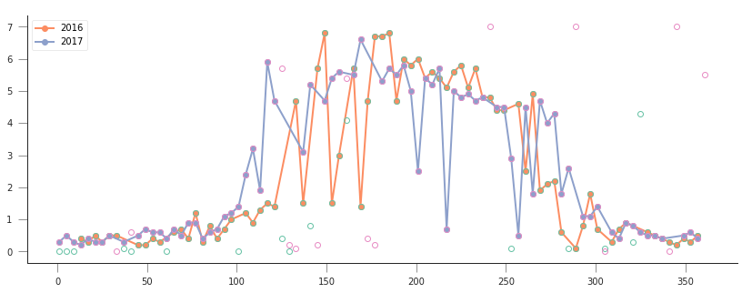


We can now try to fit our double logistic model to the observations,
weighted by their uncertainty. We make use the previously defined
functions for the model and the cost function that we defined above. We
will start by fitting the data to 2016, but will also try to “eyeball” a
good starting point for the optimisation. And obviously, we’ll want some
plots…

A nice way to plot points with errorbars is (surprisingly enought) the
```plt.errorbar``
method <https://matplotlib.org/api/_as_gen/matplotlib.pyplot.errorbar.html>`__.
It’s like the ``plt.plot`` method, but it also takes a ``yerr`` (or
``xerr``) keyword with the extent of the error in the :math:`y`
direction.

.. code:: ipython3

    from scipy.optimize import minimize
    
    plt.figure(figsize=(15, 6))
    
    
    lat, long = 43.0156, -6.7038
    ##################################################################
    # Start by reading in the data
    ##################################################################
    # Filenames
    year = 2016
    lai_raster = f"data/euro_lai/Europe_mosaic_Lai_500m_{year:d}.tif"
    qa_raster = f"data/euro_lai/Europe_mosaic_FparLai_QC_{year:d}.tif"
    # Actually read the data
    data = read_tseries(lai_raster, lat, long)/10. # Read LAI
    qa = read_tseries(qa_raster, lat, long) # Read QA/QC
    # We only want to use QA flags 0 or 1
    passer = get_sfc_qc(qa) <= 1
    # This is the uncertainty
    sigma = get_scaling(get_sfc_qc(qa))[passer]
    # This is the time axis: every 4 days
    t = np.arange(len(passer))*4 + 1
    
    ##################################################################
    # Plot the observations of LAI with uncertainty bands
    ##################################################################
    
    plt.errorbar(t[passer], data[passer], yerr=sigma, fmt="o", 
                 mfc="none", label=f"Obs {year:d}")
    
    ##################################################################
    # Plot a first prediction with some random model parameters
    ##################################################################
    # First eyeballing test:
    p0 = np.array([0.5, 6, 0.2, 150, 0.23, 240])
    plt.plot(t, dbl_sigmoid_function(p0, t), '--', label="1st test")
    print("Cost: ",
          cost_function(p0, t, data[passer], passer, sigma))
    
    ##################################################################
    # Plot a second, more refined prediction
    ##################################################################
    
    # Second eyeballing test:
    p0 = np.array([0.1, 5, 0.2, 140, 0.23, 260])
    plt.plot(t, dbl_sigmoid_function(p0, t), '--', label="2nd test")
    print("Cost: ", 
          cost_function(p0, t, data[passer], passer, sigma))
    
    ##################################################################
    # Do the minimisation starting from the second prediction
    ##################################################################
    
    # Now, minimise based on the second test, which appears better
    
    retval2016 = minimize(cost_function, p0, args=(t, data[passer], 
                                                   passer, sigma))
    
    print(f"Value of the function at the minimum: {retval2016.fun:g}")
    print(f"Value of the solution: {str(retval2016.x):s}")
    
    ##################################################################
    # Plot the fitted model
    ##################################################################
    
    plt.plot(t, dbl_sigmoid_function(retval2016.x, t), '-', lw=3,
             label="Fitted function")
    plt.legend(loc="best")
    plt.ylabel("LAI $m^{2}m^{-2}$")
    plt.xlabel("DoY [d]")


.. parsed-literal::

    1224 4076
    1224 4076
    Cost:  173.30984000080434
    Cost:  89.70477658818041
    Value of the function at the minimum: 43.7381
    Value of the solution: [4.61179375e-01 5.04359058e+00 1.24979192e-01 1.26813991e+02
     9.04932708e-02 2.68361855e+02]


.. parsed-literal::

    Text(0.5,0,'DoY [d]')


.. parsed-literal::

    /home/ucfajlg/miniconda3/envs/python3/lib/python3.6/site-packages/matplotlib/font_manager.py:1328: UserWarning: findfont: Font family ['sans-serif'] not found. Falling back to DejaVu Sans
      (prop.get_family(), self.defaultFamily[fontext]))


.. image:: Chapter7_FittingPhenologyModels_Solutions_files/Chapter7_FittingPhenologyModels_Solutions_21_3.png


A model isn’t very useful if you can’t use it to make predictions. So
let’s just use the optimal solution to predict the LAI for 2017:

.. code:: ipython3

    plt.figure(figsize=(15, 6))
    
    year = 2017
    lai_raster = f"data/euro_lai/Europe_mosaic_Lai_500m_{year:d}.tif"
    qa_raster = f"data/euro_lai/Europe_mosaic_FparLai_QC_{year:d}.tif"
    
    data = read_tseries(lai_raster, lat, long)/10. # Read LAI
    qa = read_tseries(qa_raster, lat, long) # Read QA/QC
    passer = get_sfc_qc(qa) <= 1
    sigma = get_scaling(get_sfc_qc(qa))[passer]
    
    t = np.arange(len(passer))*4 + 1
    
    # Plot the data with uncertainty bars
    plt.errorbar(t[passer], data[passer], yerr=sigma, fmt="o", 
                 mfc="none", label=f"Obs {year:d}")
    
    # Print the fitted model    
    plt.plot(t, dbl_sigmoid_function(retval2016.x, t), '--', lw=3,
             label="Predicted phenology")
    plt.legend(loc="best")
    plt.ylabel("LAI $m^{2}m^{-2}$")
    plt.xlabel("DoY [d]")


.. parsed-literal::

    1224 4076
    1224 4076


.. parsed-literal::

    Text(0.5,0,'DoY [d]')


.. parsed-literal::

    /home/ucfajlg/miniconda3/envs/python3/lib/python3.6/site-packages/matplotlib/font_manager.py:1328: UserWarning: findfont: Font family ['sans-serif'] not found. Falling back to DejaVu Sans
      (prop.get_family(), self.defaultFamily[fontext]))


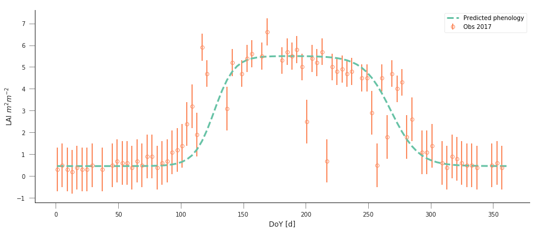


The results are very encouraging, but given the large error bars, and
the paucity of data in spring and autumn, can we be sure? We could
definitely compare the fit from last year to the fit from this year and
see whether they’re different. But it’ll be hard to decide whether they
are different or not if we don’t have error bars in the parameters!

.. container:: alert alert-danger

   .. raw:: html

      <p>

   Fit the phenology model to the 2017 data, and comment on the optimal
   parameters

   .. raw:: html

      </p>

.. code:: ipython3

    plt.figure(figsize=(15, 6))
    
    year = 2017
    lai_raster = f"data/euro_lai/Europe_mosaic_Lai_500m_{year:d}.tif"
    qa_raster = f"data/euro_lai/Europe_mosaic_FparLai_QC_{year:d}.tif"
    
    data = read_tseries(lai_raster, lat, long)/10. # Read LAI
    qa = read_tseries(qa_raster, lat, long) # Read QA/QC
    passer = get_sfc_qc(qa) <= 1
    sigma = get_scaling(get_sfc_qc(qa))[passer]
    
    t = np.arange(len(passer))*4 + 1
    
    # Plot the data with uncertainty bars
    plt.errorbar(t[passer], data[passer], yerr=sigma, fmt="o", 
                 mfc="none", label=f"Obs {year:d}")
    
    # Print the fitted model    
    plt.plot(t, dbl_sigmoid_function(retval2016.x, t), '--', lw=3,
             label="Predicted phenology")
    print(f"Value from previous year: {str(retval2016.x):s}")
    retval2017 = minimize(cost_function, p0, args=(t, data[passer], passer, 
                                                     sigma))
    
    
    print(f"Value of the function at the minimum: {retval2017.fun:g}")
    print(f"Value of the solution: {str(retval2017.x):s}")
    
    
    # Print the fitted model    
    plt.plot(t, dbl_sigmoid_function(retval2017.x, t), '-', lw=3,
             label="Fitted function")
    
    plt.legend(loc="best")
    plt.ylabel("LAI $m^{2}m^{-2}$")
    plt.xlabel("DoY [d]")


.. parsed-literal::

    1224 4076
    1224 4076
    Value from previous year: [4.61179375e-01 5.04359058e+00 1.24979192e-01 1.26813991e+02
     9.04932708e-02 2.68361855e+02]
    Value of the function at the minimum: 41.6294
    Value of the solution: [4.17809359e-01 4.83020921e+00 1.97608815e-01 1.07388496e+02
     5.23646758e-02 2.79806238e+02]


.. parsed-literal::

    Text(0.5,0,'DoY [d]')


.. parsed-literal::

    /home/ucfajlg/miniconda3/envs/python3/lib/python3.6/site-packages/matplotlib/font_manager.py:1328: UserWarning: findfont: Font family ['sans-serif'] not found. Falling back to DejaVu Sans
      (prop.get_family(), self.defaultFamily[fontext]))


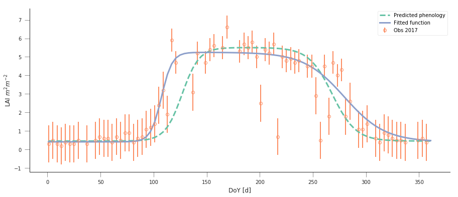


.. container:: alert alert-danger

   .. raw:: html

      <p>

   Do a similar experiment for other sites. In the benefit of
   efficiency, you could write a set of functions that would allow you
   to quickly do the entire process and relevant plots for different
   latitude/longitude points

   .. raw:: html

      </p>

.. container:: alert alert-success

   Some quick notions on how to develop the functions:

   .. raw:: html

      <ol>

   .. raw:: html

      <li>

   You probably want a read data function, that returns LAI, ``sigma``
   and ``passer``.

   .. raw:: html

      </li>

   .. raw:: html

      <li>

   A second function could take the data and a starting guess, and
   minimise it, returning the optimal parameters.

   .. raw:: html

      </li>

   .. raw:: html

      <li>

   A third function would be in charge of plotting the data, and the
   predictions, so it could take the observations and uncertainties,
   etc., as well as a vector of parameters.

   .. raw:: html

      </li>

   .. raw:: html

      <li>

   A final function could wrap the previous three and allow the user to
   select a year to fit to and a location

   .. raw:: html

      </li>

   .. raw:: html

      </ol>

You can probably come up with interesting sites, but here are some that
you **may** want to try

.. code:: python

   sites = [[43.015364, -6.703704], 
            [51.775511, -1.336993],
            [43.487178, 1.283292]
           ]

I have fished out some suitable location from the paper from `Wingate et
al (2015) <https://doi.org/10.5194/bg-12-5995-2015>`__, and you can see
the results of fitting to the model to (some of) the sites below:

.. code:: ipython3

    def read_data(year, x_location, y_location):
        """A function to read in data from the given LAI and QC maps. The
        function also converts the QA data into a `passer` (on/off) array
        to filter the really bad observations, and also creates `sigma`,
        the pseudo-uncertainty.
        
        Parameters
        -----------
        x_location: float
            The longitude in decimal degrees.
        y_location: float
            The latitude in decimal degrees.
        
        Returns
        --------
        
        A time arrray, the data (LAI, scaled properly), the uncertainty and the 
        `passer` mask
        """
        lai_raster = f"data/euro_lai/Europe_mosaic_Lai_500m_{year:d}.tif"
        qa_raster = f"data/euro_lai/Europe_mosaic_FparLai_QC_{year:d}.tif"
        print(lai_raster)
        data = read_tseries(lai_raster, y_location, x_location)/10.
        qa = read_tseries(qa_raster, y_location, x_location)
        passer = get_sfc_qc(qa) <= 1
        sigma = get_scaling(get_sfc_qc(qa))[passer]
    
        t = np.arange(len(passer))*4 + 1
        return t, data, sigma, passer
    
    def fit_data(t, data, sigma, passer,
                cost_f=cost_function,
                p0= np.array([0.1, 5, 0.2, 140, 0.23, 260])):
        """Fits the data using scipy.optimize `minimize` function. It's a wrapper
        around a cost function given by `cost_f` (by default, it)"""
        retval = minimize(cost_f, p0, args=(t, data[passer], passer, sigma))
        return retval
    
    def do_plots(t, data, sigma, passer, p):
        """Do some plots"""
        
        # Plot the data with uncertainty bars
        plt.errorbar(t[passer], data[passer], yerr=sigma, fmt="o", 
                 mfc="none", label=f"Obs {year:d}")
        # Print the fitted model    
        plt.plot(t, dbl_sigmoid_function(p, t), '--', lw=3,
             label="Predicted phenology")
        plt.legend(loc="best")
        plt.ylabel("LAI $m^{2}m^{-2}$")
        plt.xlabel("DoY [d]")
        
    def fit_data_year(fit_year, val_year, x_location, y_location):
        plt.figure(figsize=(12, 5))
        t, data, sigma, passer = read_data(fit_year, x_location, 
                                           y_location)
        optimal_p = fit_data(t, data, sigma, passer)
        do_plots(t, data, sigma, passer, optimal_p.x)
        t, data, sigma, passer = read_data(val_year, x_location, 
                                           y_location)
        plt.title("Fit year")
        plt.figure(figsize=(12, 5))
        do_plots(t, data, sigma, passer, optimal_p.x)
        plt.title("Validation year")
        
    
    fit_data_year(2016, 2017, x_location, y_location)


.. parsed-literal::

    data/euro_lai/Europe_mosaic_Lai_500m_2016.tif
    1224 4076
    1224 4076
    data/euro_lai/Europe_mosaic_Lai_500m_2017.tif
    1224 4076
    1224 4076


.. parsed-literal::

    /home/ucfajlg/miniconda3/envs/python3/lib/python3.6/site-packages/matplotlib/font_manager.py:1328: UserWarning: findfont: Font family ['sans-serif'] not found. Falling back to DejaVu Sans
      (prop.get_family(), self.defaultFamily[fontext]))


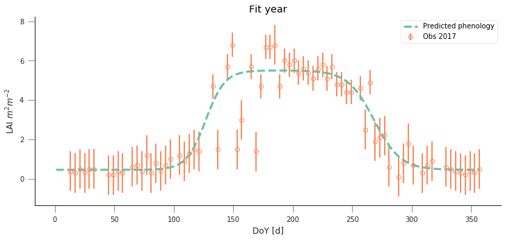


.. image:: Chapter7_FittingPhenologyModels_Solutions_files/Chapter7_FittingPhenologyModels_Solutions_27_3.png


.. code:: ipython3

    y_location, x_location = 51.775511, -1.336993
    fit_data_year(2016, 2017, x_location, y_location)
    plt.title("Wytham Forest (UK)")


.. parsed-literal::

    data/euro_lai/Europe_mosaic_Lai_500m_2016.tif
    2201 1974
    2201 1974
    data/euro_lai/Europe_mosaic_Lai_500m_2017.tif
    2201 1974
    2201 1974


.. parsed-literal::

    Text(0.5,1,'Wytham Forest (UK)')


.. parsed-literal::

    /home/ucfajlg/miniconda3/envs/python3/lib/python3.6/site-packages/matplotlib/font_manager.py:1328: UserWarning: findfont: Font family ['sans-serif'] not found. Falling back to DejaVu Sans
      (prop.get_family(), self.defaultFamily[fontext]))


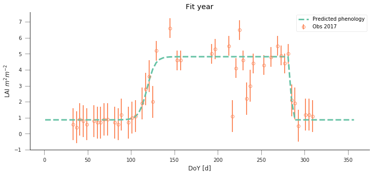


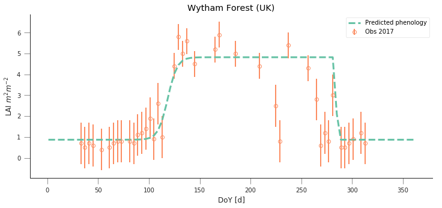


.. code:: ipython3

    
    y_location, x_location = 45.8444, 7.5781
    fit_data_year(2016, 2017, x_location, y_location)
    plt.title("Torgnon (IT)")


.. parsed-literal::

    data/euro_lai/Europe_mosaic_Lai_500m_2016.tif
    3667 3397
    3667 3397
    data/euro_lai/Europe_mosaic_Lai_500m_2017.tif
    3667 3397
    3667 3397


.. parsed-literal::

    Text(0.5,1,'Torgnon (IT)')


.. parsed-literal::

    /home/ucfajlg/miniconda3/envs/python3/lib/python3.6/site-packages/matplotlib/font_manager.py:1328: UserWarning: findfont: Font family ['sans-serif'] not found. Falling back to DejaVu Sans
      (prop.get_family(), self.defaultFamily[fontext]))


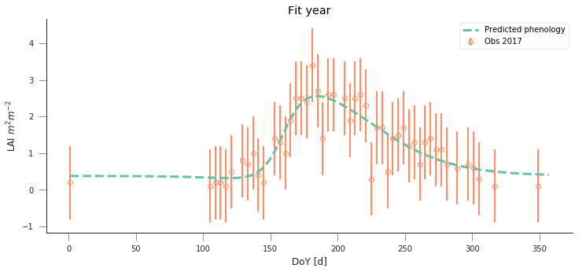


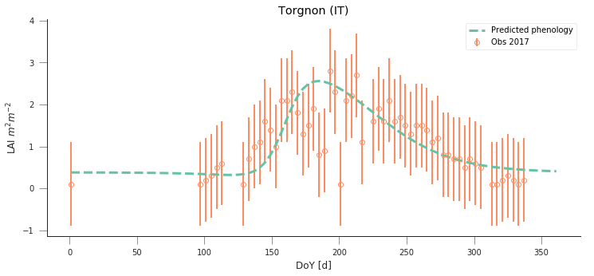


.. code:: ipython3

    y_location, x_location = 50.5516, 4.7461
    fit_data_year(2016, 2017, x_location, y_location)
    plt.title("Lonzee (BE)")


.. parsed-literal::

    data/euro_lai/Europe_mosaic_Lai_500m_2016.tif
    3124 2268
    3124 2268
    data/euro_lai/Europe_mosaic_Lai_500m_2017.tif
    3124 2268
    3124 2268


.. parsed-literal::

    Text(0.5,1,'Lonzee (BE)')


.. parsed-literal::

    /home/ucfajlg/miniconda3/envs/python3/lib/python3.6/site-packages/matplotlib/font_manager.py:1328: UserWarning: findfont: Font family ['sans-serif'] not found. Falling back to DejaVu Sans
      (prop.get_family(), self.defaultFamily[fontext]))


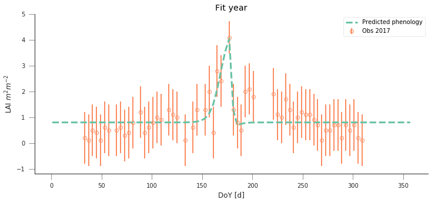


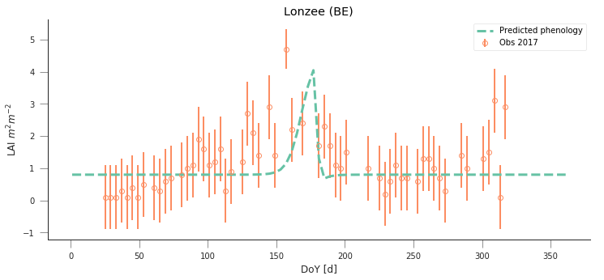


.. code:: ipython3

    y_location, x_location = 50.9500, 13.5126
    fit_data_year(2016, 2017, x_location, y_location)
    plt.title("Grillenburg (DE)")


.. parsed-literal::

    data/euro_lai/Europe_mosaic_Lai_500m_2016.tif
    4443 2172
    4443 2172
    data/euro_lai/Europe_mosaic_Lai_500m_2017.tif
    4443 2172
    4443 2172


.. parsed-literal::

    Text(0.5,1,'Grillenburg (DE)')


.. parsed-literal::

    /home/ucfajlg/miniconda3/envs/python3/lib/python3.6/site-packages/matplotlib/font_manager.py:1328: UserWarning: findfont: Font family ['sans-serif'] not found. Falling back to DejaVu Sans
      (prop.get_family(), self.defaultFamily[fontext]))


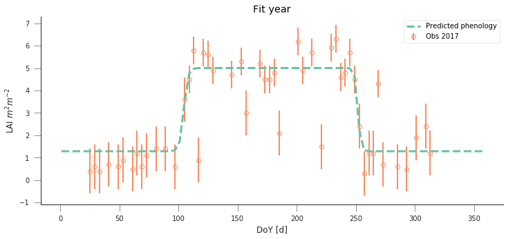


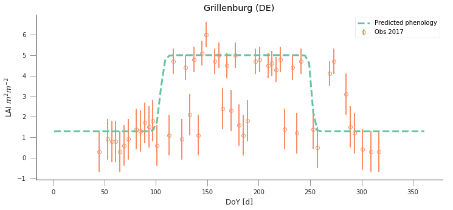


.. code:: ipython3

    y_location, x_location = 55.4859,11.6446
    fit_data_year(2016, 2017, x_location, y_location)
    plt.title("Sorø (DK)")


.. parsed-literal::

    data/euro_lai/Europe_mosaic_Lai_500m_2016.tif
    3984 1083
    3984 1083
    data/euro_lai/Europe_mosaic_Lai_500m_2017.tif
    3984 1083
    3984 1083


.. parsed-literal::

    Text(0.5,1,'Sorø (DK)')


.. parsed-literal::

    /home/ucfajlg/miniconda3/envs/python3/lib/python3.6/site-packages/matplotlib/font_manager.py:1328: UserWarning: findfont: Font family ['sans-serif'] not found. Falling back to DejaVu Sans
      (prop.get_family(), self.defaultFamily[fontext]))


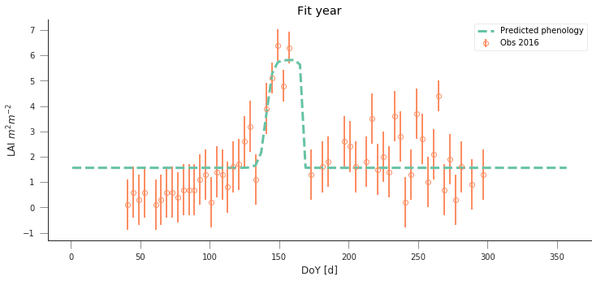


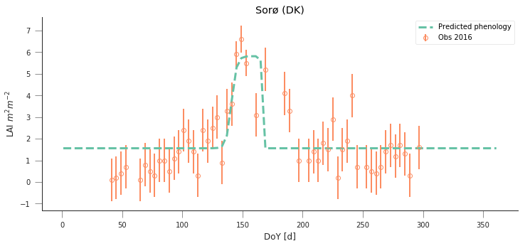


.. code:: ipython3

    
    y_location, x_location =52.253000000000, 5.702000000000
    
    fit_data_year(2016, 2017, x_location, y_location)
    plt.title("Speulderbos (NL)")


.. parsed-literal::

    data/euro_lai/Europe_mosaic_Lai_500m_2016.tif
    3238 1859
    3238 1859
    data/euro_lai/Europe_mosaic_Lai_500m_2017.tif
    3238 1859
    3238 1859


.. parsed-literal::

    Text(0.5,1,'Speulderbos (NL)')


.. parsed-literal::

    /home/ucfajlg/miniconda3/envs/python3/lib/python3.6/site-packages/matplotlib/font_manager.py:1328: UserWarning: findfont: Font family ['sans-serif'] not found. Falling back to DejaVu Sans
      (prop.get_family(), self.defaultFamily[fontext]))


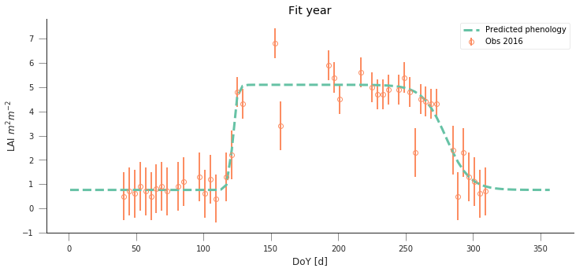


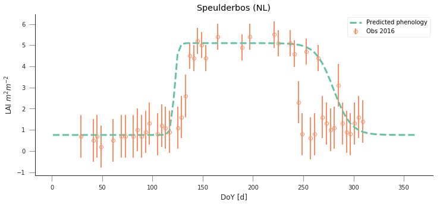


Uncertainty
-----------

In the previous examples, we have seen that the model can be made to fit
observations and used in prediction pretty well, but there’s the obvious
question of how exactly can we define the different parameters. Ideally,
we’d like to have some error bars on e.g. the date and slope of the
spring and autumn flanks, so that we can decide whether a shift has
ocurred or not. Similarly for the maximum/minimum LAI. Intuitively, we
can see that if we change the optimal parameters a bit, we’ll get a
solution that might still have an acceptable performance (meaning that
it will probably go through all the error bars).

One way to test this is to do some Monte Carlo sampling around the
optimal solution. We can evaluate the shape of the cost function around
the optimum and that will give us an idea of the uncertainty: a cost
function that changes very rapidly around the optimal point in one
direction suggests that if you change the parameters by a small amount,
the goodness of fit changes drastically, so that the parameter is very
well and accurately defined. In contrast, if changing the parameter
doesn’t change the cost function value by much, we have an uncertain
parameter.

The Metropolis-Hastings algorithm
~~~~~~~~~~~~~~~~~~~~~~~~~~~~~~~~~

A way to do this Monte Carlo sampling is to use the Metropolis-Hastings
algorithm. This is a sequential method that proposes and accepts samples
based on the likelihood value. Basically, if the cost function improves,
the sample gets accepted, if it doesn’t improve, then a uniform random
number between 0 and 1 is drawn. If the ratio of proposed to previous
likelihoods is greater than the random number, the samples gets
accepted. This means that for solutions that don’t improve the cost
function, there’s a chance that the algorithm will improve on them,
meaning that it doesn’t get trapped on local minima, and provides an
exploration of the entire problem space.

In a nutshell, here’s some **pseudocode** of the MH algorithm

1. Initialise :math:`\vec{x}^{0}`.
2. For :math:`i=1` to :math:`i=N_{iterations}`:

   a. Sample a proposed new :math:`\vec{x}^{*}` as
      :math:`\vec{x}^{*}=\vec{x}^{i-1} + \mathcal{N}(0, \Sigma)`.

   b. Calculate the **likelihood** associated with :math:`\vec{x}^{*}`,
      :math:`L(\vec{x}^{*}, i)`.

   c. Calculate the **likelihood ratio**
      :math:`\alpha=\displaystyle{\frac{L(\vec{x}^{*}, i)}{L(\vec{x}^{*}, i-1)}}`.

   d. Draw a random uniform number between 0 and 1
      :math:`u=\mathcal{U}(0,1)`

   e. if :math:`u\le \min\left\lbrace 1, \alpha\right\rbrace`:
   f. :math:`\vec{x}^{i+1} = \vec{x}^{*}`: we accept the new proposal

   g. else:

   h. :math:`\vec{x}^{i+1} = \vec{x}^{i}`: we reject the new proposal

.. raw:: html

   <div class="alert alert-success">

.. raw:: html

   <p>

Examine the MH algorithm, and try to see whether you can see how you
could go and implement it in Python. The pseudocode above presents you
with the barebones recipe, and you will need to add a couple of extra
ingredients. You can assume that you have available the
**log-likelihood** function that we have described above, and you may
need to use the ``np.random.normal`` and ``np.random.rand`` functions
which respectively provide Gaussian random numbers and uniform random
numbers between 0 and 1

.. raw:: html

   </div>

.. code:: ipython3

    def metropolis_hastings(xstart, lklhood, year, x_location, y_location, 
                            n_iter=50000):
        """MH algorithm implementation. Takes a starting vector, a log-likelihood
        function, a year and an x and y location (in degrees), as well as a number
        of iterations. We are assuming that a `read_data` function that will read
        data and return a time axis, the LAI, the uncertainties and a mask object
        is available. We also assume that the lklhood function can be called using
        these data as `(x_proposed, t, data[passer], passer,sigma)`
        """
        # We first read in the data. this only happens once
        t, data, sigma, passer = read_data(year, x_location, y_location)
        n_params = len(xstart)
        # We reserve some storage for the posterior samples
        samples = np.zeros((n_iter, n_params))
        # We start. Set up xstart as our current parameter vector
        x_curr = xstart*1.
        # Calculate the initial cost function/log-likelihood
        old_cost = lklhood(x_curr, t, data[passer], passer,
                                    sigma)
        # Now iterate...
        for i in range(n_iter):
            # Random displacement
            x_proposed = x_curr + np.random.normal(
                size=n_params)*np.array([0.1, 
                                         0.1,
                                         0.01,
                                         5.,
                                         0.01,
                                         5])
            # Now, calculate the cost function for the proposed parameter
            # vector...
            proposed_cost = lklhood(x_proposed, t, data[passer], passer,
                                    sigma)
            # This is the Metropolis acceptance: if the proposed cost is greater
            # than the previous one, accept, if not sometimes accept
            if np.random.rand() < np.exp(proposed_cost - old_cost):
                # We have accepted the proposed parameter. We update x_curr
                # to match, and updated proposed_cost to the current cost
                x_curr = x_proposed
                old_cost = proposed_cost
            # if we don't accept (because the proposed cost is less, and the 
            # difference is below the random draw) we keep the old cost, and
            # do not update x_curr
            # We store the samples nevertheless!!
            samples[i, :] = x_proposed
    
        return samples

.. code:: ipython3

    y_location, x_location = 43.0156, -6.7038
    
    def read_data(year, x_location, y_location):
        lai_raster = f"data/euro_lai/Europe_mosaic_Lai_500m_{year:d}.tif"
        qa_raster = f"data/euro_lai/Europe_mosaic_FparLai_QC_{year:d}.tif"
        print(lai_raster)
        data = read_tseries(lai_raster, y_location, x_location)/10.
        qa = read_tseries(qa_raster, y_location, x_location)
        passer = get_sfc_qc(qa) <= 1
        sigma = get_scaling(get_sfc_qc(qa))[passer]
    
        t = np.arange(len(passer))*4 + 1
        return t, data, sigma, passer
    
    def lklhood(p, t, y_obs, passer, sigma_obs, func=dbl_sigmoid_function):
        y_pred = func(p, t)
        n = passer.sum()
        cost = -0.5* (y_pred[passer]-y_obs)**2/sigma_obs**2
        return cost.sum()
        
        
    
    
    samples = metropolis_hastings(retval2016.x, lklhood,
                                  2016, x_location, y_location,
                                 n_iter=100000)


.. parsed-literal::

    data/euro_lai/Europe_mosaic_Lai_500m_2016.tif
    1224 4076
    1224 4076


The previous code has produced samples of parameters that we can now
visualise as “traces” as well as histograms. The shape of the histograms
gives us some idea of the uncertainty of the parameters in their units.
We can also use these samples and propagate them through the phenology
model to produce an *ensemble* of model trajectories that define a
region of uncertainty.

.. code:: ipython3

    fig, axs = plt.subplots(nrows=3, ncols=2, figsize=(9, 9), sharex=True)
    axs = axs.flatten()
    for i in range(len(retval2016.x)):
        axs[i].plot(samples[:, i], '-', lw=0.2)
        axs[i].set_ylabel(f"$p_{i}$")
        
    fig, axs = plt.subplots(nrows=3, ncols=2, figsize=(9, 9))
    axs = axs.flatten()
    for i in range(len(retval2016.x)):
        axs[i].hist(samples[20000:, i], bins=50, color="0.8")
        axs[i].set_xlabel(f"$p_{i}$")


.. parsed-literal::

    /home/ucfajlg/miniconda3/envs/python3/lib/python3.6/site-packages/matplotlib/font_manager.py:1328: UserWarning: findfont: Font family ['sans-serif'] not found. Falling back to DejaVu Sans
      (prop.get_family(), self.defaultFamily[fontext]))


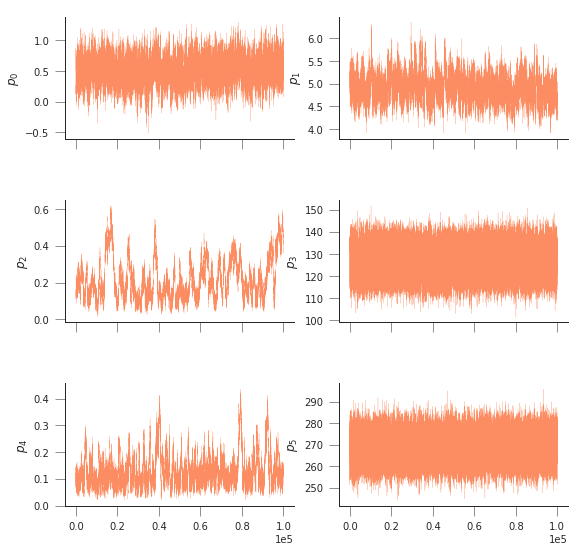


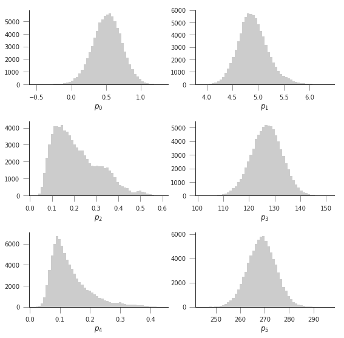


.. code:: ipython3

    n_samples = samples.shape[0]
    y_location, x_location = 43.0156, -6.7038
    
    t, data, sigma, passer = read_data(2016, x_location, y_location)
    
    pred_lai = np.zeros((n_samples, len(t)))
    for i in range(n_samples):
        pred_lai[i, :] = dbl_sigmoid_function(samples[i], t)
    
        
    plt.figure(figsize=(15, 7))
    pcntiles = np.percentile( pred_lai[60000::20], [5, 25, 50, 75, 95], axis=0)
    plt.fill_between(t, pcntiles[0], pcntiles[-1], color="0.9")
    plt.fill_between(t, pcntiles[1], pcntiles[-2], color="0.7")
    plt.plot(t, pcntiles[2], '--', lw=3, label="Median")
    
    plt.errorbar(t[passer], data[passer], yerr=sigma, fmt="o", 
                 mfc="none", label=f"Obs {year:d}", alpha=0.5)
    
    plt.legend(loc="best")
    plt.ylabel("LAI $m^{2}m^{-2}$")
    plt.xlabel("DoY [d]")


.. parsed-literal::

    data/euro_lai/Europe_mosaic_Lai_500m_2016.tif
    1224 4076
    1224 4076


.. parsed-literal::

    Text(0.5,0,'DoY [d]')


.. parsed-literal::

    /home/ucfajlg/miniconda3/envs/python3/lib/python3.6/site-packages/matplotlib/font_manager.py:1328: UserWarning: findfont: Font family ['sans-serif'] not found. Falling back to DejaVu Sans
      (prop.get_family(), self.defaultFamily[fontext]))


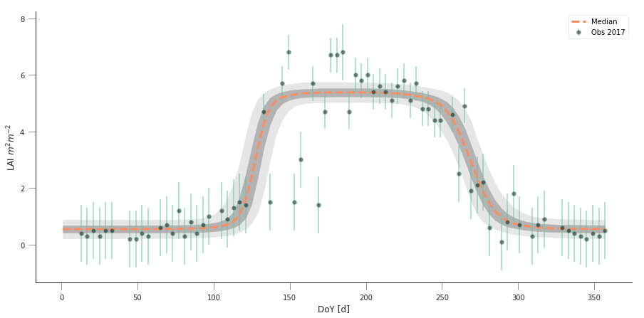


.. code:: ipython3

    cov = np.corrcoef(samples[60000::20, :].T)


.. code:: ipython3

    def hinton(matrix, max_weight=None, ax=None):
        """Draw Hinton diagram for visualizing a weight matrix."""
        ax = ax if ax is not None else plt.gca()
    
        if not max_weight:
            max_weight = 2 ** np.ceil(np.log(np.abs(matrix).max()) / np.log(2))
    
        ax.patch.set_facecolor('gray')
        ax.set_aspect('equal', 'box')
        ax.xaxis.set_major_locator(plt.NullLocator())
        ax.yaxis.set_major_locator(plt.NullLocator())
    
        for (x, y), w in np.ndenumerate(matrix):
            color = 'white' if w > 0 else 'black'
            size = np.sqrt(np.abs(w) / max_weight)
            rect = plt.Rectangle([x - size / 2, y - size / 2], size, size,
                                 facecolor=color, edgecolor=color)
            ax.add_patch(rect)
    
        ax.autoscale_view()
        ax.invert_yaxis()
    
    plt.figure(figsize=(12,12))
    hinton(cov)


.. image:: Chapter7_FittingPhenologyModels_Solutions_files/Chapter7_FittingPhenologyModels_Solutions_41_0.png

