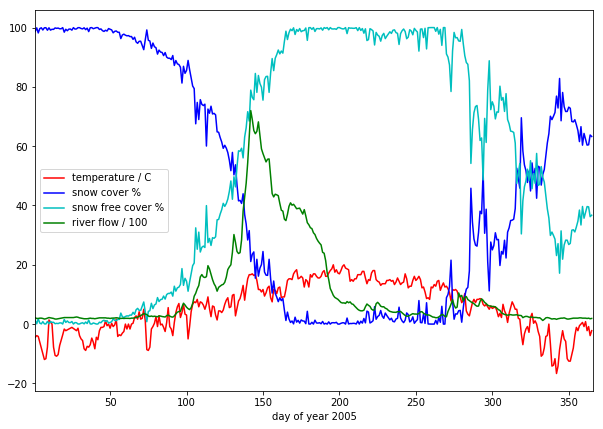
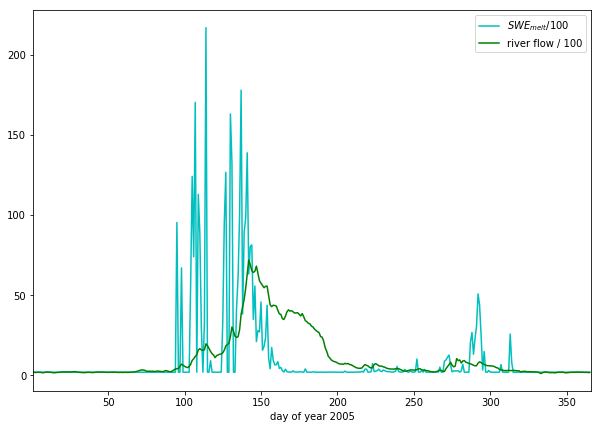
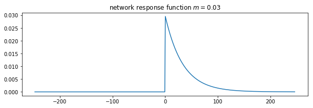
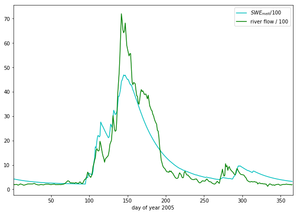

.. raw:: html

   <h1>

Table of Contents

.. raw:: html

   </h1>

.. container:: toc

   .. raw:: html

      <ul class="toc-item">

   .. raw:: html

      </ul>

8. Assessed Practical
=====================

8.1 Introduction
----------------

8.1.1 Task overview
~~~~~~~~~~~~~~~~~~~

These notes describe the practical work you must submit for assessment
in this course.

The practical comes in two parts: (1) data preparation (50%); (2)
modelling (50%).

**It is important that you complete both parts of this exercise.**

The submission for Part 1 of the coursework (worth 50% of the marks) is
the Monday after Reading week (12:00 Noon). That is Monday
:math:`12^{th}` November 2018.

The submission for Part 2 will be :math:`7^{th}` January 2019 (12:00
Noon). Submission is through the usual Turnitin link on the `course
Moodle
page <https://moodle-1819.ucl.ac.uk/course/view.php?id=2796#section-4>`__.

-  **Part 1: Data Preparation**

   The first task you must complete is to produce a dataset of the
   proportion of HUC catchment 13010001 (Rio Grande headwaters in
   Colorado, USA) that is covered by snow for **two years** (not
   necessarily consecutive), along with associated datasets on
   temperature (in C) and river discharge at the Del Norte monitoring
   station. You will use these data in the modelling work in Part 2 of
   the coursework.

   You **may not** use data from the years 2005 or 2006, as this will be
   given to you in illustrations of the material.

   The dataset you produce must have a value for **the mean snow cover,
   temperature and discharge in the catchment for every day over each
   year.**

   Your write up **must** include fully labelled graph(s) of snow cover,
   temperature and discharge for the catchment for each year (with units
   as appropriate), along with some summary statistics (e.g. mean or
   median, minimum, maximum, and the timing of these).

   You **must** provide evidence of how you got these data (i.e. the
   code and commands you ran to produce the data).

**Checklist:**

::

   * provide fully commented/documented code for all operations.
   * provide two years of **daily** data (not 2005 or 2006)
   * Generate datasets of:
       * mean snow cover (0.0 to 1.0) for the catchment for each day of the year
       * temperature (C) at the Del Norte monitoring station for each day of the year
       * river discharge at the Del Norte monitoring station for each day of the year
   * Produce a table of summary statistics for each of the 3 datasets (one for easch year)
   * produce graphs of the 3 datasets for each year (as function of day of year)
   * produce an `npz` file containing the 3 datasets, one for each year.
   * produce images of snow cover spatial data for the catchment for **13 samples** spaced equally through the year, one set of images for each year. You need to do this for the data pre-interpolation and aftyer you have done the interpolation.

-  **Part 2: Modelling**

   You will have prepared two years of data in Part 1 of the work.

   If, for some reason, you have failed to generate an appropriate
   dataset, you may use datasets that will be provided for you for the
   years 2005 and 2006. There will be no penalty for that in your Part 2
   submission: failure to gernerate the datasets will be accounted for
   in marks allocated for Part 1.

   You will be given a simple hydrological model of snowmelt.

   Use one of these years to calibrate the (snowmelt) hydrological model
   and one year to test it.

   The model parameter estimate *must* be objective (i.e. you can’t just
   arbitrarily choose a set) and optimal in some way you must define
   (you *must* state the equation of the cost function you will try to
   minimise and explain the approach used).

   You **must** state the values of the model parameters that you have
   estimated and show evidence for how you went about calculating them.
   Ideally, you should also state the uncertainty in these parameter
   estimates (not critical to pass this section though).

   You **must** quantify the goodness of fit between your measured flow
   data and that produced by your model, both for the calibration
   exercise and the validation.

**Checklist:**

::

   * Provide a site intoduction and an introduction to the purpose of the exercise ('Introduction')
   * Provide an introduction to the modelling and calibration/validation ('Method') 
   * provide code that reads in the datasets and performs the model calibration and validation ('Code')
   * Provide a table of results on model parameter calibration (and ideally, uncertainty) ('Results')
   * Provide graphs of the observed and modelled river discharge data for the calibration year ('Results')
   * Provide graphs of the observed and modelled river discharge data for the validation year ('Results')
   * Assess the accuracy of the calibration and validation ('Results')
   * Discuss the results in the light of the introduction ('Discussion')
   * Draw conclusions about issues associated with modelling of this sort ('Conclusion')

You **must** work individually on this task. If you do not, it will be
treated as plagiarism. By reading these instructions for this exercise,
we assume that you are aware of the UCL rules on plagiarism. You can
find more information on this matter in your student handbook. If in
doubt about what might constitute plagiarism, ask one of the course
convenors.

8.1.2 Purpose of the work
-------------------------

The hydrology of the Rio Grande Headwaters in Colorado, USA is snowmelt
dominated. It varies considerably from year to year and may very further
under a changing climate.

We can build a mathemetical (‘environmental’) model to describe the main
physical processes affecting hydrology in the catchment. Such a model
could help understand current behaviour and allow some prediction about
possible future scenarios.

**What you are going to do is to build, calibrate and test a (snowmelt)
hydrological model, driven by observations in the Rio Grande Headwaters
in Colorado, USA**

|image0|

|image1|

The purpose of the model will be to describe the streamflow at the Del
Norte measurement station, just on the edge of the catchment. You will
use environmental (temperature) data and snow cover observations to
drive the model. You will perform calibration and testing by comparing
model output with observed streamflow data.

8.1.2.1 Del Norte
~~~~~~~~~~~~~~~~~

The average climate for Del Norte is:

|image2|

Further general information is available from various
`websites <http://www.usclimatedata.com/climate.php?location=USCO0103>`__,
including `NOAA <http://www.ncdc.noaa.gov>`__.

.. figure:: http://www.coloradofishing.net/images/fishtails/ft_riogrande3.jpg
   :alt: www.coloradofishing.net

   www.coloradofishing.net

You can visualise the site Del Norte 2E
`here <http://mesonet.agron.iastate.edu/sites/site.php?station=CO2184&network=COCLIMATE>`__.

8.1.2.2 Previous work
~~~~~~~~~~~~~~~~~~~~~

In part 1, you should have developed datasets for two years for:

::

   * mean snow cover (0.0 to 1.0) for the catchment for each day of the year
   * temperature (C) at the Del Norte monitoring station for each day of the year
   * river discharge at the Del Norte monitoring station for each day of the year

You should use these datasets in part 2 of this work.

If for some reason, you are unable to do that, you may use the datasets
provided here:

.. |image0| image:: images/calibrate.png
.. |image1| image:: https://www.blm.gov/sites/blm.gov/files/hero_backgrounds/NM_Rio_Grande_del_Norte_Sign_640.jpg
.. |image2| image:: images/usco0103climatedelnorte.png

.. code:: ipython3

    # load a pre-cooked version of the data for 2005 (NB -- Dont use this year!!!
    # except perhaps for testing)
    
    # load the data from a pickle file
    import pickle
    import pylab as plt
    import numpy as np
    %matplotlib inline
    
    pkl_file = open('data/data2005.pkl', 'rb')
    # note encoding='latin1' because pickle generated in python2
    data = pickle.load(pkl_file, encoding='latin1')
    pkl_file.close()
    
    # set up plot
    plt.figure(figsize=(10,7))
    plt.xlim(data['doy'][0],data['doy'][-1]+1)
    plt.xlabel('day of year 2005')
    
    # plot data
    plt.plot(data['doy'],data['temp'],'r',label='temperature / C')
    plt.plot(data['doy'],data['snowprop']*100,'b',label='snow cover %')
    plt.plot(data['doy'],100-data['snowprop']*100,'c',label='snow free cover %')
    plt.plot(data['doy'],data['flow']/100.,'g',label='river flow / 100')
    plt.legend(loc='best')

.. parsed-literal::

    <matplotlib.legend.Legend at 0x10e269be0>

we have plotted the streamflow (scaled) in green, the snow cover in
blue, and the non snow cover in cyan and the temperature in red. It
should be apparent that thge hydrology is snow melt dominated, and to
describe this (i.e. to build the simplest possible model) we can
probably just apply some time lag function to the snow cover.

8.2 The model
-------------

What we need is a model that provides an estimate of flow :math:`F`
(``data['flow']``) as a function of time :math:`t` (days).

The information we have to help in this is : snow proportion :math:`p`
(``data['snowprop']``) and temperature :math:`T` (``data['temp']``)

8.2.1 Snow water equivalent
~~~~~~~~~~~~~~~~~~~~~~~~~~~

In a snow-melt dominated catchment, we are assuming that the flow can be
related to water released from the snow pack. The purpose of any model
then is to model that release. The units of this (flow) will be units of
volume per unit time.

The water contained in the snow pack is called the Snow Water Equivalent
(SWE) and is a measure of water volume. To estimate this, we would need
to know the snow equivalent depth :math:`d` and the snow area. The snow
area is the catchment area multipled by :math:`p`, so:

.. math::

   SWE = A p d

where :math:`A` is the catchment area.

We have no information on depth, so will assume that it varies in the
same way as snow cover. Letting:

.. math::

   d = \frac{k}{A} p

Then:

.. math::

   SWE = k p^2

8.2.2 Snow water melt
~~~~~~~~~~~~~~~~~~~~~

From examination of the data plotted above, we can see that the timing
of the river discharge corresponds broadly to:

-  the presence of snow cover (:math:`p > 0`)
-  temperature above some threshold (:math:`T > T_{thresh}`)

where :math:`T_{thresh}` is the threshold temperature.

This is hardly surprising and exactly what we would expect in a
snowmelt-dominated catchment. We might reasonably expect
:math:`T_{thresh}` to be :math:`0 C`, but this might not be the case
(why?).

A simple model of the SWE entering the system then is to make it equal
to some proportion :math:`k_p` of the SWE on days when melting occurs.

Then:

.. math::

   SWE_{melt}(t) = k_p(t) {SWE}(t)

where :math:`SWE_{melt}` is the proportion of SWE released per unit time
(day).

One function we could use for :math:`k_p` is to make it proportionate to
the excess temperature.

We can define this as:

.. math::

   k_p(T) = \frac{T-T_{thresh}}{T_{max}}

with negative :math:`k_p` set to zero, and :math:`T_{max}` the maximum
temperature. So, if :math:`T = T_{thresh} + T_{max}`. :math:`k_p = 1`
and the maximum amount of SWE is available as melt water.

8.2.3 Base flow
~~~~~~~~~~~~~~~

Close examination of the data suggests there is a base level flow
(i.e. a constant flow throughout the year) of around 200 units. We can
simply add this to our model as :math:`F_{base}`.

.. math::

   F_{non-base}(t) = F(t) - F_{base}

:math:`F_{base}` is easily estimated from the January mean value of
flow.

8.2.4 Total amount of water
~~~~~~~~~~~~~~~~~~~~~~~~~~~

We then have modelled flow :math:`{F}_{model}` entering the system:

.. math::

   {F}_{model}(t) =  F_{base} + SWE_{melt}(t)

.. math::

   {F}_{model}(t) =  F_{base} + k MAX \left(0, \frac{T-T_{thresh}}{T_{max}} p(t)^2 \right)

Further, we can assume that the total amount of flow that we model
(minus the base flow) should equal that measured (summed over all days).

Then:

.. math::

   \Sigma_t{{F}_{model}(t)} = \Sigma_t{F(t)}

so

.. math::

   \Sigma_t{F(t)} = \Sigma_t{F_{base}} + k \Sigma_t{MAX \left(0, \frac{T-T_{thresh}}{T_{max}} p(t)^2 \right)}

This allows us to infer the value of :math:`k` from the data:

.. math::

   k  = \frac{\Sigma_t{\left( F(t) - F_{base} \right) }}{\Sigma_t{MAX \left(0, \frac{T-T_{thresh}}{T_{max}} p(t)^2 \right)}}

.. code:: ipython3

    # Guess some values
    Tthresh = 6
    
    # we can estimate the base flow from the 
    # mean January value
    F_base = data['flow'][:31].mean()
    print(f'F_base = {F_base}')
    
    
    # 
    p           = data['snowprop']
    k_p         = (data['temp'] - Tthresh)/data['temp'].max()
    k_p         = np.max([np.zeros_like(k_p),k_p],axis=0)
    swe_melt_k  = p * p * k_p
    
    # take away the base flow from flow
    nonbase_flow = data['flow'] - F_base
    
    # k
    k = nonbase_flow.sum() / swe_melt_k.sum()
    
    model_flow = swe_melt_k * k + F_base
    
    # set up plot
    plt.figure(figsize=(10,7))
    plt.xlim(data['doy'][0],data['doy'][-1]+1)
    plt.xlabel('day of year 2005')
    
    # plot data
    plt.plot(data['doy'],model_flow/100,'c',label='$SWE_{melt}$/100')
    plt.plot(data['doy'],data['flow']/100.,'g',label='river flow / 100')
    plt.legend(loc='best')

.. parsed-literal::

    F_base = 203.8709677419355

.. parsed-literal::

    <matplotlib.legend.Legend at 0xb212ef908>

This already looks quite reasonable, although:

-  the flow is smoother than the :math:`SWE_{melt}` data
-  there seems to be a delay between snowmelt occuring and flow
   appearing in the measurements

The function that describes such delay (and that can cause smoothing)
can be called a network response function. It is often modelled as a
Laplace function (an exponential). The idea is that for any ‘flash’
input to the catchment, this network response function will give us what
we would measure as a hydrograph at the monitoring station (or
elsewhere):

.. math::

   nrf = e^{-m t}

.. code:: ipython3

    # decay parameter
    # nrf = exp(-m x)
    m  = 0.03
    
    plt.figure(figsize=(10,3))
    # window size
    ndays = 15 * int(1/m)
    nrf_x = np.arange(ndays) - ndays/2
    # function for nrf
    nrf = np.exp(-m*nrf_x)
    nrf[nrf_x<0] = 0
    
    # normalise so that sum is 1
    nrf = nrf/nrf.sum()
    
    # plot
    plt.plot(nrf_x,nrf)
    plt.title(f'network response function $m={m}$')

.. parsed-literal::

    Text(0.5, 1.0, 'network response function $m=0.03$')

.. code:: ipython3

    import scipy
    import scipy.ndimage.filters
    
    # convolve NRF with data
    model_flow_nrf = scipy.ndimage.filters.convolve1d(model_flow, nrf)
    
    # set up plot
    plt.figure(figsize=(10,7))
    plt.xlim(data['doy'][0],data['doy'][-1]+1)
    plt.xlabel('day of year 2005')
    
    # plot data
    plt.plot(data['doy'],model_flow_nrf/100,'c',label='$SWE_{melt}$/100')
    plt.plot(data['doy'],data['flow']/100.,'g',label='river flow / 100')
    plt.legend(loc='best')

.. parsed-literal::

    <matplotlib.legend.Legend at 0xb215a4358>

So, we have defined a simple snow melt model. It has two parameters that
we3 can vary:

-  :math:`T_{thresh}`: the lower temperature threshold
-  :math:`m`: the network response function decay factor

The modelled flow is normalised so that the total flow equals the total
measured flow. The base flow is estimated from the data (January mean
flow value).

Note that the values of the additional model parameters,
:math:`T_{max}`, :math:`F_{base}` and the scaling term :math:`k` should
be constant for all years modelled. i.e. ytou work out these values from
one year of data, then apply them to the modelling of other years.

A quick guess at the parameter values provides a not unreasonable match
to the data. As a model that predicts behaviour well for the main spring
melt events, this may be quite useful. That said, the model is very
simple and might easily be improved.

If we accept that this is a sufficient model for the present, we can
attempt to improve on the model performance by optimising the (two)
parameters.

To do this, we can use standard optimisation techniques (that you have
already covered in the course) to provide imprtoved parameter estimates.
There are only two model parameters to optimise, so this should be quite
straightforward. It should also be easy to visualise the error function.

**Exercise**

Write a Python function that takes the ``data`` dictionary and the model
parameters and returns the modelled flow for given :math:`T_{thresh}`
and :math:`m`.

Vary the two parameters a bit and note the impact on the match between
modelled and observed flow data.

.. code:: ipython3

    # Exercise

8.3 Coursework
--------------

You need to submit you coursework in the usual manner by the usual
submission date.

You **must** work individually on this task. If you do not, it will be
treated as plagiarism. By reading these instructions for this exercise,
we assume that you are aware of the UCL rules on plagiarism. You can
find more information on this matter in your student handbook. If in
doubt about what might constitute plagiarism, ask one of the course
convenors.

8.3.1 Summary of coursework requirements
~~~~~~~~~~~~~~~~~~~~~~~~~~~~~~~~~~~~~~~~

-  **Part 2: Modelling**

   ::

        You will have prepared two years of data in Part 1 of the work. 

   If, for some reason, you have failed to generate an appropriate
   dataset, you may use datasets that will be provided for you for the
   years 2005 and 2006. There will be no penalty for that in your Part 2
   submission: failure to gernerate the datasets will be accounted for
   in marks allocated for Part 1.

   You have been given a simple (two parameter) hydrological model of
   snowmelt.

   Use one of these years to calibrate the (snowmelt) hydrological model
   and one year to test (validate) it.

   The model parameter estimate *must* be objective (i.e. you can’t just
   arbitrarily choose a set) and optimal in some way you must define
   (you *must* state the equation of the cost function you will try to
   minimise and explain the approach used). You should state why you
   have taken any particular approach for the optimisation, and make
   consideration of what options you might have.

   You **must** state the values of the model parameters that you start
   with and those youy have estimated. ~TYou must show evidence for how
   you went about calculating the optimised pareameters. Ideally, you
   should also state the uncertainty in these parameter estimates (not
   critical to pass this section though). You should try to at least
   make some comment on the likely uncertainty.

   You **must** quantify the goodness of fit between your measured flow
   data and that produced by your model, both for the calibration
   exercise and the validation.

**Checklist:**

::

   * Provide a site intoduction and an introduction to the purpose of the exercise ('Introduction')
   * Provide an introduction to the modelling and calibration/validation ('Method') 
   * provide code that reads in the datasets and performs the model calibration and validation ('Code')
   * Provide a table of results on model parameter calibration (and ideally, uncertainty) ('Results')
   * Provide graphs of the observed and modelled river discharge data for the calibration year ('Results')
   * Provide graphs of the observed and modelled river discharge data for the validation year ('Results')
   * Assess the accuracy of the calibration and validation ('Results')
   * Discuss the results in the light of the introduction ('Discussion')
   * Draw conclusions about issues associated with modelling of this sort ('Conclusion')

8.3.2 Summary of Advice
~~~~~~~~~~~~~~~~~~~~~~~

The second task revolves around using the model that we have developed
above. You should probably put the elements of the model together in a
function. You have been through previous examples in Python where you
attempt to estimate some model parameters given an initial estimate of
the parameters and some cost function to be minimised. Solving the model
calibration part of problem should follow those same lines then. Testing
(validation) should be easy enough. Don’t forget to include the
estimated parameters (and other relevant information, e.g. your initial
estimate, uncertainties if available) in your write up.

There is quite a lot of data presentation here, and you need to provide
*evidence* that you have done the task. Make sure you use graphs
(e.g. one of the inoputs used for calibration and validation years, and
one for modelled and predicted flow, etc.), and tables (e.g. model
parameter estimates) throughout, as appropriate.

8.3.3 Further advice
~~~~~~~~~~~~~~~~~~~~

There is plenty of scope here for going beyond the basic requirements
(e.g. improving the model), if you get time and are interested (and/or
want a higher mark!).

You will be given credit for all additional work included in the write
up, **once you have achieved the basic requirements**. So, there is no
point (i.e. you will not get credit for) going off on all sorts of
interesting lines of exploration here *unless* you have first completed
the core task.

Be aware that if you decide to develop a new model, and this has more
parameters than the existing model, the fact that your model fit is
better than that for the excisting model *does not* imply that your
model is an impriovement. This is because you will have increased the
degrees of freedom in the model, so an improved fit is not longer
adequate proof of model improvement.

8|.3.4 Structure of the Report
~~~~~~~~~~~~~~~~~~~~~~~~~~~~~~

The required elements of the report are:

::

       1. Provide a site intoduction and an introduction to the purpose of the exercise ('Introduction') [5]
       2. Provide a context and introduction to the modelling and calibration/validation and a visualisation of the input data you use ('Method') [10]
       3. provide code that reads in the datasets and performs the model calibration and validation ('Code') [10]
       4. A Results section with appropriate graphs and tables [10]
       5. Discuss the results in the light of the introduction ('Discussion') [10]
       6. Draw conclusions about issues associated with modelling of this sort ('Conclusion') [5]

The figures in brackets indicate the percentage of marks that we will
award for each section of the report.

8.3.5 Computer Code
~~~~~~~~~~~~~~~~~~~

General requirements
^^^^^^^^^^^^^^^^^^^^

You will obviously need to submit computer codes as part of this
assessment. Some flexibility in the style of these codes is to be
expected. For example, some might write a class that encompasses the
functionality for all tasks. Some poeple might have multiple versions of
codes with different functionality. All of these, and other reasonable
variations are allowed.

All codes needed to demonstrate that you have performed the core tasks
are required to be included in the submission. You should include all
codes that you make use of in the main body of the text in the main
body. Any other codes that you want to refer to (e.g. something you
tried out as an enhancement and didn’t quite get there) you can include
in appendices.

All codes should be well-commented. Part of the marks you get for code
will depend on the adequacy of the commenting.

Degree of original work required and plagiarism
^^^^^^^^^^^^^^^^^^^^^^^^^^^^^^^^^^^^^^^^^^^^^^^

If you use a piece of code verbatim that you have taken from the course
pages or any other source, **you must acknowledge this** in comments in
your text. **Not to do so is plagiarism**. Where you have taken some
part (e.g. a few lines) of someone else’s code, **you should also
indicate this**. If some of your code is heavily based on code from
elsewhere, **you must also indicate that**.

Some examples.

The first example is guilty of strong plagiarism, it does not seek to
acknowledge the source of this code, even though it is just a direct
copy, pasted into a method called ``model()``:

.. code:: ipython3

    def model(tempThresh=9.0,K=2000.0,p=0.96):
        '''need to comment this further ...
    
        '''
        import numpy as np
        meltDays = np.where(temperature > tempThresh)[0]
        accum = snowProportion*0.
        for d in meltDays:
            water = K * snowProportion[d]
            n = np.arange(len(snowProportion)) - d
            m = p ** n
            m[np.where(n<0)]=0
            accum += m * water
        return accum

This is **not** acceptable.

This should probably be something along the lines of:

.. code:: ipython3

    def model(tempThresh=9.0,K=2000.0,p=0.96):
        '''need to comment this further ...
    
        This code is taken directly from
        "Modelling delay in a hydrological network"
        by P. Lewis http://www2.geog.ucl.ac.uk/~plewis/geogg122/DelNorte.html
        and wrapped into a method.
        '''
        # my code: make sure numpy is imported
        import numpy as np
    
        # code below verbatim from Lewis
        meltDays = np.where(temperature > tempThresh)[0]
        accum = snowProportion*0.
        for d in meltDays:
            water = K * snowProportion[d]
            n = np.arange(len(snowProportion)) - d
            m = p ** n
            m[np.where(n<0)]=0
            accum += m * water
        # my code: return accumulator
        return accum

Now, we acknowledge that this is in essence a direct copy of someone
else’s code, and clearly state this. We do also show that we have added
some new lines to the code, and that we have wrapped this into a method.

In the next example, we have seen that the way m is generated is in fact
rather inefficient, and have re-structured the code. It is partially
developed from the original code, and acknowledges this:

.. code:: ipython3

    def model(tempThresh=9.0,K=2000.0,p=0.96):
        '''need to comment this further ...
    
        This code after the model developed in
        "Modelling delay in a hydrological network"
        by P. Lewis
        http://www2.geog.ucl.ac.uk/~plewis/geogg122/DelNorte.html
    
        My modifications have been to make the filtering more efficient.
        '''
        # my code: make sure numpy is imported
        import numpy as np
    
        # code below verbatim from Lewis unless otherwise indicated
        meltDays = np.where(temperature > tempThresh)[0]
        accum = snowProportion*0.
    
        # my code: pull the filter block out of the loop
        n = np.arange(len(snowProportion))
        m = p ** n
    
        for d in meltDays:
            water = K * snowProportion[d]
    
            # my code: shift the filter on by one day
            # ...do something clever to shift it on by one day
    
            accum += m * water
        # my code: return accumulator
        return accum

This example makes it clear that significant modifications have been
made to the code structure (and probably to its efficiency) although the
basic model and looping comes from an existing piece of code. It clearly
highlights what the actual modifications have been. Note that this is
not a working example!!

Although you are supposed to do this piece of work on your own, there
might be some circumstances under which someone has significantly helped
you to develop the code (e.g. written the main part of it for you &
you’ve just copied that with some minor modifications). You **must**
acknowledge in your code comments if this has happened. On the whole
though, this should not occur, as you **must** complete this work on
your own.

If you take a piece of code from somewhere else and all you do is change
the variable names and/or other cosmetic changes, you **must**
acknowledge the source of the original code (with a URL if available).

Plagiarism in coding is a tricky issue. One reason for that is that
often the best way to learn something like this is to find an example
that someone else has written and adapt that to your purposes. Equally,
if someone has written some tool/library to do what you want to do, it
would generally not be worthwhile for you to write your own but to
concentrate on using that to achieve something new. Even in general code
writing (i.e. when not submitting it as part of your assessment) you and
anyone else who ever has to read your code would find it of value to
make reference to where you found the material to base what you did on.
The key issue to bear in mind in this work, as it is submitted ‘as your
own work’ is that, to avoid being accused of plagiarism and to allow a
fair assessment of what you have done, you must clearly acknowledge
which parts of it are your own, and the degree to which you could claim
them to be your own.

For example, based on … is absolutely fine, and you would certainly be
given credit for what you have done. In many circumstances ‘taken
verbatim from …’ would also be fine (provided it is acknowledged) but
then you would be given credit for what you had done with the code that
you had taken from elsewhere (e.g. you find some elegant way of doing
the graphs that someone has written and you make use of it for
presenting your results).

The difference between what you submit here and the code you might write
if this were not a piece submitted for assessment is that you the vast
majority of the credit you will gain for the code will be based on the
degree to which you demonstrate that you can write code to achieve the
required tasks. There would obviously be some credit for taking codes
from the coursenotes and bolting them together into something that
achieves the overall aim: provided that worked, and you had commented it
adequately and acknowledge what the extent of your efforts had been, you
should be able to achieve a pass in that component of the work. If there
was no original input other than vbolting pieces of existing code
together though, you be unlikely to achieve more than a pass. If you get
less than a pass in another component of the coursework, that then puts
you in danger of an overall fail.

Provided you achieve the core tasks, the more original work that you
do/show (that is of good quality), the higher the mark you will get.
Once you have achieved the core tasks, even if you try something and
don’t quite achieve it, is is probably worth including, as you may get
marks for what you have done (or that fact that it was a good or
interesting thing to try to do).

Documentation
^^^^^^^^^^^^^

Note: All methods/functions and classes must be documented for the code
to be adequate. Generally, this will contain:

-  some text on the purpose of the method (/function/class)

-  some text describing the inputs and outputs, including reference to
   any relevant details such as datatype, shape etc where such things
   are of relevance to understanding the code.

-  some text on keywords, e.g.:

.. code:: ipython3

    def complex(real=0.0, imag=0.0):
        """Form a complex number.
    
        Keyword arguments:
        real -- the real part (default 0.0)
        imag -- the imaginary part (default 0.0)
    
        Example taken verbatim from:
        http://www.python.org/dev/peps/pep-0257/
        """
        if imag == 0.0 and real == 0.0: return complex_zero

You should look at the `document on good docstring
conventions <http://www.python.org/dev/peps/pep-0257/>`__ when
considering how to document methods, classes etc.

To demonstrate your documentation, you **must** include the help text
generated by your code after you include the code. e.g.:

.. code:: ipython3

    def print_something(this,stderr=False):
        '''This does something.
    
        Keyword arguments:
        stderr -- set to True to print to stderr (default False)
        '''
    
        if stderr:
            # import sys.stderr
            from sys import stderr
    
            # print to stderr channel, converting this to str
            print >> stderr,str(this)
    
            # job done, return
            return
    
        # print to stdout, converting this to str
        print (str(this))
    
        return

Then the help text would be:

.. code:: ipython3

    help(print_something)

.. parsed-literal::

    Help on function print_something in module __main__:
    
    print_something(this, stderr=False)
        This does something.
        
        Keyword arguments:
        stderr -- set to True to print to stderr (default False)
    

The above example represents a ‘good’ level of commenting as the code
broadly adheres to the style suggestions and most of the major features
are covered. It is not quite ‘very good/excellent’ as the description of
the purpose of the method (rather important) is trivial and it fails to
describe the input this in any way. An excellent piece would do all of
these things, and might well tell us about any dependencies
(e.g. requires sys if stderr set to True).

An inadequate example would be:

.. code:: ipython3

    def print_something(this,stderr=False):
        '''This prints something'''
        if stderr:
            from sys import stderr
            print >> stderr,str(this)
            return
        print (str(this))

It is inadequate because it still only has a trivial description of the
purpose of the method, it tells us nothing about inputs/outputs and
there is no commenting inside the method.

Word limit
^^^^^^^^^^

There is no word limit per se on the computer codes, though as with all
writing, you should try to be succint rather than overly verbose.

Code style
^^^^^^^^^^

A good to excellent piece of code would take into account issues raised
in the `style guide <http://www.python.org/dev/peps/pep-0008/>`__. The
‘degree of excellence’ would depend on how well you take those points on
board.
